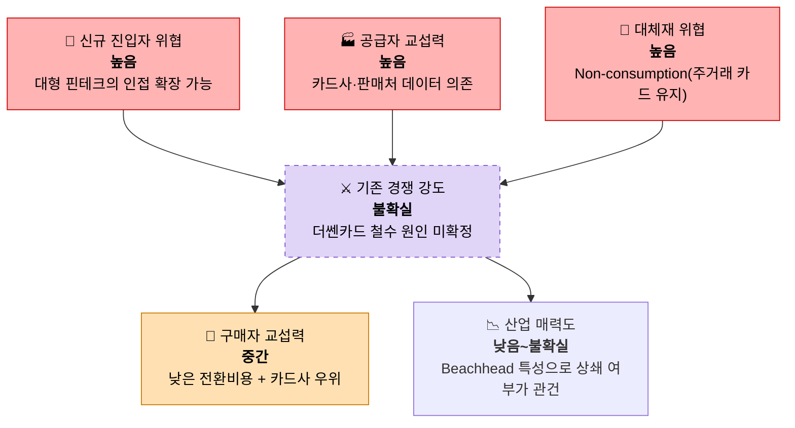
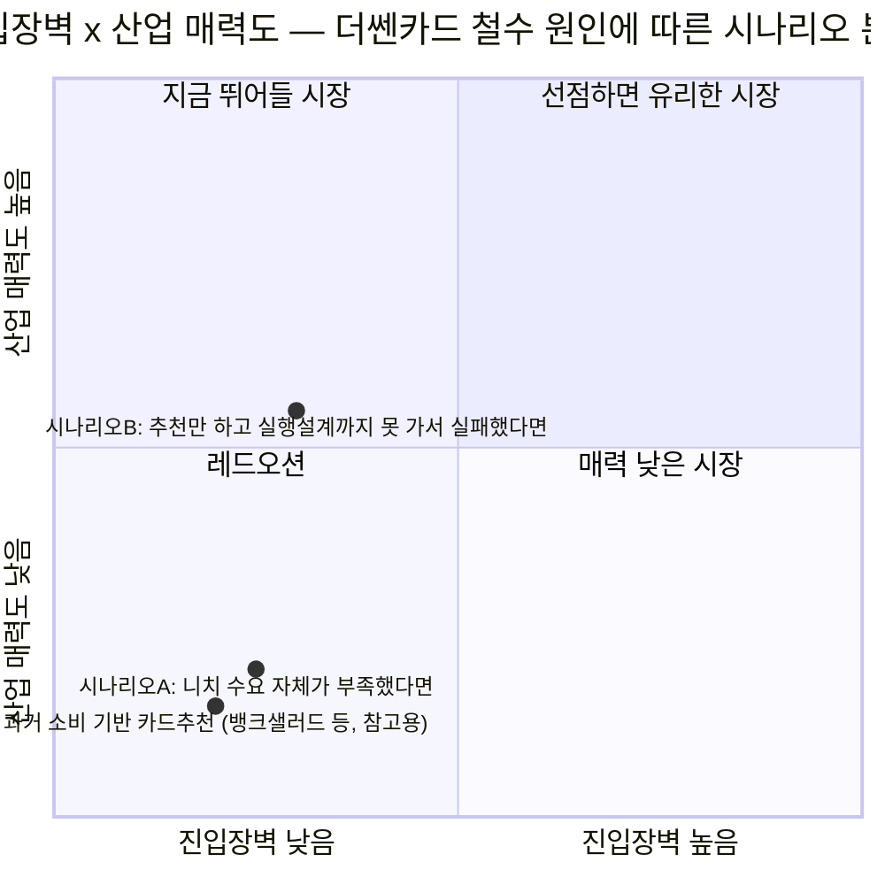

# 01. Porter's Five Forces 모델 — 미래지출 결제설계 서비스

> **분석 대상 기획서:** [`proposal/미래지출 결제설계 서비스 기획서 v0.1.md`](<../../proposal/미래지출 결제설계 서비스 기획서 v0.1.md>)
> **방법론 참고:** [business-analysis-frameworks/01_Porters_Five_Forces_모델/00_방법론.md](https://github.com/jennie-brain/business-analysis-frameworks/blob/main/01_Porters_Five_Forces_%EB%AA%A8%EB%8D%B8/00_%EB%B0%A9%EB%B2%95%EB%A1%A0.md)
> **분석 기준일:** 2026-08-13
> **작성자 / 팀:** JENNIE / AI-PM-study

> **상태 표기**
> - **🟢** 공개 1차 자료 등으로 현재 확인된 사실
> - **🔷** 확인된 사실을 바탕으로 한 합리적 추론
> - **🟡** 추가 검증이 필요한 가설
> - **⬜** 아직 조사하지 않았거나 결론을 유보한 항목

---

## 0. 시장 정의 (Market Definition)

이 분석은 두 개 층위를 함께 다룬다. **시장 정의(조준점)는 날카롭게 좁게, 분석(근거)은 그 시장이 속한 넓은 기존 산업까지 넓혀서** 본다 — 좁은 정의만 쓰면 실제 경쟁자·대체재 데이터가 없는 진공 상태를 분석하게 되고, 넓은 산업만 쓰면 이 프로젝트가 실제로 조준하는 지점이 흐려진다.

### 0.1 넓은 기존 산업 — Five Forces의 실제 근거가 나오는 곳

**대한민국 개인 신용카드 추천·비교·혜택최적화 서비스 산업**

- 참여자: 뱅크샐러드, 카드고릴라, (철수한) 더쎈카드, 각 카드사 자체 앱, 토스 등.
- 아래 다섯 힘의 판단(강도, 근거)은 모두 **이 넓은 산업의 실제 데이터**(E-03~E-06, 03-1 기업사례 등)에서 가져온다. "이 산업에서 돈 벌기 어려운 이유는 무엇인가"에 정직하게 답하는 것이 이 층위의 역할이다.

### 0.2 좁은 타겟 시장 — 이 프로젝트가 조준하는 지점

**대한민국 개인 소비자 대상, 미래 예정 고액지출(Life Event)에 따른 카드조합·결제설계(Payment Planning) 서비스**

- 0.1의 넓은 산업 안에 속한 **부분집합/인접 시장**이다. 기획서가 실제로 검증하려는 차별점(보유·신규 카드 조합과 결제 시점·방식을 설계)을 기준으로 정의한다.
- Beachhead Segment(신혼·입주 가전·가구 구매자)를 1차 렌즈로 삼되, 확장 대상(이사·여행·출산 등 Planned High-Value Spending Event)까지 함께 고려한다.

### 0.3 분석 원칙

각 힘은 **먼저 0.1(넓은 산업) 기준으로 강도를 판단**하고, 그 힘이 **0.2(좁은 타겟)에서 상쇄되거나 증폭되는지**를 별도로 짚는다(6장 "Beachhead에서 상쇄 가능성" 열). 시장 범위를 고르는 유일한 기준은 "이 힘이 실제로 어디서 발생하는가"이며, 결론이 마음에 드는지는 기준이 되지 않는다.

> **본 분석의 목적:** 5 Forces 각각에서 "매력적/비매력적"이라는 이분법적 결론을 내리는 대신, **어느 힘이 왜 강한지, 그리고 좁은 타겟(Beachhead) 특성상 그 위협이 상쇄될 여지가 있는지**를 판단 근거로 남긴다. 최종 go/no-go는 이 문서 단독이 아니라 이후 단계(Persona·Opportunity Score·JTBD)와 종합하여 내린다.

### 0.4 시장 정의 관련 Decision Log

| 날짜 | 결정 | 이유 |
|---|---|---|
| 2026-08-13 | 시장을 "과거 소비 기반 카드 추천"이 아닌 "미래 예정 고액지출에 따른 카드조합·결제설계"로 좁혀 정의 | 기존 시장(뱅크샐러드 등)과 겹쳐 분석하면 이미 알려진 결론만 반복되고, 실제 검증하려는 차별점의 경쟁구도가 가려짐 |
| 2026-08-13 | 시장 정의에 "카드조합"을 명시 | 이 서비스의 차별점은 단일 카드 추천이 아니라 보유·신규 카드를 함께 배치하는 포트폴리오 설계이므로, 그 점을 시장 정의에서부터 드러냄 |
| 2026-08-13 | "예정"·"고액" 표현은 유지 | 이 조건이 빠지면 이미 서비스가 종료된 더쎈카드의 "미래 소비 카테고리 → 카드 추천" 개념과 구분되지 않음 |
| 2026-08-13 | Five Forces 결과를 즉시 go/no-go 판정에 쓰지 않고 신호로만 활용 | 시장을 지나치게 좁게 잡아 조기에 기각할 경우, 이후 단계(Persona·JTBD)에서 확인 가능했던 기회를 놓치는 비용이 더 큼 |
| 2026-08-13 | 페인포인트 도출은 5단계(페르소나)에서 별도 진행 | Five Forces는 산업구조 분석 도구이고 페인포인트 검증은 별개 질문이라, 한 단계에 합치면 두 신호가 모두 흐려짐 |
| 2026-08-13 | `business-analysis-frameworks` 저장소의 방법론·시각화 템플릿(mermaid flowchart, 색상 코드, quadrantChart)을 그대로 적용 | 비전문가도 산업구조·시나리오 분기를 한눈에 이해할 수 있도록, 텍스트 판단만이 아니라 시각 자료로도 근거를 제시 |
| 2026-08-13 | §0을 "넓은 기존 산업(분석 대상)"과 "좁은 타겟 시장(조준점)" 두 층위로 재구성 | 시장 정의(좁게)와 실제 분석 근거(뱅크샐러드 등 넓은 산업 데이터)가 서로 어긋나 있었음을 재검토 과정에서 확인 — Porter는 넓은 산업을 정직하게 판단하는 도구이고, 좁은 타겟에 대한 함의는 원래 KSF(3단계)가 답할 질문이었는데 시장 정의 단계에서 미리 좁혀 그 역할을 대신하려 했던 것이 불일치의 원인이었음 |

---

## 한눈에 보기

## 5가지 힘 요약표

| 힘 | 강도 | 핵심 근거 |
|---|---|---|
| 신규 진입자 위협 | 🟥 높음 | 계산 로직 자체는 진입장벽이 낮고, 대형 핀테크 플랫폼이 인접 기능으로 확장 가능 |
| 대체재 위협 | 🟥 높음 | Non-consumption(비교를 포기하고 기존 카드로 결제)이 가장 강력한 대체 행동 |
| 구매자 협상력 | 🟧 중간 | 전환비용이 거의 0 + 잠재 수익원인 카드사가 협상 우위 |
| 공급자 협상력 | 🟥 높음 | 핵심 계산 엔진(F-03, F-04)이 카드사·판매처 제공 데이터에 전적으로 의존 |
| 기존 경쟁 강도 | 🟪 불확실 | 개념적으로 가장 가까운 선례(더쎈카드)가 이미 철수 — 원인 미확정 |

---

## 1. 신규 진입자의 위협 (Threat of New Entrants) — **높음**

| 근거 | 상태 |
|---|---|
| 카드 혜택 비교·계산 로직 자체는 Rule 기반이라 기술적 진입장벽이 낮다 (기획서 §10.2 Deterministic 영역 참조 — 할인·적립·전월실적·혜택한도 계산은 결정론적 로직) | 🔷 |
| 마이데이터 기반 소비분석·카드추천 서비스(뱅크샐러드)가 이미 존재하며, "미래 소비 반영" 기능을 추가하는 것은 이들에게 기존 자산 위에 얹는 확장에 가깝다 | 🔷 |
| 토스·카카오페이·네이버페이 등 대형 결제/핀테크 플랫폼이 유사 "미래지출 계획 기반 카드 추천" 기능을 자사 서비스에 추가할 유인과 데이터(마이데이터 연동, 대규모 트래픽)를 이미 보유하고 있다 | 🟡 — 실제 출시 계획 여부는 미확인 |
| 반대로 카드·프로모션 데이터를 최신 상태로 유지하는 **운영(오퍼레이션) 비용**은 진입장벽으로 작동할 수 있다 (기획서 R-05, R-02) | 🔷 |

**판단:** 계산 로직 자체의 진입장벽은 낮고, 대형 플랫폼이 인접 기능으로 손쉽게 확장할 수 있는 잠재 위협이 크다. 반면 신규 발급/프로모션 데이터 운영 부담은 소규모 신규 진입자에게는 오히려 진입장벽으로 작동한다 — 즉 **"작은 신규 진입자"보다 "이미 데이터를 가진 대형 플랫폼"이 더 위협적인 구도**다.

---

## 2. 대체재의 위협 (Threat of Substitutes) — **높음**

기획서 §1.3 "현재 대체 행동 / 대체재"에 이미 열거되어 있다:

| 대체재 | 근거 |
|---|---|
| 카드고릴라·뱅크샐러드 등에서 카드 검색 | 🟢 (E-04) |
| 카드사·쇼핑몰·백화점 프로모션 개별 조회 | 🔷 |
| 가전·가구 판매직원에게 카드 조건 문의 | 🔷 |
| 웨딩·입주·재테크 커뮤니티 질문 | 🔷 |
| 엑셀·메모 등으로 직접 계산 | 🔷 |
| **Non-consumption:** 비교를 포기하고 기존 주거래 카드로 결제 | 🔷 — 기획서는 이를 유효한 대체 행동으로 명시 |

**판단:** 대체재는 다양하지만 대부분 "완전하지 않은" 대체재(개별 조회, 수기 계산, 비공식 상담)다. 다만 **Non-consumption(그냥 기존 카드로 결제)** 이 가장 강력한 대체재일 가능성이 높다 — 이는 기술적 경쟁자가 아니라 "이 문제 자체를 심각하게 여기지 않는 태도"이므로, 제품 경쟁력이 아니라 **문제 인식(Problem Awareness) 자체**를 만들어야 하는 부담을 의미한다.

---

## 3. 구매자(고객)의 협상력 (Bargaining Power of Buyers) — **중간, 이중 구조**

이 시장은 최종사용자(개인 소비자)와 잠재적 수익원(카드사/제휴사)이 분리될 가능성이 높아, 두 축으로 나눠 본다.

**(a) 최종사용자(개인 소비자) 관점**
- 서비스가 대부분 무료로 제공될 가능성이 높고, 전환 비용(switching cost)이 거의 없다 — 언제든 다른 비교 서비스나 Non-consumption으로 이탈 가능 🔷
- 개인화의 정확도(추천 근거의 신뢰성, 기획서 §10.2 "허용 불가능한 오류")가 곧 이탈 방지의 핵심이며, 오류 한 번이 이탈로 직결될 수 있다 🟡

**(b) 카드사/제휴사 관점 (기획서 §7.2 잠정 BM 후보 "카드 발급 제휴모델" 전제 시)**
- 카드사는 이미 확립된 자체 모집 채널(카드사 앱, 제휴 비교 플랫폼)을 갖고 있어, 신규 서비스에 대한 의존도가 낮다 — 협상력 우위 🔷
- 제휴 수수료 조건은 카드사가 주도할 가능성이 높다 🟡

**판단:** 최종사용자의 협상력(이탈 용이성)과 잠재 수익원(카드사)의 협상력이 모두 서비스 쪽에 불리하게 작용할 가능성이 있다. 이는 기획서 §7.2가 "BM을 아직 확정하지 않는다"고 명시한 것과 일치하는 리스크다.

---

## 4. 공급자의 협상력 (Bargaining Power of Suppliers) — **높음**

| 공급자 | 협상력 근거 |
|---|---|
| 카드사(발급사) | 혜택·프로모션 조건, 제휴 데이터 제공 여부를 카드사가 결정 — 서비스가 카드사 데이터/제휴 없이는 핵심 기능(F-03, F-04)을 만들 수 없음 | 🔷 |
| 마이데이터/오픈뱅킹 API 제공자 | 실시간 소비 연동 시(기획서 5.2 Out of Scope로 MVP는 제외) 규제·기관 의존도가 발생 | ⬜ |
| 가전·가구 판매처(프로모션 정보 출처) | 판매처별 프로모션이 표준화되어 있지 않아 데이터 수집·유지 비용이 판매처 협조 여부에 좌우됨 | 🟡 |

**판단:** 서비스의 핵심 계산 엔진(F-03, F-04)이 카드사·판매처가 제공하는 조건 데이터에 전적으로 의존하므로, 공급자 협상력이 구조적으로 높다. 이는 기획서 R-02(만료된 프로모션 반영), R-05(데이터 운영비 과다)와 직접 연결된다.

---

## 5. 기존 경쟁자간의 경쟁강도 (Rivalry Among Existing Competitors) — **중간~높음**

| 근거 | 상태 |
|---|---|
| 뱅크샐러드가 2026년 마이데이터 기반 카드 추천·혜택비교 서비스를 이미 출시함 (기획서 E-03) | 🟢 |
| 카드고릴라 등에서 혼수·결혼 준비 카드 추천 콘텐츠가 이미 제공됨 (E-04) | 🟢 |
| 헥토이노베이션 더쎈카드가 2023년 "미래 소비 카테고리 기반 카드 추천" 기능을 제공했으나, 2026년 사업보고서 기준 **서비스를 종료**함 (E-05, E-06) | 🟢 |

**판단:** 가장 중요한 신호는 E-06이다 — 이 기획서와 개념적으로 가장 가까운 선례(더쎈카드)가 **이미 시장에서 철수했다**. 이는 다음 두 가지로 해석될 수 있어 결론을 유보한다:

- **🟡A** 이 세부 니치(미래 소비 기반 카드 설계) 자체의 수요·재사용빈도·사업성에 구조적 한계가 있다 (기획서도 §1.1에서 이미 이 가능성을 인정).
- **🟡B** 더쎈카드는 "추천"에서 멈췄고, 이 기획서가 제안하는 "구매건별 결제계획 설계 + Future Card Design"(F-05)까지는 나아가지 않았다 — 즉 실패 원인이 니치 자체가 아니라 **얕은 구현(추천만 하고 실행 설계까지 못 감)**이었을 가능성도 배제할 수 없다.

이 판단은 데스크 리서치만으로는 확정할 수 없으며, **9.1 Riskiest Assumption의 A-07(지속 가능한 유통/BM 구조 존재 여부) 검증과 직접 연결**된다.

---

## 6. 종합 시그널

아래 "강도"·"핵심 위협" 열은 §0.1(넓은 기존 산업) 기준 판단이고, "Beachhead에서 상쇄 가능성" 열이 §0.2(좁은 타겟 시장)에 대한 함의다 — §0.3에서 선언한 두 층위 분석 원칙을 표 하나로 압축한 것이다.

| Force | 강도 | 핵심 위협 | Beachhead(신혼·입주)에서 상쇄 가능성 |
|---|---|---|---|
| 신규 진입자 위협 | 높음 | 대형 플랫폼의 인접 확장 | 낮음 — 대형 플랫폼도 동일 세그먼트에 접근 가능 |
| 대체재 위협 | 높음 | Non-consumption(주거래 카드 사용) | 중간 — 결혼 준비는 지출이 크고 계획적이라 비교 의향이 상대적으로 높을 수 있음 🟡 |
| 구매자 협상력 | 중간 | 낮은 전환비용 + 카드사 우위 | 낮음 |
| 공급자 협상력 | 높음 | 카드사·판매처 데이터 의존 | 낮음 — Beachhead라고 데이터 의존 구조가 달라지지 않음 |
| 경쟁강도 | 중간~높음 | 더쎈카드 철수 선례 | **불확실** — 실패 원인 규명이 핵심 |

### 6.1 시나리오별 매력도 지도

더쎈카드 철수 원인(OQ-01)에 대한 답이 무엇이냐에 따라 이 시장의 위치가 완전히 달라진다 — 그래서 지금은 하나의 점이 아니라 두 개의 시나리오로 남겨둔다.

- **시나리오 A**(🟡A)가 맞다면 이 시장은 기존 카드추천 레드오션과 거의 같은 위치에 놓인다 — 형태만 다른 같은 문제.
- **시나리오 B**(🟡B)가 맞다면 "구매건별 결제계획 + Future Card Design"(F-05)이라는 더 깊은 실행이 실제 차별화가 되어, 매력도가 눈에 띄게 올라간다.
- 두 시나리오의 매력도 차이가 크기 때문에, **OQ-01 하나를 확인하는 것이 이후 6단계 전체 리소스 배분보다 더 시급하다.**

**결론 (go/no-go 아님):** 5개 힘 중 4개가 "높음"으로, 산업구조 자체는 우호적이지 않다. 다만 이 결과를 근거로 즉시 기각하기보다, 다음 두 가지를 다음 단계에서 반드시 확인해야 한다.

1. **더쎈카드 철수 원인이 니치 수요 부족인지, 얕은 구현 때문인지** — Value Chain 분석(2단계)과 페르소나·페인포인트 조사(5단계)에서 직접 검증.
2. **Beachhead(신혼·입주)가 Non-consumption 대체재를 실제로 이길 만큼 지출 규모·계획성이 큰지** — Persona/JTBD 단계에서 검증할 핵심 가설.

---

## 7. Open Questions (다음 단계로 이월)

| ID | 내용 | 관련 단계 |
|---|---|---|
| OQ-01 | 더쎈카드 종료의 실제 원인(수요 부족 vs 얕은 구현)은 무엇인가? | 2단계 Value Chain, 5단계 Persona |
| OQ-02 | 토스·카카오페이·네이버페이가 유사 기능을 실제로 검토/출시한 이력이 있는가? | 2단계 Value Chain |
| OQ-03 | 카드사 제휴 수수료 구조는 이 BM에서 협상 가능한 수준인가? | 7.2 Business Model 재검토 |
