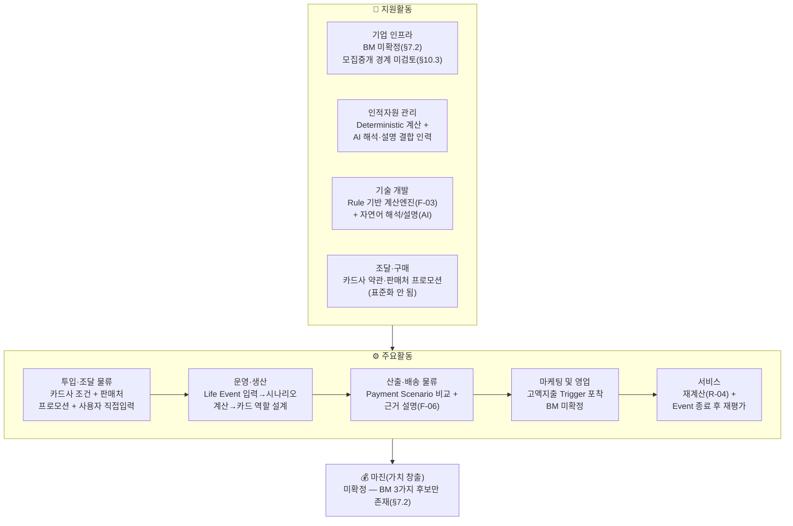
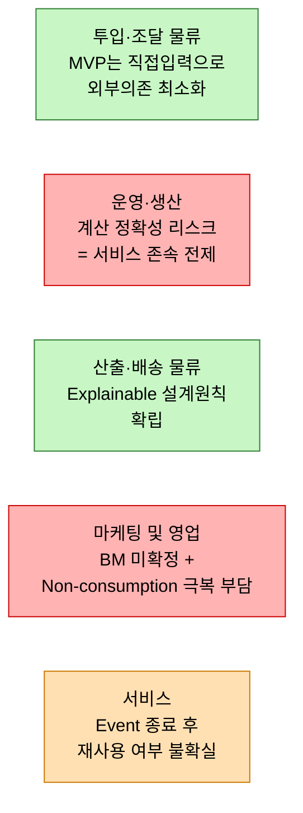

# 02. 기업 내부 활동의 가치사슬 분석 — 미래지출 결제설계 서비스

> **분석 대상 기획서:** [`proposal/미래지출 결제설계 서비스 기획서 v0.1.md`](<../proposal/미래지출 결제설계 서비스 기획서 v0.1.md>)
> **방법론 참고:** [business-analysis-frameworks/02_가치사슬_분석/00_방법론.md](https://github.com/jennie-brain/business-analysis-frameworks/blob/main/02_%EA%B0%80%EC%B9%98%EC%82%AC%EC%8A%AC_%EB%B6%84%EC%84%9D/00_%EB%B0%A9%EB%B2%95%EB%A1%A0.md)
> **이전 단계:** [`01 - Porter's Five Forces 모델.md`](<./01 - Porter's Five Forces 모델.md>)
> **분석 기준일:** 2026-08-13
> **작성자 / 팀:** JENNIE / AI-PM-study

> **상태 표기**
> - **🟢** 공개 1차 자료 등으로 현재 확인된 사실
> - **🔷** 확인된 사실을 바탕으로 한 합리적 추론
> - **🟡** 추가 검증이 필요한 가설
> - **⬜** 아직 조사하지 않았거나 결론을 유보한 항목

---

## 0. 분석 범위

1단계와 동일하게, "미래 예정 고액지출(Life Event)에 따른 카드조합·결제설계 서비스"를 대상으로 한다. 이번 단계에서는 산업구조가 아니라 **서비스 내부의 어느 활동에서 실제 가치가 만들어지고, 어느 활동이 취약한지**를 본다.

### 0.1 Decision Log

| 날짜 | 결정 | 이유 |
|---|---|---|
| 2026-08-13 | 방법론의 일반 금융 가치사슬 질문표 중 이 서비스에 실제로 해당하는 질문만 선별 적용 | 방법론 문서의 질문표는 종합 금융플랫폼 전반을 겨냥해 범위가 넓음 — MVP 단계(§5.1, 마이데이터 미연동·직접입력·시뮬레이션까지만)와 무관한 항목(예: 대량 결제망 인프라)까지 모두 채우면 신호가 흐려짐 |

---

## 한눈에 보기

**핵심 요약**: 이 서비스는 가치사슬이 아직 대부분 **설계 대상**이다 (기획서 자체가 Working Draft, §7.2 "BM을 아직 확정하지 않는다"). 다만 그 중에서도 **운영·생산(계산 정확성)** 과 **마케팅 및 영업(BM·Trigger 확보)** 두 지점이 다른 활동보다 훨씬 더 큰 리스크를 안고 있다.

---

## 1. 주요활동 (Primary Activities)

### 1.1 투입·조달 물류 (Inbound Logistics)

| 유형 | 질문 | 답변 |
|---|---|---|
| 설계 | 서비스 제공에 필요한 핵심 투입자원은 무엇인가? | 카드 혜택·프로모션 조건(카드사), 가전·가구 판매처 프로모션 정보, 사용자가 직접 입력하는 현재 소비 기준선·미래 지출계획·보유카드(§5.1) 🟢 |
| 설계 | 어떤 데이터는 자체 확보하고 어떤 기능은 외부 제휴로 확보하는가? | MVP는 마이데이터 연동 없이 **사용자 직접입력**으로 한정(§5.1) — 초기에는 외부 데이터 의존을 의도적으로 줄인 설계 🟢 |
| 개선 | 카드사·판매처가 데이터 제공에 참여할 유인은 무엇인가? | 기획서상 MVP는 "발급 실행 없음"(§10.3)이라 카드사 입장에서 즉각적 참여 유인이 약할 수 있음 🟡 — 1단계 Five Forces의 "공급자 협상력 높음" 판정과 직접 연결 |
| 개선 | 판매처별 프로모션 데이터의 정확성·최신성을 어떻게 높일 것인가? | 판매처 프로모션이 표준화되어 있지 않아 수집·유지비용이 판매처 협조 여부에 좌우됨(R-05) 🟡 |

### 1.2 운영·생산 (Operations)

| 유형 | 질문 | 답변 |
|---|---|---|
| 설계 | 핵심 처리 흐름은 어떻게 설계되는가? | 현재 소비/보유카드 확인 → Life Event 추가 → 지출항목/금액/시점 입력 → 제약조건 설정 → 현재카드유지안/신규카드추가안 계산 → 비교 → 카드 역할 설계 → 결제계획 확인(§6.1) 🟢 |
| 설계 | 자동화(AI)와 결정론적 계산의 경계를 어떻게 정하는가? | 할인·적립·전월실적·혜택한도·시나리오 비교는 Deterministic 영역, 자연어 해석·결과 설명은 AI 영역으로 명확히 분리(§10.2) 🟢 — 이 경계 자체가 이 서비스의 핵심 설계 원칙 |
| 개선 | 오류율을 어떻게 낮출 것인가? | "존재하지 않는 혜택 생성", "할인 한도 누락", "프로모션 기간 오적용", "실제보다 큰 순혜택 제시"는 **허용 불가능한 오류**로 명시(§10.2) — 계산 신뢰성이 서비스 존속의 전제조건 🟢 |
| 개선 | 처리시간·오류율을 낮추는 체계가 있는가? | Rule Engine + Test Set(R-01), Card Rule Calculation Error Rate를 Guardrail로 관리(G-01) 🟢 |

### 1.3 산출·배송 물류 (Outbound Logistics)

| 유형 | 질문 | 답변 |
|---|---|---|
| 설계 | 고객은 결과를 어떤 형식으로 전달받는가? | 여러 Payment Scenario 비교, 신규카드 포함/미포함 비교, 구매건별 결제수단 배분 + 계산 근거·조건·주의사항 설명(F-01~F-06) 🟢 |
| 설계 | 초기 채널은 무엇인가? | Web/Mobile Web Prototype(§2.3), 자연어 질문 기반 진입 🟢 |
| 개선 | 복잡한 계산 결과를 비전문가가 이해하도록 개선할 수 있는가? | Black Box → Explainable을 보조 해결원리로 명시(§4.2) — 근거 공개가 단순 부가기능이 아니라 핵심 설계 원칙 🟢 |

### 1.4 마케팅 및 영업 (Marketing & Sales)

| 유형 | 질문 | 답변 |
|---|---|---|
| 설계 | 핵심 고객과 진입 Trigger는 무엇인가? | 신혼·입주 등으로 향후 1~3개월 내 고액구매 예정인 개인 소비자(§2.1), "다음 달 신혼집 가전·가구 사는데 어떤 카드가 좋아?" 같은 자연어 Trigger(§2.2) 🟢 |
| 개선 | 프로모션·초기 후킹 없이도 재방문이 발생하는가? | 아직 BM이 미확정(§7.2)이고 Fake Door / Concierge Test로 전환의향을 검증하는 단계(K-06 Business KPI) — 실제 수익화 경로 자체가 검증 전 🟡 |
| 개선 | Non-consumption(비교 자체를 포기)을 어떻게 넘어서는가? | 1단계 Five Forces에서 확인한 가장 강력한 대체재 — 문제 인식(Problem Awareness) 자체를 만들어야 하는 부담이 이 활동의 핵심 리스크 [연결: 1단계 §2] |

### 1.5 서비스 (Service)

| 유형 | 질문 | 답변 |
|---|---|---|
| 설계 | 거래 이후 지원은 어떻게 설계되는가? | 미래 지출계획 변경 시 언제든 재계산(R-04), Event 종료 이후 신규 카드 유지 여부를 별도로 재평가(§6.3) 🟢 |
| 개선 | Life Event 종료 이후 고객 관계가 유지되는가? | Life Event 이후 사용빈도 급감 리스크를 R-06으로 이미 명시하고 A-07(지속 가능한 유통/BM 구조)로 검증 대상에 포함 🟢 — **1단계 OQ-01(더쎈카드 철수 원인)과 직결되는 지점** |

---

## 2. 지원활동 (Support Activities)

### 2.1 기업 인프라

| 유형 | 질문 | 답변 |
|---|---|---|
| 설계 | BM과 법인 구조는 확정되어 있는가? | BM은 4개 잠정 후보(금융/카드 플랫폼 내 기능, B2B2C Engine, 카드 발급 제휴모델, 프리미엄 서비스) 중 미확정 — "A-07을 검증하기 전 BM을 고정하지 않는다"(§7.2) 🟢 |
| 개선 | 규제·법무 검토는 언제 이뤄지는가? | 모집·중개 경계, 제휴수수료 구조, 마이데이터 지위, 이해상충 등은 "상용모델 설계 시 별도 검토"로 유보(§10.3) 🟢 — 아직 검토 전 단계 |

### 2.2 인적자원 관리

| 유형 | 질문 | 답변 |
|---|---|---|
| 설계 | 어떤 역량 조합이 필요한가? | 카드 상품설명서 구조화·자연어 해석·결과 설명은 AI, 계산·검증은 Deterministic 로직 담당자로 역할이 이미 나뉘어 있음(§10.2, §12) 🟢 |

### 2.3 기술 개발

| 유형 | 질문 | 답변 |
|---|---|---|
| 설계 | 핵심 경쟁력을 만드는 기술은 무엇인가? | Rule 기반 Payment Scenario 계산엔진(F-03)이 핵심 자산 — AI는 보조(자연어 해석, 설명 생성)로 한정(§10.2) 🟢 |

### 2.4 조달·구매

| 유형 | 질문 | 답변 |
|---|---|---|
| 설계 | 핵심 조달 대상은 무엇인가? | 카드사 상품설명서·약관, 판매처 프로모션 데이터 — 1단계에서 이미 "공급자 협상력 높음"으로 판정된 바로 그 대상 [연결: 1단계 §4] |

---

## 3. 취약도 지도

가장 안정된 두 지점(투입·산출)은 **MVP 범위를 의도적으로 좁혀서** 얻은 안정성이지, 시장에서 검증된 안정성이 아니다. 반면 **운영(계산 정확성)** 과 **마케팅 및 영업(BM·재방문)** 은 지금 단계에서 실제로 미확정·미검증인 채로 남아 있다.

---

## 4. 1단계와의 연결

- **OQ-01(더쎈카드 철수 원인)과 직접 연결되는 지점**: 이 기획서의 가치사슬은 "산출·배송 물류"(구매건별 결제계획)와 "서비스"(Event 종료 후 재평가)까지 명시적으로 설계되어 있다. 더쎈카드가 "추천"(마케팅 및 영업 직후)에서 멈췄다면, 이 기획서는 최소한 **설계상으로는** 그보다 가치사슬이 한 단계 더 길다 — 다만 이것이 실제 차별화로 이어지는지는 여전히 🟡B이며, 5단계 페르소나 조사에서 확인해야 한다.
- 1단계에서 "공급자 협상력 높음"으로 판정한 근거(카드사·판매처 데이터 의존)가 이번 단계의 "투입·조달 물류"·"조달·구매"에서 동일하게 재확인되었다 — 서로 다른 프레임워크가 같은 지점을 반복해서 지목한다는 것은 이 리스크의 신뢰도가 높다는 신호다.

---

## 5. Open Questions (다음 단계로 이월)

| ID | 내용 | 관련 단계 |
|---|---|---|
| OQ-04 | 카드사가 발급 실행 없이도(§10.3 MVP 전제) 데이터 제휴에 참여할 유인이 실제로 존재하는가? | 3단계 KSF, 7.2 Business Model 재검토 |
| OQ-05 | Rule 기반 계산엔진의 오류율을 낮추는 데 필요한 최소 데이터 운영 조직 규모는 어느 정도인가? | 3단계 KSF |
| OQ-06 | Life Event 종료 후에도 고객이 서비스에 남을 유인(다른 Life Event로의 확장 등)이 실제로 있는가? | 5단계 Persona/CJM, 6단계 Opportunity Score |
