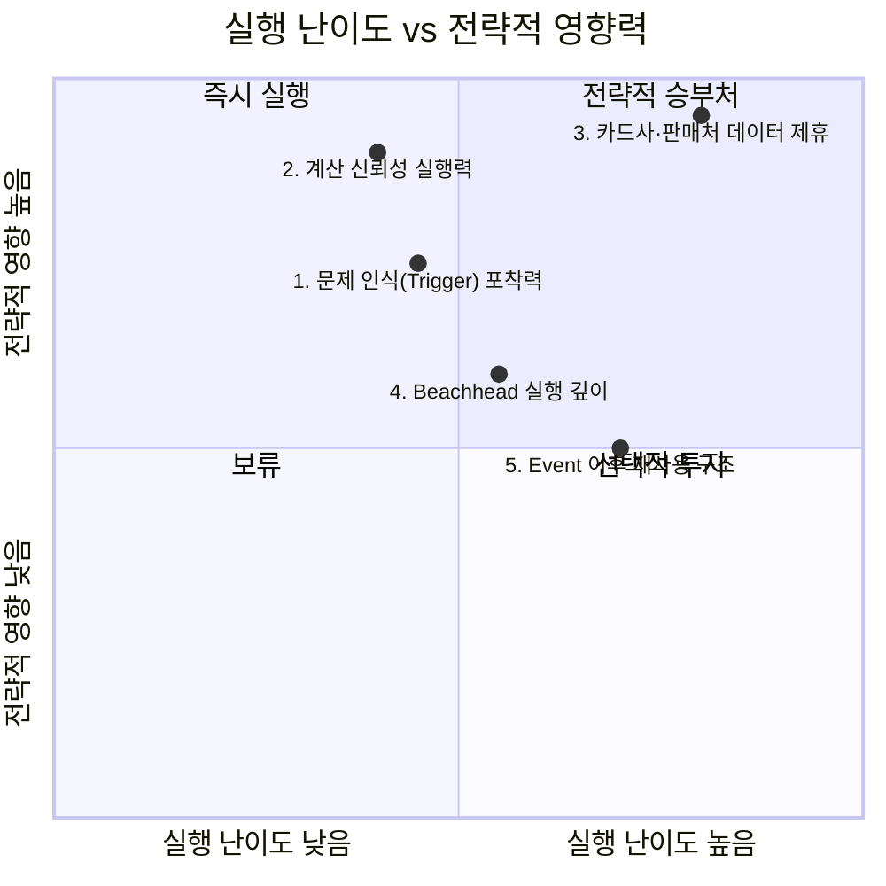

# 03. 신규 진입자를 위한 Top 5 핵심 성공 요인 — 미래지출 결제설계 서비스

> **분석 대상 기획서:** [`proposal/미래지출 결제설계 서비스 기획서 v0.1.md`](<../proposal/미래지출 결제설계 서비스 기획서 v0.1.md>)
> **방법론 참고:** [business-analysis-frameworks/03_핵심성공요인_분석/00_방법론.md](https://github.com/jennie-brain/business-analysis-frameworks/blob/main/03_%ED%95%B5%EC%8B%AC%EC%84%B1%EA%B3%B5%EC%9A%94%EC%9D%B8_%EB%B6%84%EC%84%9D/00_%EB%B0%A9%EB%B2%95%EB%A1%A0.md)
> **입력:** [`01 - Porter's Five Forces 모델.md`](<./01 - Porter's Five Forces 모델.md>), [`02 - 기업 내부 활동의 가치사슬 분석.md`](<./02 - 기업 내부 활동의 가치사슬 분석.md>)
> **분석 기준일:** 2026-08-13
> **작성자 / 팀:** JENNIE / AI-PM-study

> **상태 표기**
> - **🟢** 공개 1차 자료 등으로 현재 확인된 사실
> - **🔷** 확인된 사실을 바탕으로 한 합리적 추론
> - **🟡** 추가 검증이 필요한 가설
> - **⬜** 아직 조사하지 않았거나 결론을 유보한 항목

---

## 우선순위 지도

1단계 Five Forces는 이 시장의 다섯 힘 중 네 개가 신규 진입자에게 불리하다고 판정했고, 2단계 가치사슬은 그 중에서도 **운영(계산 정확성)** 과 **마케팅 및 영업(BM·Trigger)** 이 가장 취약하다고 짚었다. 따라서 KSF의 초점은 "산업 전체와 정면으로 싸우지 않고, 어디에 자원을 집중해야 살아남는가"에 맞춘다.

---

## Top 5 핵심 성공 요인

### 1. 문제 인식(Problem Awareness) 및 Trigger 포착력

1단계 Five Forces는 대체재 위협을 "높음"으로 판정하면서, 그 핵심 근거로 **"Non-consumption(비교를 포기하고 기존 카드로 결제)이 가장 강력한 대체 행동"** 이며 이는 "기술적 경쟁자가 아니라 문제 자체를 심각하게 여기지 않는 태도"라고 명시했다. 2단계 가치사슬의 마케팅 및 영업 활동 역시 같은 지점을 "Non-consumption을 어떻게 넘어서는가"가 이 활동의 핵심 리스크라고 재확인했다.

두 분석을 연결하면 결론은 명확하다 — 경쟁자는 다른 카드추천 서비스가 아니라 **"굳이 비교 안 해도 그만"이라는 소비자의 기본 태도**다. 따라서 신규 진입자는 기획서 §2.3이 이미 제시한 "예정된 큰 지출이 있나요?" Trigger를 소비자가 스스로 문제를 인식하기 전, 즉 웨딩·입주 플랫폼·가전 구매 시점 같은 실제 의사결정 접점에서 포착하는 능력을 최우선으로 확보해야 한다.

### 2. 계산 신뢰성 실행력 (Deterministic Rule Engine Excellence)

2단계 가치사슬은 운영·생산 활동을 이 서비스에서 가장 취약한 지점 중 하나로 지목하며, 그 근거로 기획서 §10.2의 **"허용 불가능한 오류"**(존재하지 않는 혜택 생성, 할인 한도 누락, 프로모션 오적용, 실제보다 큰 순혜택 제시)를 직접 인용했다. 1단계 Five Forces는 신규 진입 위협을 판정하며 "계산 로직 자체의 진입장벽은 낮다"고 봤지만, 이는 계산 로직을 짜는 것 자체가 쉽다는 뜻이지 **계속 정확하게 유지하는 것**이 쉽다는 뜻이 아니다.

이 둘을 연결하면, 진짜 경쟁우위는 "누가 더 빨리 계산 기능을 만드는가"가 아니라 **"누가 오류 없이 계속 최신 상태를 유지하는가"** 에 있다. 오류 한 번이 곧 이탈로 직결된다는 3단계(1단계 §3 구매자 협상력) 판단과 겹쳐 보면, Rule Engine + Test Set(R-01), Guardrail(G-01~G-03) 운영 체계를 실제로 돌릴 수 있는 실행력이 결정적이다.

### 3. 카드사·판매처 데이터 제휴 확보 (Supply-side Partnership)

1단계 Five Forces는 공급자 협상력을 "높음"으로 판정했고, 그 근거는 **"핵심 계산 엔진(F-03, F-04)이 카드사·판매처 제공 데이터에 전적으로 의존"** 한다는 것이었다. 2단계 가치사슬은 투입·조달 물류와 조달·구매 두 활동에서 이 사실을 그대로 재확인했고, 여기에 더해 새로운 문제를 제기했다 — 기획서 §10.3 전제상 MVP는 **"발급 실행 없음"** 이라, 카드사 입장에서 데이터 제공에 협조할 유인이 약할 수 있다는 것(OQ-04)이다.

즉 이 서비스는 카드사·판매처 데이터 없이는 F-03·F-04라는 핵심 기능 자체가 성립하지 않는데, 정작 카드사에게는 협조할 뚜렷한 이유가 아직 없다. 따라서 신규 진입자에게 가장 시급하고도 어려운 과제는 **"발급 실행 없이도 카드사가 데이터를 내줄 유인 구조"** 를 설계하는 것이다 — 5개 요인 중 실행 난이도가 가장 높지만, 이게 막히면 나머지 4개는 실행할 기반 자체가 없다.

### 4. Beachhead에서만 가능한 실행 깊이 (Beachhead-specific Depth)

1단계 종합 시그널은 신규 진입자 위협의 Beachhead(신혼·입주) 상쇄 가능성을 **"낮음 — 대형 플랫폼도 동일 세그먼트에 접근 가능"** 으로 판정했다. 대형 핀테크가 마음만 먹으면 같은 세그먼트에 들어올 수 있다면, 세그먼트를 좁히는 것만으로는 방어가 안 된다는 뜻이다.

2단계 가치사슬은 이 서비스가 "산출·배송 물류"(구매건별 결제계획)와 "서비스"(Event 종료 후 재평가)까지 설계상 이미 확장되어 있으며, 더쎈카드는 "추천"(마케팅 및 영업 직후)에서 멈췄다는 점을 지적했다(1단계 OQ-01, 🟡B). 대형 플랫폼이 인접 기능으로 "카드 추천"까지는 쉽게 따라와도, **구매건별로 카드 역할을 배정하고 결제 시점까지 설계하는 실행(F-05)** 은 훨씬 번거롭고 낮은 우선순위일 가능성이 높다. 따라서 진짜 방어선은 세그먼트가 아니라 **경쟁자가 따라오기 귀찮아할 만큼의 실행 깊이**다.

### 5. Life Event 이후 재사용 구조 (Post-Event Retention & BM)

2단계 가치사슬의 서비스 활동은 Life Event 종료 이후 고객 관계 유지를 "불확실"로 분류하며, 기획서 R-06(Life Event 이후 사용빈도 급감 리스크)과 A-07(지속 가능한 유통/BM 구조 존재 여부)을 직접 인용했다. 기업 인프라 활동 역시 BM이 아직 4개 후보 중 미확정 상태임을 확인했다(§7.2).

1단계는 더쎈카드 철수(E-06)가 정확히 이 지점 — 재사용·사업성 구조의 한계 — 때문일 가능성(🟡A)을 열어뒀다. 이 가설이 맞다면, 계산 엔진이나 UX가 아무리 뛰어나도 **"한 번의 결혼·입주 이벤트가 끝나면 관계가 끝난다"** 는 구조적 한계를 넘지 못하는 한 같은 결말을 맞을 수 있다. 따라서 신규 진입자는 처음부터 다른 Planned High-Value Spending Event(이사·여행·출산 등, §0 Product Vision)로의 확장 경로를 BM 설계에 포함해야 한다.

---

## 종합: 선택과 집중의 순서

한정된 자원을 가진 신규 진입자라면, **3번(카드사·판매처 데이터 제휴)** 을 가장 먼저 풀어야 한다 — 이게 막히면 2·4번을 실행할 데이터 기반 자체가 없다. 그 다음 **2번(계산 신뢰성)** 으로 신뢰를 확보하고, **1번(문제 인식·Trigger 포착)** 으로 수요 자체를 만들어야 한다. **4번(Beachhead 실행 깊이)** 은 앞의 세 가지가 자리 잡은 뒤 실제 차별화를 굳히는 단계이며, **5번(Event 이후 재사용)** 은 §11.3 A-07 검증 결과에 따라 BM 구조 자체를 다시 설계해야 할 수도 있는, 가장 마지막에 확정할 항목이다.

---

## Open Questions (다음 단계로 이월)

| ID | 내용 | 관련 단계 |
|---|---|---|
| OQ-07 | 카드사가 실제로 "발급 실행 없는" 데이터 제휴에 응할 유인 구조(예: 데이터 제공 대가)는 무엇이 있을 수 있는가? | 6단계 Opportunity Score, 7.2 Business Model 재검토 |
| OQ-08 | 신혼·입주 외 다른 Life Event(이사·여행·출산)로의 확장이 실제로 동일한 Trigger 강도를 가지는가? | 4단계 TAM-SAM-SOM, 5단계 Persona |
