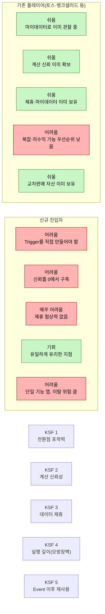
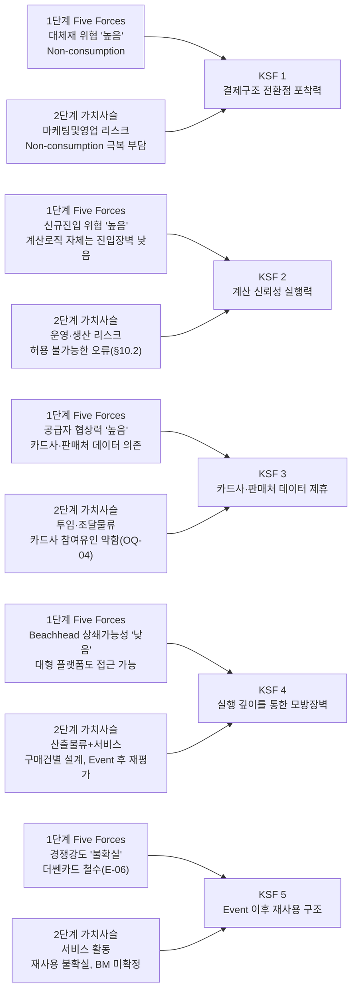
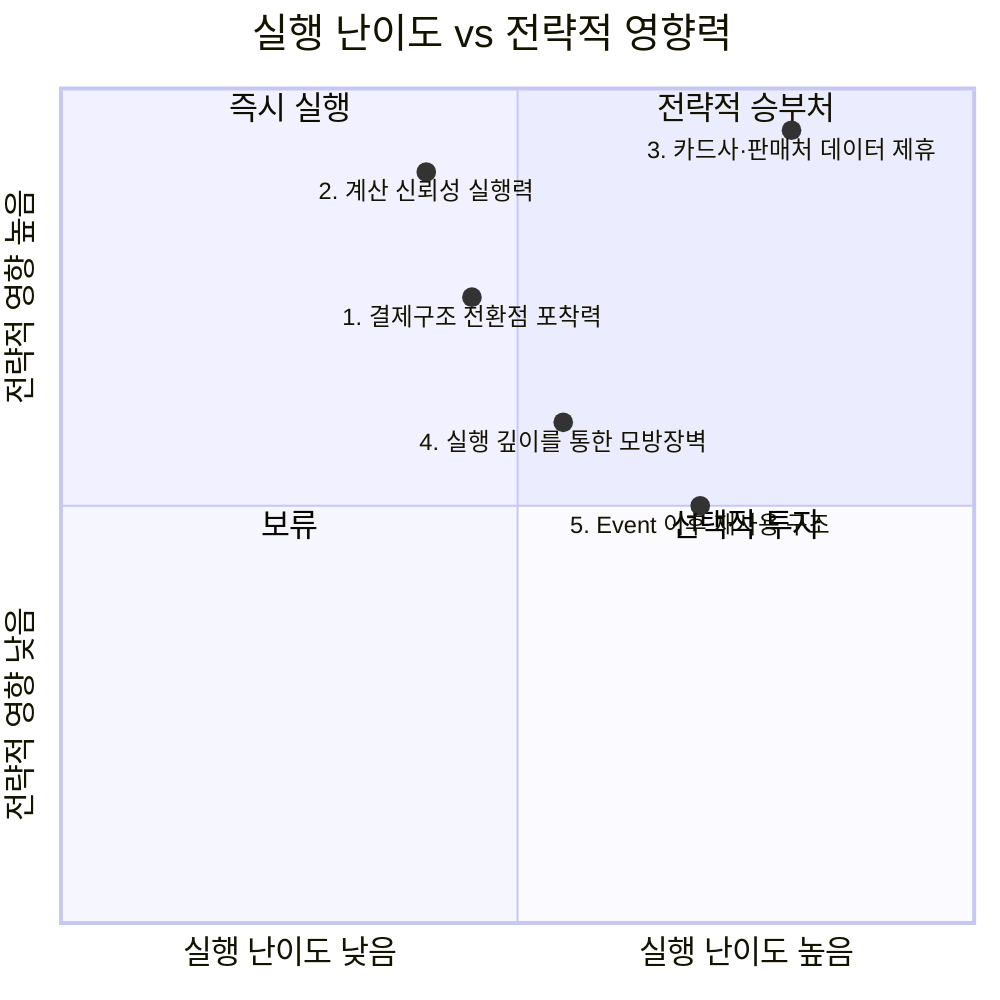

# 03. 신규 진입자를 위한 Top 5 핵심 성공 요인 — 미래지출 결제설계 서비스

> **분석 대상 기획서:** [`proposal/미래지출 결제설계 서비스 기획서 v0.1.md`](<../../proposal/미래지출 결제설계 서비스 기획서 v0.1.md>)
> **방법론 참고:** [business-analysis-frameworks/03_핵심성공요인_분석/00_방법론.md](https://github.com/jennie-brain/business-analysis-frameworks/blob/main/03_%ED%95%B5%EC%8B%AC%EC%84%B1%EA%B3%B5%EC%9A%94%EC%9D%B8_%EB%B6%84%EC%84%9D/00_%EB%B0%A9%EB%B2%95%EB%A1%A0.md)
> **입력:** [`01_Porters_Five_Forces_모델.md`](<../01_Porters_Five_Forces_모델/01_Porters_Five_Forces_모델.md>), [`01_가치사슬_분석.md`](<../02_가치사슬_분석/01_가치사슬_분석.md>)
> **관련 자료:** [`02_기업사례.md`](<./02_기업사례.md>) — KSF별 실제 기업 사례
> **분석 기준일:** 2026-08-13
> **작성자 / 팀:** JENNIE / AI-PM-study
> **Decision Log:** [`00_Decision_Log.md`](<./00_Decision_Log.md>)

> **상태 표기**
> - **🟢** 공개 1차 자료 등으로 현재 확인된 사실
> - **🔷** 확인된 사실을 바탕으로 한 합리적 추론
> - **🟡** 추가 검증이 필요한 가설
> - **⬜** 아직 조사하지 않았거나 결론을 유보한 항목

---

## 결론부터: 이 시장에서 이기는 법

1단계 Five Forces는 다섯 힘 중 네 개(신규진입·대체재·공급자·경쟁강도)를 신규 진입자에게 불리한 쪽으로 판정했다. 2단계 가치사슬은 그중에서도 **운영·생산(계산 정확성)** 과 **마케팅 및 영업(BM·Trigger)** 을 가장 취약한 활동으로 지목했다. 이 두 분석을 그대로 겹쳐 읽으면, 전략기획팀이 던져야 할 질문은 "이 산업 자체가 매력적인가"가 아니라 **"산업 전체와 정면으로 싸우지 않고 어디에 자원을 몰아야 살아남는가"** 다. 아래 Top 5는 그 질문에 대한 답이다.

이 시장에는 두 종류의 진입자가 섞여 있다는 점도 함께 다룬다 — ① 토스·뱅크샐러드처럼 **이미 마이데이터 연동·대규모 유저·계산 신뢰를 보유한 채 인접 기능으로 진입**하는 경우, ② 아무 자산 없이 **완전한 신규 진입자**로 시작하는 경우. 다섯 개 KSF는 두 유형에게 난이도가 똑같지 않다 — 각 KSF마다 "진입자 유형별 시사점"을 별도로 짚는다.

## KSF 한눈에 보기

| # | KSF 명칭 | 근거 원천 |
|---|---|---|
| 1 | 결제구조 전환점(Payment Structure Transition Point) 포착력 | 1단계 대체재 위협 · 2단계 마케팅및영업 |
| 2 | 계산 신뢰성 실행력 | 2단계 운영·생산 · 1단계 구매자 협상력 |
| 3 | 카드사·판매처 데이터 제휴 확보 | 1단계 공급자 협상력 · 2단계 투입·조달물류/조달·구매 |
| 4 | 실행 깊이를 통한 모방장벽 | 1단계 신규진입 위협·종합시그널 · 2단계 산출물류/서비스 |
| 5 | Event 이후 재사용 구조(BM) | 1단계 경쟁강도(더쎈카드) · 2단계 서비스/기업인프라 |

## 진입자 유형별 난이도 지도

**핵심 역설**: KSF 1·2·3·5는 기존 플레이어에게 쉽고 신규 진입자에게 어렵지만, **KSF 4만 정반대다.** 대형 플랫폼일수록 복잡하고 당장 수익성이 낮아 보이는 실행(구매건별 카드 역할 설계)에 조직 자원을 배정할 유인이 약하기 때문이다 — 신규 진입자에게 열린 유일한 문이 KSF 4라는 뜻이다.

## 근거 연결 지도 — 분석에서 전략으로

## 우선순위 지도

---

## Top 5 핵심 성공 요인

### 1. 결제구조 전환점(Payment Structure Transition Point) 포착력

**정의:** "결혼·입주 고액지출"에 한정하지 않고, **특정 시점부터 결제수단·결제구조 자체가 바뀌는 모든 전환점**(예: 구독료를 계좌송금에서 카드결제로 변경, 신규 대형지출 발생 등)을 소비자가 스스로 인지하기 전에 포착해 문제 인식 자체를 만들어내는 능력. 단, 아래 3가지 필터를 모두 통과해야 이 서비스가 다룰 수 있는 진짜 트리거다.

| 필터 | 질문 | 통과 예시 | 탈락 예시 |
|---|---|---|---|
| ① 카드결제 대상 | 카드로 결제되거나 카드 선택에 영향을 주는 지출인가? | 혼수 가전·가구 구매, 구독료 결제수단을 카드로 전환 | 전세→자가 전환 시 발생하는 대출이자(계좌 자동이체, 카드 결제 대상이 아님) |
| ② 외부 감지 가능성 | 마이데이터 없이도 외부 신호(광고·제휴 채널)로 감지할 수 있는가? | 웨딩업체 계약, 부동산 입주 계약 | "이번 달부터 구독료 결제수단을 바꿈"처럼 조용한 변화(마이데이터로만 감지 가능 → 기획서 §5.1 MVP 범위와 충돌) |
| ③ 비교 유인 크기 | 지출 규모·빈도가 사용자가 실제로 비교할 만큼 크거나 반복적인가? | 1,445만원 혼수 지출(1단계 §0) | 월 3만원 구독료 결제수단 변경(Non-consumption 유인이 더 큼) |

**선정 근거:** 1단계 Five Forces는 대체재 위협을 "높음"으로 판정하며 그 핵심 근거로 "Non-consumption(비교를 포기하고 기존 카드로 결제)이 가장 강력한 대체 행동"이라는 점, 그리고 이것이 "기술적 경쟁자가 아니라 문제 자체를 심각하게 여기지 않는 태도"라는 점을 명시했다. 2단계 가치사슬의 마케팅 및 영업 활동 분석은 정확히 같은 지점을 짚어, "Non-consumption을 어떻게 넘어서는가"가 "이 활동의 핵심 리스크"라고 재확인했다. 이 리스크를 구조적으로 이해하면, "웨딩·입주"만이 유일한 트리거가 아니라 **위 3필터를 통과하는 모든 결제구조 전환점**이 잠재적 트리거라는 것을 알 수 있다 — 다만 필터를 넓게 잡을수록 ②(감지 가능성)가 급격히 어려워진다는 트레이드오프가 함께 따른다. 결혼·입주는 외부 산업(웨딩업체·부동산)이 이미 계약 시점을 만들어주지만, 구독료 결제수단 변경처럼 조용한 전환점은 그런 외부 신호가 없다.

**그래서 무엇을 해야 하는가:** 기획서 §2.3이 제시한 "예정된 큰 지출이 있나요?" 트리거를 자체 앱 안에서 기다리지 말고, 웨딩·입주 플랫폼처럼 3필터를 모두 통과하는 접점에 먼저 심어야 한다. 구독료 결제수단 변경처럼 감지 가능성이 낮은 트리거는 마이데이터 연동이 가능해지는 이후 단계의 확장 과제로 미뤄야 한다.

**진입자 유형별 시사점:** 토스·뱅크샐러드 같은 기존 플레이어는 마이데이터로 사용자의 결제구조 변화를 이미 "관찰"만 하면 되므로 ②(감지 가능성) 필터가 사실상 해소되어 있다 — 오히려 이들에게는 3필터를 좁게 적용한 "혼수 지출"보다 넓게 적용한 "모든 결제구조 전환점"이 더 쉬운 시장일 수 있다. 반면 신규 진입자는 마이데이터가 없는 MVP 단계에서 ②를 외부 제휴로만 메울 수 있으므로, 필터를 넓히기보다 결혼·입주처럼 ①②③을 모두 확실히 통과하는 좁은 트리거에 먼저 집중해야 한다.

---

### 2. 계산 신뢰성 실행력 (Deterministic Rule Engine Excellence)

**정의:** 카드 혜택·할인·한도 계산에서 단 한 건의 오류도 없이, 변경되는 프로모션 조건을 지속적으로 정확하게 반영하는 운영 실행력.

**선정 근거:** 2단계 가치사슬은 운영·생산 활동에서 기획서 §10.2를 직접 인용해 "'존재하지 않는 혜택 생성', '할인 한도 누락', '프로모션 기간 오적용', '실제보다 큰 순혜택 제시'는 허용 불가능한 오류"이며 "계산 신뢰성이 서비스 존속의 전제조건"이라고 명시했다. 한편 1단계 Five Forces는 신규 진입 위협을 판정하며 "계산 로직 자체의 진입장벽은 낮다"고 봤다 — 이는 로직을 짜는 일 자체가 쉽다는 뜻이지, 그것을 오류 없이 계속 유지하는 일까지 쉽다는 뜻이 아니다. 여기에 1단계 구매자 협상력 분석의 "오류 한 번이 이탈로 직결될 수 있다"는 판단을 더하면, 진짜 경쟁우위는 "누가 더 빨리 계산 기능을 만드는가"가 아니라 **"누가 오류 없이 계속 최신 상태를 유지하는가"** 에 있다는 결론이 나온다.

**그래서 무엇을 해야 하는가:** 기획서가 이미 명시한 Rule Engine + Test Set(R-01)과 Card Rule Calculation Error Rate 가드레일(G-01)을, 기능 추가보다 우선순위가 높은 상시 운영 체계로 조직해야 한다.

**진입자 유형별 시사점:** 뱅크샐러드는 이미 "혜택을 원 단위까지 계산해 공개"하는 신뢰를 구축해 뒀으므로(03-1 참고), 새 기능을 얹을 때 이 신뢰를 그대로 상속한다 — 기존 플레이어에게는 낮은 난이도다. 신규 진입자는 이 신뢰를 처음부터 쌓아야 하며, 초기 오류 한 번이 곧 이탈로 직결된다는 1단계 판단이 그대로 적용되는 가장 취약한 구간이다.

---

### 3. 카드사·판매처 데이터 제휴 확보 (Supply-side Partnership Leverage)

**정의:** 발급 실행이나 즉각적 수익 배분 없이도 카드사·판매처가 혜택·프로모션 데이터를 지속적으로 제공하도록 만드는 제휴 구조 설계 역량.

**선정 근거:** 1단계 Five Forces는 공급자 협상력을 "높음"으로 판정하며 "핵심 계산 엔진(F-03, F-04)이 카드사·판매처 제공 데이터에 전적으로 의존"한다는 점을 근거로 들었다. 2단계 가치사슬은 투입·조달 물류와 조달·구매 두 활동에서 이 사실을 그대로 재확인했을 뿐 아니라, 새로운 문제를 하나 더 제기했다 — 기획서 §10.3 전제상 MVP는 "발급 실행 없음"인데, 이 경우 "카드사 입장에서 즉각적 참여 유인이 약할 수 있다"(OQ-04)는 것이다. 즉 이 서비스는 카드사 데이터 없이는 핵심 기능(F-03·F-04) 자체가 성립하지 않는데, 정작 카드사에게는 아직 협조할 뚜렷한 이유가 없다 — **다섯 요인 중 실행 난이도가 가장 높지만, 이것이 막히면 나머지 네 가지는 실행할 데이터 기반 자체가 없다.**

**그래서 무엇을 해야 하는가:** "발급 실행 없이도 카드사가 얻는 이득"(예: 자사 카드의 특정 세그먼트 노출, 비교 데이터 피드백)을 구체적인 제휴 제안으로 설계해, 데이터 확보를 가장 먼저 검증해야 할 전제조건으로 다뤄야 한다.

**진입자 유형별 시사점:** 토스·뱅크샐러드는 이미 마이데이터 제휴·카드사 협상력을 보유하고 있어 이 KSF가 사실상 해소된 상태다 — 신규 진입자가 겪는 "다섯 요인 중 가장 어려운 문제"가 이들에게는 이미 존재하지 않는 진입장벽이라는 뜻이다. 이는 왜 03-1의 Credit Karma 사례가 "이미 성숙한 뒤의 모습"일 뿐 신규 진입자의 초기 난이도를 보여주지 못하는지도 설명한다.

---

### 4. 실행 깊이를 통한 모방장벽 (Execution Depth as a Moat)

**정의:** 대형 플랫폼이 "카드 추천" 기능까지는 쉽게 따라오더라도, 구매건별로 카드 역할을 배정하고 결제 시점까지 설계하는 실행(F-05) 단계는 따라오기 번거롭게 만드는 깊이.

**선정 근거:** 1단계 종합 시그널은 신규 진입자 위협의 Beachhead(신혼·입주) 상쇄 가능성을 "낮음 — 대형 플랫폼도 동일 세그먼트에 접근 가능"으로 판정했다. 세그먼트를 좁히는 것만으로는 대형 핀테크의 진입을 막을 수 없다는 뜻이다. 그런데 2단계 가치사슬은 이 기획서가 "산출·배송 물류"(구매건별 결제계획)와 "서비스"(Event 종료 후 재평가)까지 이미 설계에 포함하고 있으며, "더쎈카드는 '추천'에서 멈췄고... 그보다 가치사슬이 한 단계 더 길다"고 짚었다(1단계 OQ-01, 🟡B). 대형 플랫폼이 "카드 추천"이라는 얕은 기능은 손쉽게 복제해도, 구매건별 카드 역할 배정처럼 UX·계산이 복잡하고 당장의 수익성도 낮아 보이는 기능까지 따라올 유인은 상대적으로 약하다. 따라서 진짜 방어선은 세그먼트의 좁음이 아니라 **경쟁자가 따라오기 귀찮아할 만큼의 실행 깊이**다.

**그래서 무엇을 해야 하는가:** "카드 추천"에서 멈추지 않고 F-05(구매건별 결제수단 배분·Future Card Design)까지 완결된 형태로 먼저 시장에 내놓아, 후발 대형 플랫폼이 단순 추천 기능만으로는 대체할 수 없는 지점을 선점해야 한다.

**진입자 유형별 시사점:** 다섯 요인 중 유일하게 역전이 일어나는 지점이다. 토스·뱅크샐러드에게는 이 실행 깊이가 "할 수는 있지만 조직 우선순위상 안 할 가능성이 높은" 기능이고, 신규 진입자에게는 "이것 말고는 이길 방법이 없는" 유일한 승부처다. 03-1의 Curve("Go Back in Time")도 대형 카드사가 아니라 챌린저 핀테크가 먼저 만든 기능이라는 점이 이 비대칭을 뒷받침한다.

---

### 5. Life Event 이후 재사용 구조 (Post-Event Retention & Business Model)

**정의:** 결혼·입주 같은 단발성 이벤트가 끝난 뒤에도 고객 관계와 수익이 이어지도록 만드는 제품·BM 설계.

**선정 근거:** 2단계 가치사슬의 서비스 활동은 Life Event 종료 이후 고객 관계 유지 여부를 "불확실"로 분류하며, 기획서 R-06(Life Event 이후 사용빈도 급감 리스크)과 A-07(지속 가능한 유통/BM 구조 존재 여부)을 직접 인용했다. 기업 인프라 활동 역시 BM이 4개 후보 중 아직 미확정 상태임을 확인했다(§7.2). 1단계 Five Forces는 이보다 앞서 더쎈카드 철수(E-06)가 정확히 이 지점 — 재사용·사업성 구조의 한계 — 때문일 가능성(🟡A)을 열어뒀다. 이 가설이 맞다면, 계산 엔진과 UX가 아무리 뛰어나도 **"결혼·입주 한 번이 끝나면 관계도 끝난다"** 는 구조적 한계를 넘지 못하는 한 같은 결말을 반복할 수 있다.

**그래서 무엇을 해야 하는가:** 처음부터 이사·여행·출산 등 다른 Planned High-Value Spending Event(§0 Product Vision)로의 확장 경로를 BM 설계 단계에 포함해, 단일 이벤트 종료 후에도 고객이 남는 구조를 함께 검증해야 한다.

**진입자 유형별 시사점:** 토스는 간편송금·결제에서 마이데이터·증권·뱅킹으로 이미 교차판매 자산을 넓혀둔 상태라(03-1), 결혼이라는 단일 이벤트가 끝나도 앱 안에 다른 서비스로 고객을 붙잡을 수 있다. 신규 진입자는 이 교차판매 자산이 없는 단일 기능 앱이라, 더쎈카드가 겪었을 가능성이 있는 이탈(1단계 🟡A)에 그대로 노출된다.

---

## 종합: 선택과 집중의 순서

한정된 자원을 가진 신규 진입자라면 **3번(카드사·판매처 데이터 제휴)** 을 가장 먼저 풀어야 한다 — 이것이 막히면 2번과 4번을 실행할 데이터 기반 자체가 없다. 데이터 제휴가 확보되면 **2번(계산 신뢰성)** 으로 신뢰를 확보하고, 동시에 **1번(전환점 포착력)** 으로 수요 자체를 만들어야 한다. **4번(실행 깊이)** 은 앞의 세 가지가 자리 잡은 뒤 실제 차별화를 굳히는 단계이며, **5번(Event 이후 재사용)** 은 A-07 검증 결과에 따라 BM 구조 자체를 다시 설계해야 할 수도 있는 항목이라 가장 마지막에 확정한다.

**진입자 유형이 던지는 전략적 질문**: 위 순서는 "독자 서비스로 정면 승부"를 전제로 한다. 그런데 진입자 유형별 난이도 지도가 보여주듯, KSF 1·2·3·5는 신규 진입자에게 구조적으로 불리하고 토스·뱅크샐러드에게는 이미 해소되어 있다. 이는 기획서 §7.2가 제시한 BM 후보 중 "B2B2C Engine"(독자 서비스가 아니라, 이미 1·2·3·5를 가진 기존 플레이어에게 KSF 4의 실행 깊이만 공급하는 파트너 전략)을 더 무겁게 검토해야 한다는 뜻이기도 하다 — 독자 진입이 KSF 3에서 막히는 시나리오라면, 토스·뱅크샐러드의 "실행 깊이 공급자"로 포지셔닝을 바꾸는 것이 대안이 된다.

> **범위에 대한 참고:** 기획서 §10.3이 언급한 모집·중개 경계, 제휴수수료, 마이데이터 지위 같은 법률·컴플라이언스 이슈는 이 Top 5에 포함하지 않았다. 이는 "경쟁에서 이기기 위한 성공 요인"이 아니라 사업을 시작하기 위한 **규제상 전제조건**에 가까워, 선택과 집중의 대상이 아니라 상용화 이전 별도 검토가 필요한 항목으로 남겨둔다.

---

## Open Questions (다음 단계로 이월)

| ID | 내용 | 관련 단계 |
|---|---|---|
| OQ-07 | 카드사가 실제로 "발급 실행 없는" 데이터 제휴에 응할 유인 구조(예: 데이터 제공 대가)는 무엇이 있을 수 있는가? | 6단계 Opportunity Score, 7.2 Business Model 재검토 |
| OQ-08 | 신혼·입주 외 다른 Life Event(이사·여행·출산)로의 확장이 실제로 동일한 Trigger 강도를 가지는가? | 4단계 TAM-SAM-SOM, 5단계 Persona |
| OQ-12 | 토스·뱅크샐러드가 실제로 "구매건별 카드 역할 설계"(KSF 4)를 로드맵에 검토하고 있거나 검토했다가 보류한 근거가 있는가? (있다면 "조직 우선순위상 안 함" 가설이 뒤집힐 수 있음) | 5단계 Persona, 6단계 Opportunity Score |
| OQ-13 | 독자 서비스(B2C) 대신 기존 플레이어에게 KSF 4 실행 깊이를 공급하는 B2B2C 전략이 실제로 더 나은 경로인가? | 6단계 Opportunity Score, 7.2 Business Model 재검토 |
