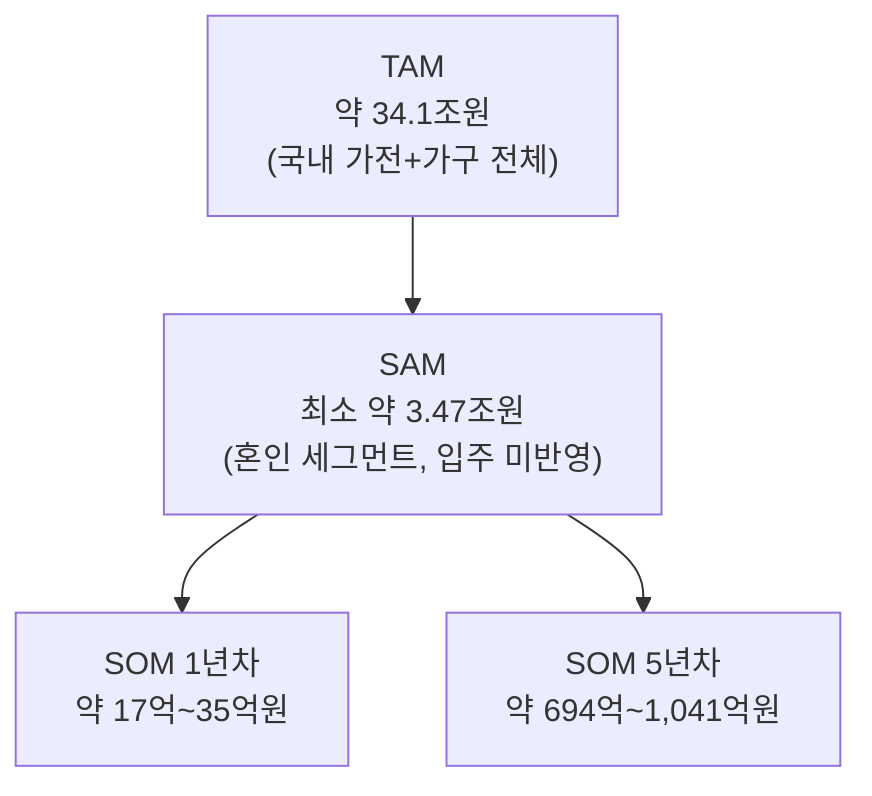

# 04. TAM·SAM·SOM 및 Market Segment Map — 미래지출 결제설계 서비스

> **분석 대상 기획서:** [`proposal/미래지출 결제설계 서비스 기획서 v0.1.md`](<../proposal/미래지출 결제설계 서비스 기획서 v0.1.md>)
> **방법론 참고:** [business-analysis-frameworks/04_TAM-SAM-SOM_마켓세그먼트/00_방법론.md](https://github.com/jennie-brain/business-analysis-frameworks/blob/main/04_TAM-SAM-SOM_%EB%A7%88%EC%BC%93%EC%84%B8%EA%B7%B8%EB%A8%BC%ED%8A%B8/00_%EB%B0%A9%EB%B2%95%EB%A1%A0.md)
> **입력:** [`01 - Porter's Five Forces 모델.md`](<./01 - Porter's Five Forces 모델.md>), [`02 - 기업 내부 활동의 가치사슬 분석.md`](<./02 - 기업 내부 활동의 가치사슬 분석.md>), [`03 - 핵심 성공 요인(KSFs) 분석.md`](<./03 - 핵심 성공 요인(KSFs) 분석.md>)
> **분석 기준일:** 2026-08-13
> **작성자 / 팀:** JENNIE / AI-PM-study

> **상태 표기**
> - **🟢** 공개 1차 자료 등으로 현재 확인된 사실
> - **🔷** 확인된 사실을 바탕으로 한 합리적 추론
> - **🟡** 추가 검증이 필요한 가설
> - **⬜** 아직 조사하지 않았거나 결론을 유보한 항목

### Decision Log

| 날짜 | 결정 | 이유 |
|---|---|---|
| 2026-08-13 | 방법론 원본의 "7단계 AI 협업 리서치" 중간 산출물(01~07)은 생략하고, 최종 종합(08번 파일 형식)에 해당하는 TAM·SAM·SOM·Market Segment Map만 작성 | 원본은 완전히 다른 시장(B2B 국경간 결제)을 대상으로 7단계 전체를 거쳤지만, 이 프로젝트는 이미 1~3단계에서 시장·차별점 정의가 끝나 있어 같은 절차를 반복할 필요가 없음 |
| 2026-08-13 | TAM은 "국내 가전+가구 전체 소비시장", SAM은 "혼인·입주 등 Life Event 기반 계획적 가전가구 지출"로 정의 | 기획서 자체가 §1.1에서 시장규모를 "핵심 Problem Evidence가 아니므로 우선순위를 낮춘다"고 명시했기 때문에, 존재하지 않는 공식 통계를 찾기보다 기획서의 Evidence(E-01, E-02)와 공개된 가전·가구 시장 통계를 조합한 상향식(bottom-up) 추정을 사용 |

---

## 요약

| 구분 | 정의 | 규모 | 근거 |
|---|---|---|---|
| TAM | 대한민국 가전·가구 전체 소비시장 | **약 34.1조원** | 공개 산업 리포트 🟢 |
| SAM | 혼인·입주 등 Life Event 기반 계획적 가전가구 지출 | **최소 약 3.47조원**(혼인만 반영, 입주 미포함) | 기획서 E-01 × 산업 통계, 상향식 산출 🟢🔷 |
| SOM | Beachhead(신혼) 중 초기 확보 가능한 몫 | 1년차 약 17억~35억원 → 5년차 약 694억~1,041억원 | 단계별 채택률 가정 🟡 |

---

## 1. TAM — 전체 시장

**정의**: 이 서비스가 결제설계 대상으로 다룰 수 있는 지출 카테고리(가전·가구)의 대한민국 전체 소비 규모. Life Event 여부와 무관하게, "결제수단을 비교·설계할 수 있는 모든 가전·가구 구매"를 상위 모수로 잡는다.

**근거**: Mordor Intelligence 산업 리포트 기준 한국 가전 시장은 2025년 약 113.4억 달러, 한국 가구 시장은 2024년 약 126억 달러(2025~2033년 연평균 3.42% 성장 전망)다. 2025년 가구 시장은 126억 달러 × 1.0342 ≈ 130.3억 달러로 추정한다. 환율은 1,400원/달러로 가정한다.

| 구분 | 금액(달러) | 원화 환산(1,400원 가정) |
|---|---|---|
| 가전 시장(2025) | 113.4억 달러 | 약 15.9조원 |
| 가구 시장(2025 추정) | 130.3억 달러 | 약 18.2조원 |
| **TAM 합계** | **243.7억 달러** | **약 34.1조원** |

**TAM = 약 34.1조원**

한계: 이 수치는 Life Event와 무관한 모든 가전·가구 소비(예: 노후 교체, 인테리어 리모델링)를 포함하므로, 이 서비스가 실제로 다루는 "계획적 고액지출"보다 넓은 상위 모수다. 가구 시장 2025년 수치도 2024년 실적에 성장률을 적용한 추정치다.

---

## 2. SAM — 서비스 가능 시장

**정의**: TAM 중에서도 "Life Event(혼인·입주 등)를 계기로 짧은 기간에 집중적으로 발생하는 계획적 가전·가구 지출"로 좁힌 시장. 기획서 §0 Beachhead Segment(신혼·입주 가전·가구 구매자) 정의와 일치시킨다.

### 2.1 혼인 세그먼트 (데이터 확보)

| 항목 | 수치 | 출처 |
|---|---|---|
| 2025년 혼인 건수 | 240,326건 | 국가데이터처(기획서 E-01) 🟢 |
| 혼당 평균 혼수 비용(가전·가구·침구 등, 예식·예단·예물·신혼여행 제외) | 1,445만원 | 듀오 「2026 결혼비용 실태보고서」(2025년 기준) 🟢 |
| **혼인 세그먼트 SAM** | **240,326건 × 1,445만원 ≈ 약 3.47조원** | 상향식 산출 🔷 |

기획서 E-02(결혼 1개월 전 카드 사용액 평균 약 227만원, 3~4개월 전부터 지출 증가)는 이 혼수 지출 중 어느 정도가 실제로 "카드 결제 + 사전 계획 가능한 기간"에 집중되는지를 보여주는 보조 지표로, 위 3.47조원과 상충하지 않고 오히려 뒷받침한다.

### 2.2 입주(비혼인 이사) 세그먼트 — ⬜ 데이터 공백

기획서의 Beachhead는 "신혼·입주"를 함께 지칭하지만, 혼인과 무관한 일반 이사(전월세 이동 등)로 인한 가전·가구 구매 규모는 연간 이사 건수에 대한 공식 통계를 확보하지 못해 정량화하지 못했다. 이사비용 견적 정보(건당 약 58만~수백만원, 포장이사 기준)는 확인했으나 이는 "이사 서비스 비용"이지 "이사로 유발되는 신규 가전·가구 구매액"이 아니므로 SAM에 직접 대입할 수 없다.

**SAM = 최소 약 3.47조원**(혼인 세그먼트만 반영한 보수적 하한치. 입주 세그먼트를 포함하면 이보다 클 것으로 추정되나 미확인)

---

## 3. SOM — 실제 확보 가능 시장

**정의**: SAM(혼인 세그먼트) 중 이 서비스가 초기에 실제로 확보할 수 있는 몫. 03단계 KSF #1(문제 인식·Trigger 포착력)이 지적했듯, 이 시장은 B2B 인프라 영업과 달리 **소비자가 스스로 서비스를 인지하고 써야 확보되는 시장**이라, 채택률을 단계별로 매우 보수적으로 가정한다.

| 시점 | 가정 채택률 | SOM(혼인 세그먼트 3.47조원 기준) |
|---|---|---|
| Phase 1(1년차) | 0.05~0.1%(Trigger 포착 채널 극소수, MVP 검증 단계) | 약 17억~35억원 |
| Phase 2(3년차) | 0.5~1% | 약 174억~347억원 |
| Phase 3(5년차) | 2~3% | 약 694억~1,041억원 |

이 채택률은 실측 데이터가 아니라 가정치다. 03단계에서 확인한 KSF 3(카드사·판매처 데이터 제휴)이 확보되지 않으면 Phase 1 채택률은 이보다 더 낮아질 수 있고, KSF 5(Event 이후 재사용 구조)가 검증되지 않으면 혼인이라는 1회성 이벤트 특성상 3~5년차로 갈수록 매년 "새로운 240,326쌍"을 매번 처음부터 다시 확보해야 하는 구조라는 점도 함께 감안해야 한다.

---

## 4. TAM → SAM → SOM 퍼널



TAM에서 SAM으로 좁힐 때는 "Life Event 기반 계획성" 여부가 기준이고, SAM에서 SOM으로 좁힐 때는 채택률(Trigger 포착·데이터 제휴 확보 정도, 03단계 KSF)이 기준이다.

---

## 5. Market Segment Map

### 5.1 세그먼트별 매트릭스

| Life Event | 지출 규모 | 계획성(Trigger 예측 가능성) | 데이터 확보 상태 |
|---|---|---|---|
| 혼인(결혼 준비) | 🟥 약 3.47조원 | 높음 — 예식일 기준 3~4개월 전부터 집중(기획서 E-02) | 🟢 확보 |
| 입주(비혼인 이사) | ⬜ 미확인 | 중간 — 계약일 기준 단기 집중 가능하나 혼인만큼 장기 준비되지 않을 수 있음 | ⬜ 공백(OQ-09) |
| 기타(여행·출산 등, §0 Product Vision 확장 대상) | ⬜ 미확인 | 낮음~중간 | ⬜ 미조사 |

### 5.2 전략적 포지셔닝

```mermaid
quadrantChart
    title 지출 규모 x 계획성(Trigger 포착 용이성)
    x-axis 지출 규모 작음 --> 지출 규모 큼
    y-axis 계획성 낮음 --> 계획성 높음
    quadrant-1 핵심 타겟(현재 Beachhead)
    quadrant-2 작지만 포착 쉬운 확장 후보
    quadrant-3 관찰만
    quadrant-4 크지만 포착 어려움
    "혼인(결혼 준비)": [0.75, 0.85]
    "입주(비혼인 이사)": [0.45, 0.5]
    "기타(여행·출산)": [0.3, 0.35]
```

혼인 세그먼트만 1사분면(핵심 타겟)에 명확히 위치한다 — 이는 기획서 §11.3 Decision Log가 "신혼·입주를 Beachhead로 설정"한 근거("다건·고액·계획형 소비가 집중되는 대표적 Event")와 일치한다. 다만 그 근거는 사실 **혼인** 쪽에서만 데이터로 뒷받침되고, **입주(비혼인 이사)** 는 아직 3사분면과 1사분면 경계의 추정치일 뿐이라는 점이 이번 단계에서 새로 드러난 공백이다.

### 5.3 세그먼트 요약

| 세그먼트 | 규모 | 우선순위 | 권고 액션 |
|---|---|---|---|
| 혼인(결혼 준비) | 약 3.47조원 | 1순위 | 현재 Beachhead 그대로 유지, SOM 목표(1~5년차)의 기준 세그먼트로 확정 |
| 입주(비혼인 이사) | 미확인 | 2순위(검증 필요) | 이사 건수·이사 유발 가전가구 구매액 통계 확보 후 Beachhead 포함 여부 재검토 |
| 기타(여행·출산 등) | 미확인 | 관찰 | §0 Product Vision상 장기 확장 후보로만 유지, 이번 SOM 산정에서 제외 |

---

## 6. 이전 단계와의 연결

- 03단계 KSF #1(문제 인식·Trigger 포착력)이 강조한 "계획성"은 이번 단계 Market Segment Map의 y축과 그대로 대응한다 — 혼인이 압도적으로 계획성이 높다는 정량 근거(E-02, 3~4개월 전부터 지출 집중)가 KSF #1의 우선순위를 다시 한번 뒷받침한다.
- 03단계 KSF #5(Event 이후 재사용 구조)의 리스크가 이번 단계 SOM 산정에서 구체적인 숫자로 드러났다 — 혼인은 매년 새로운 240,326쌍을 처음부터 다시 확보해야 하는 구조이므로, 5년차 SOM(694억~1,041억원)도 "누적 고객"이 아니라 "매년 새로 흘러들어오는 유량(flow)"에 가깝다.
- 03단계 KSF #3(카드사·판매처 데이터 제휴)이 확보되지 않으면 Phase 1 채택률(0.05~0.1%) 가정 자체가 더 낮아질 수 있다 — SOM은 KSF 3의 진척과 연동해서 다시 계산해야 한다.

---

## Open Questions (다음 단계로 이월)

| ID | 내용 | 관련 단계 |
|---|---|---|
| OQ-09 | 비혼인 이사(입주)로 인한 신규 가전·가구 구매 규모는 얼마나 되는가? (연간 이사 건수 통계 우선 확보 필요) | 5단계 Persona/CJM |
| OQ-10 | 혼인 세그먼트의 "매년 새 고객을 처음부터 확보해야 하는 구조"를 상쇄할 교차 세그먼트 확장(이사·여행 등)이 실제로 같은 앱·브랜드 안에서 자연스럽게 이어지는가? | 5단계 Persona, 6단계 Opportunity Score |
| OQ-11 | Phase 1 채택률(0.05~0.1%) 가정을 검증할 수 있는 유사 서비스(더쎈카드, 뱅크샐러드 등)의 실제 초기 전환율 벤치마크가 있는가? | 6단계 Opportunity Score |

## 참고자료

- 국가데이터처, 2025 혼인·이혼 통계 (기획서 E-01)
- 듀오, 「2026 결혼비용 실태보고서」— [beyondpost.co.kr](https://www.beyondpost.co.kr/view.php?ud=2026030616531765599aeda69934_30)
- Mordor Intelligence, 「한국 가전 시장 규모, 점유율, 동향 및 산업 보고서」— [mordorintelligence.kr](https://www.mordorintelligence.kr/industry-reports/south-korea-home-appliances-market-industry)
- Mordor Intelligence, 「한국 주요 가전제품 시장 규모 및 점유율」— [mordorintelligence.kr](https://www.mordorintelligence.kr/industry-reports/south-korea-major-home-appliances-market)
- H&I글로벌리서치, 「국내의 가구 시장 2025년-2033년」— [globalresearch.kr](https://www.globalresearch.kr/report/south-korea-furniture-market-report-imarc25jl121)
