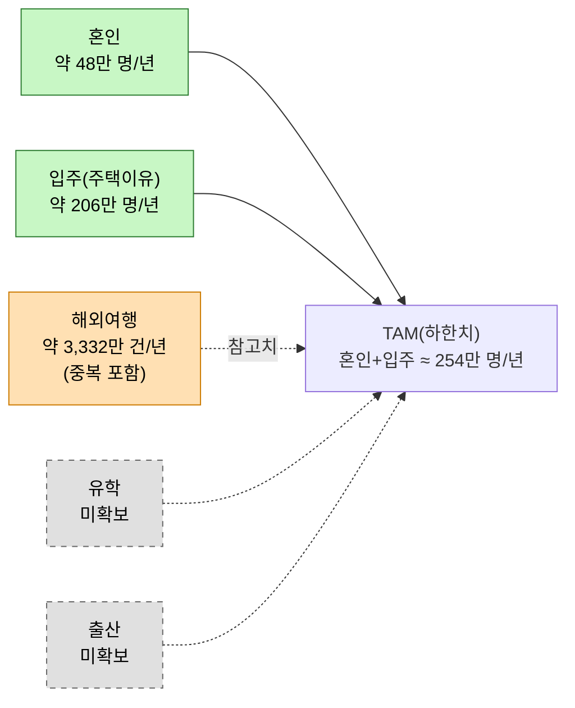
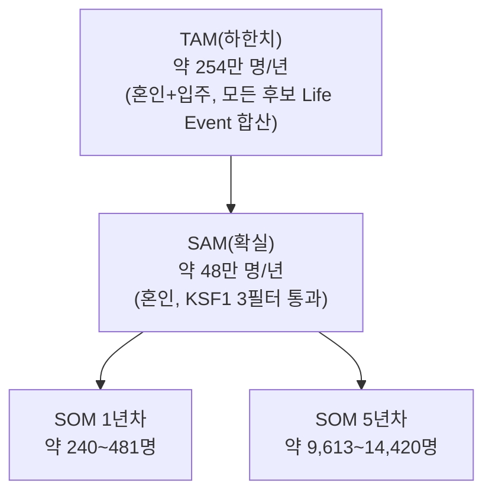

# 04. TAM·SAM·SOM 및 Market Segment Map — 미래지출 결제설계 서비스

> **분석 대상 기획서:** [`proposal/미래지출 결제설계 서비스 기획서 v0.1.md`](<../proposal/미래지출 결제설계 서비스 기획서 v0.1.md>)
> **방법론 참고:** [business-analysis-frameworks/04_TAM-SAM-SOM_마켓세그먼트/00_방법론.md](https://github.com/jennie-brain/business-analysis-frameworks/blob/main/04_TAM-SAM-SOM_%EB%A7%88%EC%BC%93%EC%84%B8%EA%B7%B8%EB%A8%BC%ED%8A%B8/00_%EB%B0%A9%EB%B2%95%EB%A1%A0.md)
> **입력:** [`01 - Porter's Five Forces 모델.md`](<./01 - Porter's Five Forces 모델.md>), [`02 - 기업 내부 활동의 가치사슬 분석.md`](<./02 - 기업 내부 활동의 가치사슬 분석.md>), [`03 - 핵심 성공 요인(KSFs) 분석.md`](<./03 - 핵심 성공 요인(KSFs) 분석.md>)
> **분석 기준일:** 2026-08-13
> **작성자 / 팀:** JENNIE / AI-PM-study

> **상태 표기**
> - **🟢** 공개 1차 자료 등으로 현재 확인된 사실
> - **🔷** 확인된 사실을 바탕으로 한 합리적 추론
> - **🟡** 추가 검증이 필요한 가설
> - **⬜** 아직 조사하지 않았거나 결론을 유보한 항목

### Decision Log

| 날짜 | 결정 | 이유 |
|---|---|---|
| 2026-08-13 | 방법론 원본의 "7단계 AI 협업 리서치" 중간 산출물(01~07)은 생략하고, 최종 종합(08번 파일 형식)만 작성 | 이 프로젝트는 이미 1~3단계에서 시장·차별점 정의가 끝나 있어 원본의 절차를 반복할 필요가 없음 |
| 2026-08-13 | TAM 단위를 "제품 카테고리 시장 규모(원화)"에서 **"연간 계획형 고액·다건 소비가 발생하는 카드 이용자 수(인원)"** 로 최종 변경 | 이 서비스는 가전·가구 판매업이 아니라 **카드 리밸런싱/결제설계 서비스**이므로, 시장 크기는 "카드 이용자가 몇 명인가"로 재야 한다. 원화(가전+가구 산업, 혼인 Job 지출액) 기준은 카테고리 매출과 착각될 위험이 있었음 |
| 2026-08-13 | TAM을 "혼인"이라는 단일 후보에서 **"모든 후보 Life Event(혼인·이사·여행·유학·출산)의 인원을 합산"** 하는 방식으로 확장 | 혼인만 데이터가 있다는 이유로 대표값처럼 써온 것을 재검토 — 실제로 인원 기준 재계산 결과 이사(주택 이유) 인구가 혼인의 4배 이상으로 나타나, 혼인 중심 프레이밍 자체가 데이터 편향이었을 가능성을 확인 |
| 2026-08-13 | Reference Market(기존 시장) 규모를 별도 슬롯(0장)으로 분리 | 1단계 Five Forces는 기존 시장의 구조(경쟁강도 등)만 다뤘고 규모(매출 등)는 다루지 않았음 — TAM과의 비교 기준점으로 필요 |

---

## 0. Reference Market — 기존 개인화 카드 비교·추천·최적화 서비스

01단계 §0.1의 "넓은 기존 산업"과 동일 대상이다. 이 시장의 **구조**는 1단계에서 이미 분석했으므로, 여기서는 **규모**만 확인한다.

| 지표 | 값 | 출처 |
|---|---|---|
| 뱅크샐러드 2025년 매출 | 260억원(전년 147억원 대비 +77%) | 플래텀, ZDNet Korea |
| 뱅크샐러드 MAU 성장률 | 전년 대비 +22% | 스포츠경향 |
| 뱅크샐러드 ARPU 성장률 | 전년 대비 +25% | 스포츠경향 |

**시사점**: 이 시장의 선두 업체조차 매출 규모 자체는 크지 않다(260억원). 카드 추천·비교 서비스의 수익화 단위는 "총 소비액의 일부"가 아니라 "리드/전환당 수수료"에 가깝다는 뜻이며, 이는 TAM/SAM/SOM을 원화(소비액) 대신 인원(카드 이용자 수) 기준으로 잡아야 하는 이유와도 맞닿아 있다.

---

## 1. TAM — 연간 계획형 고액·다건 소비가 발생하는 카드 이용자

**정의**: "1년 동안, 계획 가능한 고액·다건 지출 상황을 실제로 겪는 카드 이용자 수." 혼인 하나로 한정하지 않고 후보가 될 수 있는 모든 Life Event를 합산한다. "언젠가는 누구나 겪을 수 있다"는 잠재치가 아니라, **연간 기준으로 실제 발생하는 인원**으로 한정해 Reference Market(전체 카드 이용자)과 구분되게 만든다.

### 1.1 후보 Life Event별 인원

| Life Event | 연간 인원(개인 기준) | 산출 근거 | 상태 |
|---|---|---|---|
| 혼인(결혼 준비) | 약 48만 명 | 240,326건(국가데이터처, 기획서 E-01) × 2명 | 🟢 |
| 입주(비혼인 이사, 주택 이유) | 약 206만 명 | 국내인구이동자 611.8만 명(2025, 국가데이터처) × 주된 사유 "주택" 33.7% | 🟢 |
| 해외여행 | 연간 약 3,332만 건(출국 기준, **중복 포함**) | 833.1만 명(2026 Q1 출국자) × 4 근사 연환산 | 🟡(중복·계절성 미보정) |
| 유학 | ⬜ 미확보 | — | ⬜ |
| 출산 | ⬜ 미확보 | — | ⬜ |



**TAM(하한치) = 약 254만 명/년**(혼인 48만 + 입주 206만. 해외여행은 단위가 달라 별도 참고치, 유학·출산은 데이터 없어 미반영)

한계: 이사(주택 이유) 인구가 혼인의 4배가 넘는다는 것은, 지금까지 혼인을 중심 세그먼트처럼 다룬 것이 **데이터 확보 편의성에 따른 편향**일 수 있음을 보여준다 — 인원만 보면 입주가 더 큰 시장일 가능성이 있다(단, 1인당 지출강도는 아직 모름 → 2장·5장에서 다룬다). 해외여행은 "건수"라 인원과 단순 합산하면 중복집계 위험이 커서 TAM 합계에는 넣지 않고 별도 표기했다.

---

## 2. SAM — 카드결제 최적화가 실제 유효한 인원

**정의**: TAM 중에서도 03단계 KSF #1의 3필터(①카드결제 대상 ②외부 감지 가능성 ③비교 유인 크기)를 통과하는 인원만 남긴다.

| Life Event | ① 카드결제 대상 | ② 외부 감지 가능성 | ③ 비교 유인(1인당 지출강도) | 판정 |
|---|---|---|---|---|
| 혼인 | 🟢 가전·가구 등 카드결제 가능 | 🟢 웨딩업체 계약이 외부 신호 | 🟢 약 722.5만원/인(혼수 1,445만원÷2) | **통과 — SAM 포함** |
| 입주(주택이유) | 🔷 가전·가구 신규구입 시 카드결제 가능(추정) | 🟡 부동산 계약일은 신호가 되나, 웨딩업체처럼 단일화된 제휴 채널이 없고 중개소가 파편화됨 | ⬜ 1인당 지출강도 데이터 없음 | **부분 통과 — 조건부 포함, 신뢰도 낮음** |
| 해외여행 | 🟢 여행경비 카드결제 매우 흔함 | 🟡 항공권 예약이 신호가 될 수 있으나 OTA 제휴 필요 | 🔷 약 102만원/건(해외카드사용 총액÷출국건수 역산, 정밀도 낮음) | **부분 통과 — stakes가 혼인보다 낮음** |
| 유학·출산 | ⬜ | ⬜ | ⬜ | 판단 보류 |

**SAM(확실) = 약 48만 명/년**(혼인만, 3필터 모두 확인됨)
**SAM(상한, 참고치) = 약 254만 명/년**(입주 포함 시. 다만 입주는 ③번 필터가 미확인이라 신뢰도가 낮다)

---

## 3. SOM — Beachhead(혼인) 채택률

**정의**: SAM(확실, 48만 명) 중 이 서비스가 초기에 실제로 확보할 수 있는 인원. 매년 새로운 48만 명이 유입되는 **유량(flow) 시장**이라는 점(03단계 KSF #5, 5장에서 재확인)을 전제로 한다.

| 시점 | 가정 채택률 | SOM(인원, 연간 신규) |
|---|---|---|
| Phase 1(1년차) | 0.05~0.1% | 약 240~481명 |
| Phase 2(3년차) | 0.5~1% | 약 2,403~4,807명 |
| Phase 3(5년차) | 2~3% | 약 9,613~14,420명 |

**참고 — 영향 거래액(GMV) 추정**: 위 SOM 인원 × 1인당 혼수지출(722.5만원)을 곱하면 "이 서비스가 결제설계에 영향을 준 거래액"은 1년차 약 17억~35억원, 5년차 약 694억~1,041억원 규모다. 다만 이 서비스의 BM이 0장에서 확인한 리드/전환당 수수료 구조(예: Credit Karma형)라면, **실제 매출은 이 거래액의 일부가 아니라 "1인당 수수료 × SOM 인원"으로 별도 계산해야 한다** — 1인당 수수료 가정치가 아직 없어 이번 단계에서는 산정하지 않고 Open Question(OQ-15)으로 남긴다.

---

## 4. TAM → SAM → SOM 퍼널



TAM에서 SAM으로 좁힐 때는 **KSF1의 3필터**(카드결제 대상·감지가능성·비교유인)가 기준이고, SAM에서 SOM으로 좁힐 때는 **채택률**(Trigger 포착·데이터 제휴, 03단계 KSF)이 기준이다.

---

## 5. Market Segment Map — 빈도(인원) × 강도(1인당 지출)

혼인을 중심에 놓기 전에, 후보 Life Event를 "얼마나 많은 사람이 겪는가(빈도)"와 "1인당 얼마를 쓰는가(강도)" 두 축으로 먼저 비교한다.

### 5.1 매트릭스

| Life Event | 빈도(연간 인원) | 강도(1인당 지출) | 계획성 | 데이터 상태 |
|---|---|---|---|---|
| 혼인 | 🟧 약 48만 명 | 🟥 약 722.5만원 | 높음(E-02, 3~4개월 전부터 집중) | 🟢 완전 확보 |
| 입주(주택이유) | 🟥 약 206만 명 | ⬜ 미확보 | 중간(계약일 기준이나 혼인보다 준비기간 짧을 가능성) | 🟡 빈도만 확보 |
| 해외여행 | 🟥 약 3,332만 건 | 🟨 약 102만원(정밀도 낮음) | 낮음~중간(항공권 예약 시점은 짧음) | 🟡 부분 확보 |
| 유학 | ⬜ 미확보 | ⬜ 미확보 | 높음(준비기간 길 것으로 추정) | ⬜ 미조사 |
| 출산 | ⬜ 미확보 | ⬜ 미확보 | 중간 | ⬜ 미조사 |

### 5.2 전략적 포지셔닝

```mermaid
quadrantChart
    title 빈도(연간 인원) x 강도(1인당 지출)
    x-axis 빈도 낮음 --> 빈도 높음
    y-axis 강도 낮음 --> 강도 높음
    quadrant-1 핵심 타겟(빈도·강도 모두 큼)
    quadrant-2 소수 고가치 고객(현재 Beachhead)
    quadrant-3 관찰만
    quadrant-4 다수 저가치(효율화 필요)
    "혼인": [0.35, 0.9]
    "입주(주택이유)": [0.75, 0.45]
    "해외여행": [0.95, 0.35]
```

**혼인은 2사분면("소수 고가치")에 위치한다** — 지금까지 이 서비스가 혼인에 집중한 것은 "가장 큰 시장"이어서가 아니라 "1인당 stakes가 가장 크고 데이터가 확보된" 시장이었기 때문이다. **입주(주택이유)는 빈도만 보면 1사분면에 가깝지만, 강도(1인당 지출)를 아직 모르기 때문에 좌표가 불확실하다** — 이것이 바로 OQ-09/OQ-16이 우선순위인 이유다. 해외여행은 건수는 압도적으로 많지만 1건당 stakes가 상대적으로 작아 4사분면에 가깝다.

### 5.3 세그먼트 요약

| 세그먼트 | 우선순위 | 권고 액션 |
|---|---|---|
| 혼인 | 1순위(현재 Beachhead) | 데이터가 확실하고 stakes가 커서 그대로 유지. SOM 목표의 기준 세그먼트 |
| 입주(주택이유) | 2순위(잠재적 1순위) | **1인당 지출강도 데이터만 확보되면 혼인을 능가하는 핵심 세그먼트로 격상될 가능성** — 가장 시급한 리서치 과제(OQ-16) |
| 해외여행 | 3순위 | 빈도는 크나 stakes가 작아 별도 저가치·고빈도 상품(예: 해외여행 전용 카드 추천)으로 분리 검토 |
| 유학·출산 | 관찰 | 데이터 확보 전까지 판단 보류 |

---

## 6. 이전 단계와의 연결

- 01단계에서 정리한 "넓은 층위 + 좁은 층위" 원칙이 이번 단계에서는 **"인원(TAM/SAM) + 지출강도(Segment Map 보조축)"** 로 구체화됐다 — 01은 "산업"을, 04는 "인원"을 넓히는 축으로 썼다는 점에서 프레임워크마다 넓히는 축이 다르다는 교훈이 다시 확인된다.
- 03단계 KSF #1의 3필터가 이번 단계 SAM 산정의 실제 기준으로 그대로 쓰였다 — 분석에서 전략으로, 전략에서 다시 시장 규모 추정으로 이어지는 연결이 성립한다.
- 03단계 KSF #5(Event 이후 재사용 구조)의 "유량(flow) 시장"이라는 특성이 이번 단계 SOM에서 "연간 신규 인원"이라는 형태로 재확인됐다.
- 5.2 포지셔닝 지도는 3단계 "우선순위 지도"와 같은 방식(quadrantChart)을 다른 축(빈도×강도)에 적용한 것이다.

---

## Open Questions (다음 단계로 이월)

| ID | 내용 | 관련 단계 |
|---|---|---|
| OQ-09 | 비혼인 이사(입주)로 인한 신규 가전·가구 구매 규모(1인당 지출강도)는 얼마나 되는가? | 5단계 Persona/CJM |
| OQ-10 | 혼인 세그먼트의 "매년 새 고객을 처음부터 확보해야 하는 구조"를 상쇄할 교차 세그먼트 확장이 실제로 이어지는가? | 5단계 Persona, 6단계 Opportunity Score |
| OQ-11 | Phase 1 채택률(0.05~0.1%) 가정을 검증할 수 있는 유사 서비스의 실제 초기 전환율 벤치마크가 있는가? | 6단계 Opportunity Score |
| OQ-15 | 이 서비스의 BM이 리드/전환당 수수료 구조라면, 1인당 평균 수수료(ARPU) 가정치는 얼마로 잡아야 하는가? | 6단계 Opportunity Score, 7.2 Business Model 재검토 |
| OQ-16 | **입주(주택이유) 세그먼트의 1인당 지출강도 데이터를 확보할 수 있는가?** — 확보되면 Beachhead 재검토가 필요할 정도로 중요한 질문 | 5단계 Persona/CJM (최우선) |

## 참고자료

- 국가데이터처, 2025 혼인·이혼 통계 (기획서 E-01)
- 국가데이터처, 2025년 국내인구이동통계 — [korea.kr](https://www.korea.kr/archive/expDocView.do?docId=41555)
- 듀오, 「2026 결혼비용 실태보고서」— [beyondpost.co.kr](https://www.beyondpost.co.kr/view.php?ud=2026030616531765599aeda69934_30)
- 뱅크샐러드 2025년 매출 260억원 — [platum.kr](https://platum.kr/archives/284579), [zdnet.co.kr](https://zdnet.co.kr/view/?no=20260401095412)
- 국내 거주자 해외 카드사용액·출국자수(2026 Q1) — [sedaily.com](https://www.sedaily.com/article/20052533)
