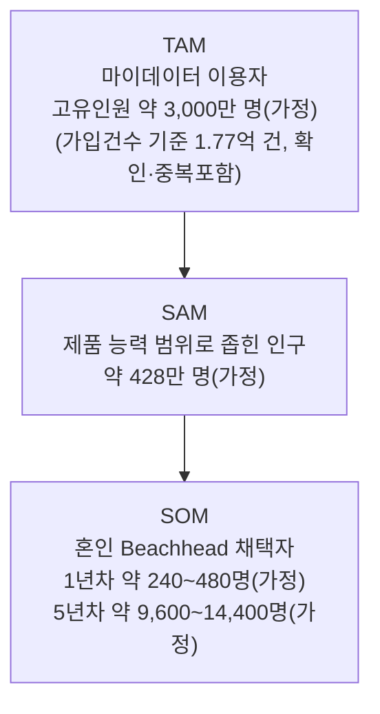
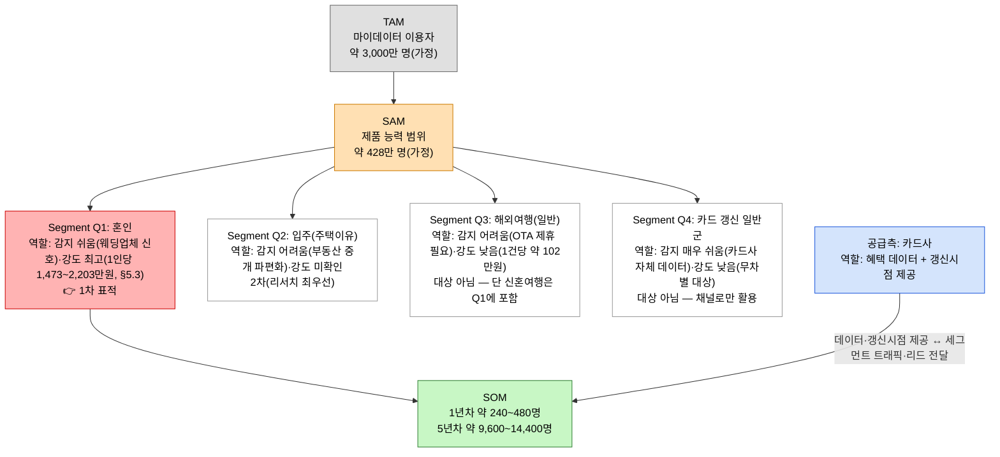

# 04. TAM·SAM·SOM 및 Market Segment Map — 미래지출 결제설계 서비스

> **분석 대상 기획서:** [`proposal/미래지출 결제설계 서비스 기획서 v0.1.md`](<../../proposal/미래지출 결제설계 서비스 기획서 v0.1.md>)
> **방법론:** 이 챕터는 사용자가 제공한 TAM·SAM·SOM 규격 문서(세 개의 동심원 원칙, Segment Map 다이어그램 규칙, (확인)/(추정)/(가정) 표기)를 그대로 따른다.
> **리서치 원본:** [`리서치-원본/`](<./리서치-원본>) — 01-혼인_결혼비용.md, 02-인구이동_이사.md, 03-카드시장_레퍼런스마켓.md
> **입력:** [`01_Porters_Five_Forces_모델.md`](<../01_Porters_Five_Forces_모델/01_Porters_Five_Forces_모델.md>), [`01_가치사슬_분석.md`](<../02_가치사슬_분석/01_가치사슬_분석.md>), [`01_핵심성공요인_분석.md`](<../03_핵심성공요인_분석/01_핵심성공요인_분석.md>)
> **분석 기준일:** 2026-08-13
> **Decision Log:** [`00_Decision_Log.md`](<./00_Decision_Log.md>)

---

## 0. 분석 단위와 전제

| 항목 | 내용 |
|---|---|
| 사업 주체 | 미래지출 결제설계 서비스(신규 진입자로 가정) |
| 사업 모델 | 카드사·판매처 데이터 제휴 기반 리드/트래픽 매칭 — 발급 실행 없음(기획서 §10.3, 03-1 Credit Karma 사례형) |
| 지역·시점 | 대한민국. TAM·SAM은 자격을 가진 전체 모수(stock), SOM만 연간(flow) |
| 근거 리서치 | [`리서치-원본/`](<./리서치-원본>) 3개 파일 |

> ⚠️ **측정 대상과 단위**: TAM·SAM·SOM 모두 **개인(명)** 을 센다. TAM·SAM은 "이 JTBD를 가질 자격이 있는 인구(특정 시점의 stock)"이고, SOM만 "연간 실제로 Beachhead 상황에 놓이는 인구(flow)"다 — SOM에서 시간축이 다시 살아난다는 점을 §4에서 명시한다.

---

## 1. 전체 구조도

- TAM: 마이데이터 가입건수 1억 7,734만 건(확인, 2025.10, 중복포함) → 고유인원 약 3,000만 명(가정, dedup 비율 미확인) — 근거: [`03-카드시장_레퍼런스마켓.md`](<./리서치-원본/03-카드시장_레퍼런스마켓.md>)
- SAM: TAM × 카드결제사용자 비율(가정 95%) × 제휴 카드사 시장점유율(가정 15%)
- SOM: 혼인 연간 발생 인원 약 48만 명(추정, SAM에 포함되는 부분집합) × 03단계 채택률 가정

---

## 2. TAM — Total Addressable Market

**정의**: 핵심 JTBD("미래 예정 고액지출에 카드를 어떻게 배분할지 결정하고 싶다")를 가질 자격이 있는 전체 인구 중, 이 서비스가 데이터로 접근할 수 있는 경로(마이데이터 연동 또는 직접입력)를 가진 인구. **일단 "마이데이터 이용자"로 정의한다** — 비마이데이터 이용자·평소 니즈가 없는 잠재군은 이번 단계에서 TAM 밖으로 둔다(향후 확장 후보로 남김).

| 항목 | 값 | 상태 |
|---|---|---|
| 마이데이터 가입건수(2025.10) | 1억 7,734만 건 | (확인) — 단, 검색 결과 자체가 "중복 포함"을 명시 |
| 1인당 평균 가입 사업자 수 | 미확인 | (가정 불가 — dedup 비율 데이터 없음) |
| **TAM(고유인원)** | **약 3,000만 명** | (가정 — 대한민국 성인 인구 다수가 최소 1곳 이상 마이데이터를 이용한다고 가정) |

한계: 이 3,000만 명은 실측 dedup 값이 아니라 가정이다 — 정확한 고유 이용자 수는 금융위원회·신용정보원 1차 통계로 재확인해야 한다(OQ-20). 또한 TAM을 마이데이터 이용자로 한정한 것 자체가 "비마이데이터 이용자·직접입력만으로 충분한 사용자"를 배제하므로, 이 TAM은 실제보다 좁을 수 있다.

---

## 3. SAM — Serviceable Available Market

**정의**: TAM(마이데이터 이용자) 중 이 서비스의 **현재 데이터·기능 범위**로 실제 해결 가능한 부분. 좁히는 기준은 아래 필터다.

| 필터 | 기준 | 값 | 상태 |
|---|---|---|---|
| 지역 | 대한민국 | TAM 전체가 이미 국내 기준 | — |
| 카드 결제 사용자 | 마이데이터 이용자 중 신용·체크카드를 실제 보유·사용하는 비율 | 95% | (가정 — 마이데이터 이용 목적 자체가 대부분 카드·계좌 통합관리라 카드보유율이 매우 높을 것으로 추정) |
| 미래 소비계획 입력 가능 | 앱 자체 기능이라 전원 충족 | 100% | (가정) |
| 지원하는 카드/가맹점 범위 | 제휴 카드사 시장점유율 | 15% | (가정 — 03단계·이전 버전에서 도입한 값 재사용) |
| 마이데이터 또는 직접입력 가능 | TAM 정의상 이미 충족 | 100% | — |

**SAM = 3,000만 명 × 95% × 15% ≈ 약 428만 명(가정)**

한계: 95%(카드보유율)와 15%(제휴 점유율) 둘 다 실측치가 아니다. 특히 15%는 아직 어느 카드사와도 제휴가 성사되지 않은 상태의 가정이라, 실제 SAM은 0(제휴 실패 시)부터 훨씬 커질 수 있는 범위를 갖는다.

---

## 4. SOM — Serviceable Obtainable Market

**정의**: SAM(428만 명, stock) 중 **초기 유통채널로 실제 확보할 Beachhead** — "결혼·신혼집·입주를 앞두고 예식·신혼여행·가전·가구를 **여러 업종에 걸쳐 다건·고액** 구매하고 카드 혜택을 적극 비교하는 사람." 여기서 처음으로 **연간(flow)** 시간축이 들어간다. (업종·시점 분산이 이 세그먼트의 정의적 특징이라는 근거는 §5.3)

| 항목 | 값 | 상태 |
|---|---|---|
| Beachhead 연간 발생 인원(혼인) | 약 48만 명/년 | (추정 — 240,326건×2, SAM 428만 명에 포함되는 부분집합) |

| 시점 | 가정 채택률 | SOM(연간 신규) | 상태 |
|---|---|---|---|
| Phase 1(1년차) | 0.05~0.1% | 약 240~480명 | (가정) |
| Phase 2(3년차) | 0.5~1% | 약 2,400~4,800명 | (가정) |
| Phase 3(5년차) | 2~3% | 약 9,600~14,400명 | (가정) |

이 채택률의 근거 없음을 숨기지 않는다 — 03단계에서 도입한 값을 그대로 재사용했다. SAM(428만 명)이 SOM(1만 명대)보다 훨씬 크다는 것은, **SAM의 크기 자체가 SOM의 병목이 아니라는 뜻이다** — 진짜 병목은 03단계 KSF #1(Trigger 포착)과 KSF #3(카드사 제휴)의 실행이다.

---

## 5. Market Segment Map

> ⚠️ **이 사분면은 사건의 전체 목록이 아니다.** Q1~Q4는 이번 리서치로 **데이터를 구할 수 있었던** 사건일 뿐, 서비스의 대상 범위가 아니다. 03단계는 KSF #1을 "문제 인식(결혼·입주 Trigger)"이 아니라 **"결제구조 전환점 포착력"** 으로 정의했고, 기획서 §2.2도 "결혼·입주·이사 **등** Life Event"로 예시 열거만 했다. 자녀 입학·학원, 유학, 출산, 은퇴 등도 같은 JTBD를 발생시키며, 특히 **소비가 감소하는 사건(유학·은퇴)은 지출 방향 자체가 반대라 별도 설계가 필요**하다 — 사건을 이름이 아니라 지출 변화의 형태로 분류한 정리는 [`08-1 §1`](<../08_가치제안서_VPS/02_차별화된_서비스_가치선언문.md>)에 있다(OQ-50, OQ-51).
>
> **혼인을 1차 표적으로 고른 이유는 그 사건이 본질적으로 중요해서가 아니라, 1인당 지출강도(§5.3)와 감지 신호(웨딩업체)를 동시에 확인할 수 있는 유일한 사건이었기 때문이다.** Beachhead의 정의가 그렇듯, 이는 "먼저 이길 시장"이지 "우리 시장의 전부"가 아니다.

### 5.1 두 축

- **X축 — Trigger 감지 가능성**: 카드사·서비스가 외부 제휴 없이도 이 상황을 감지할 수 있는가 (낮음 → 높음)
- **Y축 — 1인당 지출 강도**: 이 상황에서 카드 리밸런싱이 만들어내는 1인당 가치(고액지출 규모)가 큰가 (낮음 → 높음)

이 지도는 SAM(428만 명) 안에서 "어떤 상황(세그먼트)에 먼저 집중할 것인가"를 보여준다 — TAM·SAM 자체를 쪼개는 게 아니라, SAM 내부의 이질적인 하위 집단을 나눈다.

### 5.2 사분면 및 우선순위

**1차 표적은 Q1(혼인) 하나로 좁힌다.** Q2(입주)는 강도 데이터만 확보되면 Q1을 능가할 수 있는 후보라 리서치 우선순위 1위다. **Q4(카드 갱신 일반군)는 세그먼트가 아니라 채널이다** — 감지는 가장 쉽지만 대상을 좁히지 않으면 강도가 낮아 비효율적이다. 공급측(카드사)→SOM 화살표가 사업 모델이다: 카드사가 혜택 데이터·갱신 시점 접점을 제공하고, 그 대가로 세그먼트 트래픽·리드를 돌려받는다(03-1 Credit Karma형).

### 5.3 Q1(혼인) 지출강도 재분해 — 항목별·카드결제 대상 기준

초판은 Q1의 강도를 **혼수(1,445만원÷2 = 722.5만원)** 만으로 계산했다. 그러나 혼수는 결혼비용 5,912만원(주택자금 제외)의 **24%에 불과**하다. 나머지 76%를 항목별로 되살리고, 여기에 03단계 KSF #1의 필터 ①**카드결제 대상**을 적용한다.

| 항목 | 금액(커플) | 지출 발생 원인 | 카드결제 적합성 |
|---|---|---|---|
| 예식홀 | 1,460만원 | 혼인 | 🟡 조건부(업체별 수납 관행 상이) |
| 웨딩패키지(스드메) | 471만원 | 혼인 | 🔷 높음 |
| 신혼여행 | 1,030만원 | 혼인 | 🟢 매우 높음(항공·호텔·해외결제) |
| 예단 | 763만원 | 혼인 | 🟡 낮음(현금 송금 관행) |
| 예물 | 588만원 | 혼인 | 🟡 낮음(귀금속 현금할인 관행) |
| 이바지 | 155만원 | 혼인 | 🔷 중간 |
| 혼수(가전·가구) | 1,445만원 | **입주(신규 가구 형성)** | 🟢 매우 높음 |

| 구간 | 포함 항목 | 커플 합계 | **1인당** |
|---|---|---|---|
| 카드결제 확실 | 신혼여행 + 혼수 + 웨딩패키지 | 2,946만원 | **1,473만원** |
| 확실 + 조건부 | 위 + 예식홀 | 4,406만원 | **2,203만원** |
| (참고) 현금 관행 — 제외 | 예단 + 예물 | 1,351만원 | 675.5만원 |

**세 가지 시사점**:

1. **초판은 Q1을 2~3배 과소평가하고 있었다** — 722.5만원이 아니라 1,473~2,203만원이다. "강도 최고"라는 판정 자체는 유지되지만, 그 근거가 훨씬 두꺼워졌다.
2. **혼인 지출은 업종·시점이 분산된 다건 고액지출이다** — 예식장(서비스업)·가전(전자상가)·가구·항공/호텔(해외결제)로 업종이 흩어지고, 예식(D-day 고정)·신혼여행(예식 직후)·혼수(입주 시점)로 시점도 흩어진다. 단일 카테고리 지출이었다면 카드 한 장으로 끝날 문제가, 이 구조 때문에 **카드 배분 문제로 남는다**(03단계 KSF #4·06단계 C1-P2의 구조적 원인).
3. **예단·예물(1,351만원)은 애초에 이 서비스의 대상 시장이 아니다** — 03단계 필터 ①을 혼인 세그먼트에 적용한 첫 사례다.

> ⚠️ **한계 두 가지**: (a) 항목별 카드결제 적합성(🟡 표기 항목)은 관행에 대한 추론이며 1차 통계로 확인하지 않았다(OQ-44). (b) 듀오는 결혼정보회사 표본이라 관혼상제 관행을 따르는 응답자로 치우쳤을 수 있다 — 다만 그 편향이 가장 클 항목(예단·예물)은 어차피 카드 대상에서 제외되므로, 위 1,473만원 추정에는 보수적으로 작용한다.

---

## 6. 수치 검증 메모

| 수치 | 값 | 리서치 원본 위치 | 상태 |
|---|---|---|---|
| 마이데이터 가입건수 | 1억 7,734만 건(2025.10, 중복포함) | [`03-카드시장_레퍼런스마켓.md`](<./리서치-원본/03-카드시장_레퍼런스마켓.md>) | (확인) |
| TAM 고유인원 | 약 3,000만 명 | 위와 동일, dedup 비율은 가정 | (가정) — OQ-20 |
| 카드결제사용자 비율 | 95% | 1차 통계 미확인 | (가정) |
| 제휴 카드사 점유율 | 15% | 1차 통계 미확인 | (가정) — OQ-18 |
| 혼인 건수 | 240,326건 | 기획서 E-01(국가데이터처) | (확인) |
| 혼인 Beachhead 인원 환산 | 약 48만 명 | 240,326×2 | (추정) |
| 혼인 1인당 혼수지출 | 722.5만원 | [`01-혼인_결혼비용.md`](<./리서치-원본/01-혼인_결혼비용.md>) 1,445만÷2 | (추정) — **혼수 항목만**, Q1 강도로는 부적절(§5.3에서 교체) |
| **혼인 1인당 카드결제 대상 지출** | **1,473만원**(확실) / **2,203만원**(조건부 포함) | 위 원본의 항목별 분해 + 03단계 필터 ① 적용(§5.3) | (추정) — 카드결제 적합성 판단은 관행 추론, OQ-44 |
| 결혼비용 총계(주택자금 제외) | 5,912만원 | [`01-혼인_결혼비용.md`](<./리서치-원본/01-혼인_결혼비용.md>) 듀오 2026 | (확인) |
| 신혼여행 지출 | 1,030만원 | 위와 동일 — 일반 해외여행(약 102만원)의 약 10배 | (확인) |
| 입주 인원(주택이유) | 약 206만 명 | [`02-인구이동_이사.md`](<./리서치-원본/02-인구이동_이사.md>) 611.8만×33.7% | (추정) |
| SOM 채택률 | 0.05~3% | 03단계에서 이미 도입한 값 재사용 | (가정) |
| 카드 유효기간 | 5년 | [`03-카드시장_레퍼런스마켓.md`](<./리서치-원본/03-카드시장_레퍼런스마켓.md>) | (확인) |

---

## 7. 다음 단계로 넘기는 질문

| ID | 내용 | 관련 단계 |
|---|---|---|
| OQ-20 | 마이데이터 고유 이용자 수(중복 제외)는 실제로 얼마인가? TAM(3,000만 명 가정)의 신뢰도를 좌우하는 가장 시급한 질문 | 5단계 Persona, 6단계 Opportunity Score — 최우선 |
| OQ-16 | 입주(주택이유) 세그먼트의 1인당 지출강도 데이터를 확보할 수 있는가? | 5단계 Persona/CJM |
| OQ-18 | 실제 제휴 가능한 카드사와 그 시장점유율은 얼마인가? (SAM의 15% 가정을 실측치로 교체) | 3단계 KSF #3 실행 |
| OQ-15 | 이 서비스의 BM이 리드/전환당 수수료 구조라면, 1인당 평균 수수료(ARPU) 가정치는 얼마로 잡아야 하는가? | 6단계 Opportunity Score |
| OQ-19 | 카드 갱신 시점을 실제 Trigger 채널로 쓸 경우, 카드사가 이 접점을 제3자 서비스에 열어줄 유인이 있는가? | 3단계 KSF #3 |
| OQ-44 | 혼인 지출 항목별 실제 카드결제 비율은 얼마인가? (§5.3의 예식홀 조건부·예단/예물 현금 관행은 추론이며 1차 통계 미확인 — 이 비율이 Q1 강도 1,473만원/2,203만원 중 어느 쪽에 가까운지를 결정한다) | 7단계 JTBD 인터뷰 |
| OQ-45 | 신혼여행(1,030만원)의 결제 설계를 별도 기능으로 다룰 가치가 있는가? (해외결제·환율·항공 마일리지가 국내 가전·가구와 최적 카드가 다를 가능성) | 8단계 VPS Job-Feature Map |
