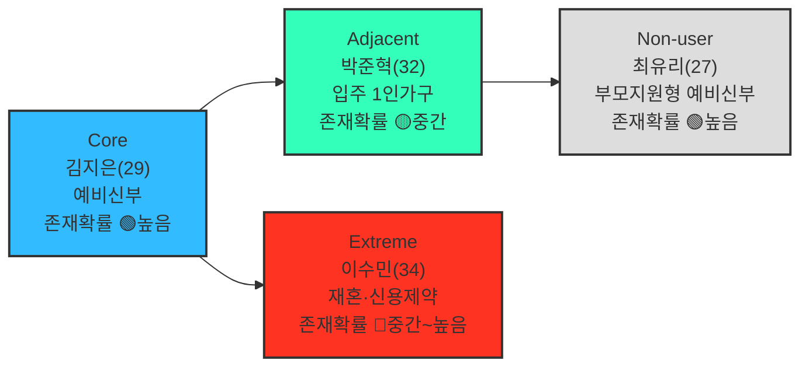
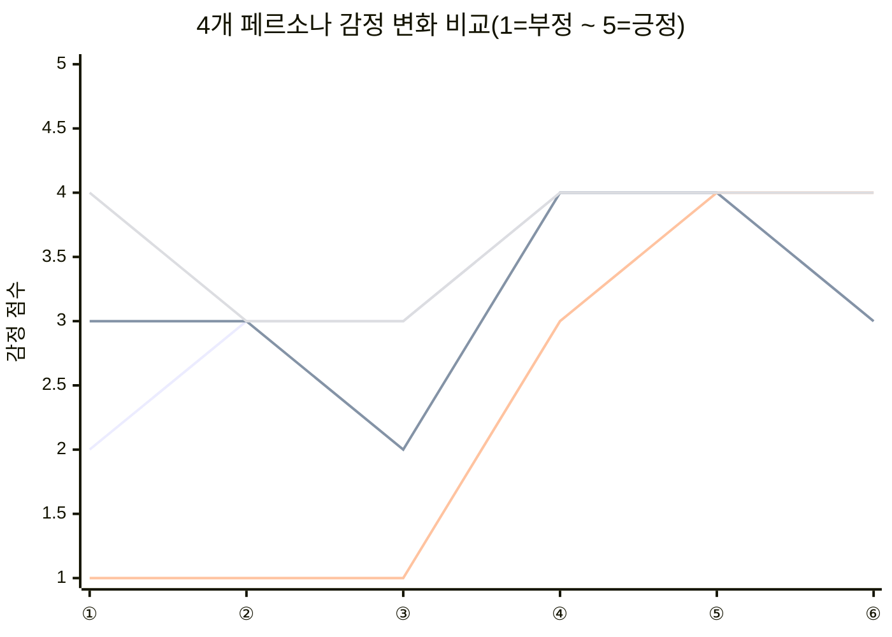

# 05. 페르소나, 페르소나 스펙트럼, 고객 여정지도 — 미래지출 결제설계 서비스

> **분석 대상 기획서:** [`proposal/미래지출 결제설계 서비스 기획서 v0.1.md`](<../proposal/미래지출 결제설계 서비스 기획서 v0.1.md>)
> **방법론 참고:** [business-analysis-frameworks/05_페르소나_고객여정지도/00_방법론.md](https://github.com/jennie-brain/business-analysis-frameworks/blob/main/05_%ED%8E%98%EB%A5%B4%EC%88%98%EB%98%98_%EA%B3%A0%EA%B0%9D%EC%97%AC%EC%A0%95%EC%A7%80%EB%8F%84/00_%EB%B0%A9%EB%B2%95%EB%A1%A0.md)
> **입력:** [`01`](<./01 - Porter's Five Forces 모델.md>), [`02`](<./02 - 기업 내부 활동의 가치사슬 분석.md>), [`03`](<./03 - 핵심 성공 요인(KSFs) 분석.md>), [`04`](<./04 - TAM-SAM-SOM 과 Market Segment Map.md>)
> **분석 기준일:** 2026-08-13
> **작성자 / 팀:** JENNIE / AI-PM-study

> **상태 표기** — 페르소나·CJM은 전부 가상 인물/시나리오다. 이름·나이·직무·구체 수치는 모두 가설(🟡)이며, 각 페르소나가 대응하는 **문제(Problem)와 마찰**만 1~4단계에서 이미 확인된 사실에 근거한다.
> - 🟢 확인된 사실(1~4단계 인용) · 🔷 그 사실에서의 합리적 추론 · 🟡 가설(가상 인물·시나리오 포함) · ⬜ 미조사

### Decision Log

| 날짜 | 결정 | 이유 |
|---|---|---|
| 2026-08-13 | 04단계 SOM(혼인 Beachhead)을 그대로 페르소나로 쓰지 않고, 페르소나 스펙트럼(Core·Adjacent·Extreme·Non-user) 4종으로 확장 | 방법론의 경계 사례("임의로 선택한 가상 페르소나는 실패로 이어질 수 있다")에 따라, 단일 대표 인물이 아니라 포용적 스펙트럼으로 검증해야 함 |
| 2026-08-13 | 4개 페르소나 전원을 1~4단계에서 이미 확인된 특정 리스크에 정확히 대응시킴 | Non-user=1단계 Non-consumption, Adjacent=04단계 Q2(입주), Extreme=03단계 KSF #2·#3 실패 리스크, Core=04단계 SOM(혼인) — "산업이 다르다"류의 느슨한 차별화 대신 근거를 명시 |
| 2026-08-13 | 방법론 2.1절 5단계 워크플로우(1차 생성→2차 평가→3차 보정→4차 검증→5차 통합)를 생략하지 않고 처음부터 다시 적용 | 사용자가 "방법론에 충실하게"를 명시적으로 요청 — 최종 4명만 제시하면 왜 그 4명인지 근거가 드러나지 않음 |

---

## 1. 페르소나 스펙트럼

### 1.1 1차 생성(Divergent Thinking) — 12명 후보

방법론 2.1절 ①단계를 그대로 적용해 핵심 5명·확장 3명·극단 2명·비활성 2명을 만들었다. 각 후보를 1~4단계에서 이미 확인한 문제·마찰(Non-consumption, KSF #1~#5, 04단계 세그먼트)에 정확히 대응시켰다.

**핵심(Core) — 5명** (목적: 주력 타깃 설정 / 생성포인트: 매출·사용빈도 중심)

| ID | 이름 | 직무 | 문제 | 목표 | 감정 | 대체 솔루션 |
|---|---|---|---|---|---|---|
| C1 | 김지은(29) | 예비신부, 마케팅 회사원 | 결혼 3개월 앞두고 가전·가구 다건구매 예정, 카드 2장 보유, 신규발급 고민 | 어떤 카드로 뭘 사야 최대 혜택인지 알고 싶다 | 기대+막막함 | 카드고릴라·뱅크샐러드 개별 검색, 엑셀 계산 |
| C2 | 정하늘(31) | 예비신랑, 회계사 | 예산관리를 직접 주도, 이미 엑셀로 카드별 혜택을 비교 중이나 시나리오가 많아 관리가 번거로움 | 계산을 자동화해 의사결정 시간을 줄이고 싶다 | 효율 추구 | 자체 엑셀 시트 |
| C3 | 오세영(27) | 예비신부, 간호사(교대근무) | 결혼 2개월 앞두고 스드메+혼수를 동시 진행, 비교할 시간 자체가 부족 | 빠르게 결정하고 넘어가고 싶다 | 시간 압박 | 판매직원 추천에 즉석 의존 |
| C4 | 한지수(33) | 예비신부, 프리랜서 디자이너 | 소득이 불규칙해 할부·무이자 조건에 민감, 일시불 부담이 큼 | 부담 없는 결제 스케줄을 짜고 싶다 | 재정 불안 | 무이자할부 검색을 개별로 반복 |
| C5 | 윤성민(30) | 예비신랑, 스타트업 직원 | 이미 카드 3장(각기 다른 카테고리 특화) 보유, 조합 최적화에 관심이 높은 고급 사용자 | 보유 카드의 조합 효율을 극대화하고 싶다 | 최적화 지향 | 카드사 앱 여러 개를 오가며 수동 비교 |

**확장(Adjacent) — 3명** (목적: 확장 기회 탐색 / 생성포인트: 유사 니즈·다른 맥락)

| ID | 이름 | 직무 | 문제 | 목표 | 감정 | 대체 솔루션 |
|---|---|---|---|---|---|---|
| A1 | 박준혁(32) | 1인가구 IT회사원, 입주예정 | 전세→자가 입주, 가전·가구 다건구매 필요 — 혼인은 아니나 동일 Job(04단계 Q2) | 이사 비용 외에 새 가전을 가장 유리하게 사고 싶다 | 혼자 알아봐야 하는 부담 | 뱅크샐러드 카드추천(과거소비 기준이라 미래계획엔 안 맞음) |
| A2 | 최다인(28) | 회사원, 비혼 동거 커플 | 함께 살 집 입주로 가전·가구 공동구매, 혼인이 아니라 법적·사회적 지위가 다름 | 두 사람 명의 카드를 함께 최적화하고 싶다 | 혼인과 달리 참고할 정보가 적어 답답함 | 각자 카드로 나눠 결제, 사후 정산 |
| A3 | 이건우(35) | 회사원, 이혼 후 재정착 | 이혼으로 새 거처 마련, 가전·가구 재구매 필요 — 혼인은 아니나 동일 Job | 다시 시작하는 상황에서 손해를 줄이고 싶다 | 위축·조심스러움 | 정보 탐색을 최소화, 필요한 것만 급하게 구매 |

**극단(Extreme) — 2명** (목적: 제품 개선·포용적 설계 / 생성포인트: 실패·불편·대안사용 중심)

| ID | 이름 | 직무 | 문제 | 목표 | 감정 | 대체 솔루션 |
|---|---|---|---|---|---|---|
| E1 | 이수민(34) | 재혼 준비, 카드 3장 보유 | 과거 신용카드 연체 이력으로 신규발급 제약, 기존 카드 혜택 비교가 복잡해 계산을 포기한 경험 | 신규발급이 막혀도 있는 카드로 손해를 최소화하고 싶다 | 좌절+포기 | 판매직원 안내에 그대로 의존 |
| E2 | 강태오(29) | 예비신랑, 신용점수 회복 중 | 신용점수가 낮아 카드 자체가 체크카드 위주로 제한적, 혜택 선택지가 좁음 | 제한된 결제수단 안에서라도 최선을 찾고 싶다 | 무력감 | 혜택 비교 자체를 단념 |

**비활성(Non-user) — 2명** (목적: 진입장벽·거부요인 파악 / 생성포인트: 인식·가치·신뢰 결여 중심)

| ID | 이름 | 직무 | 문제 | 목표 | 감정 | 대체 솔루션 |
|---|---|---|---|---|---|---|
| N1 | 최유리(27) | 예비신부, 혼수비용 부모 지원 | 혼인 예정이나 혼수비용을 부모가 지원 — 비교할 필요를 못 느낌(1단계 Non-consumption) | 그냥 무난하게 넘어가고 싶다 | 무관심 | 있는 카드로 결제, 비교 자체를 안 함 |
| N2 | 조민재(31) | 예비신랑, 개인정보 보안 민감형 | 소비·지출 데이터를 앱에 입력하는 것 자체를 꺼림(프라이버시 우려) | 데이터를 노출하지 않고도 혜택을 챙기고 싶다 | 경계·불신 | 카드사 공식 앱 외 서비스는 원천적으로 회피 |

### 1.2 2차 평가(Convergent Filtering) — 4명 선정

방법론 ②단계 기준("문제·행동·맥락의 현실성")으로 유형별 대표 1명씩만 남겼다.

| 유형 | 선정 | 선정 근거 | 보류된 후보와 사유 |
|---|---|---|---|
| Core | **C1 김지은** | 04단계 SOM(혼인 Beachhead) 정의와 가장 전형적으로 일치 — 통계(48만 명/년)로 규모가 이미 확인된 유일한 대표성 | C2(고급사용자)·C5(다카드 보유)는 KSF #4(실행깊이) 논의에 유용해 CJM 대신 3.2절에서 별도 언급, C3(시간부족)·C4(재정불안정)는 별도 세그먼트로 5단계 이후 검토 |
| Adjacent | **A1 박준혁** | 04단계 Q2(입주)와 정확히 일치하고, 국내인구이동통계로 인원 규모까지 확인된 유일한 후보 | A2(비혼 동거)·A3(이혼 재정착)는 실제로 존재하나 국내 통계로 규모를 추정할 방법이 없어 이번 라운드에서 보류(OQ-24) |
| Extreme | **E1 이수민** | "신용카드 보유는 가능하나 신규발급만 제약"이라 이 서비스가 여전히 다룰 수 있는 극단 — 제품이 대응 가능한 경계 | E2(신용점수 낮음)는 카드 보유 자체가 이 서비스의 전제(§0 카드 이용자)를 벗어나는 더 바깥의 극단이라 "대상 아님"에 더 가까움 — 3.2절에 대조군으로만 언급 |
| Non-user | **N1 최유리** | 1단계에서 이미 확인된 Non-consumption 판정과 정확히 일치 | N2(프라이버시 우려형)는 이 서비스의 MVP가 마이데이터 미연동·직접입력(§5.1)이라 실제 리스크가 낮을 수 있어, 이번 라운드 1차 표적에서는 제외(관찰 대상으로 3.2절에 남김) |

### 1.3 3차 보정(Contextual Rewriting) — 최종 4장

| 유형 | 페르소나 | 문제·근거 | 목표 | 감정 | 대체 솔루션 |
|---|---|---|---|---|---|
| **Core**(핵심) | 김지은, 29세, 예비신부, 마케팅 회사원 | 결혼 3개월 앞두고 냉장고·세탁기·침대 등 다건 고액구매 예정. 기존 신용카드 2장(혜택 상이), 신규카드 발급 여부 고민 — **04단계 SOM(혼인 Beachhead) 그 자체** 🟢 | 어떤 카드로 뭘 사야 최대 혜택인지 확실히 알고 싶다 | 기대+막막함 | 카드고릴라·뱅크샐러드로 개별 검색, 엑셀로 직접 계산 |
| **Adjacent**(확장) | 박준혁, 32세, 1인가구 IT회사원 | 전세→자가 입주 예정, 가전·가구 다건구매 필요 — 혼인은 아니지만 동일 Job. **04단계 Q2(입주 세그먼트, 강도 데이터 미확보)** 🟢 | 이사 비용을 넘어 새 가전을 가장 유리하게 사고 싶다 | 혼자 알아봐야 하는 부담 | 뱅크샐러드 카드추천은 써봤지만 "미래 지출 계획" 기능은 없어 직접 스프레드시트 관리 |
| **Extreme**(극단) | 이수민, 34세, 재혼 준비, 카드 3장 보유 | 과거 신용카드 연체 이력으로 신규카드 발급 제약, 기존 카드 혜택 비교가 복잡해 계산을 포기한 경험 있음 — **03단계 KSF #2(계산신뢰성)·#3(데이터제휴) 실패가 실제로 드러나는 상황** 🔷 | 신규발급이 막혀도 있는 카드로 최대한 손해를 줄이고 싶다 | 좌절+포기 | 판매직원 안내에 그대로 의존, 비교 자체를 단념 |
| **Non-user**(비활성) | 최유리, 27세, 예비신부, 혼수비용 부모 지원 | 혼인 예정이나 혼수비용을 부모가 지원 — **1단계에서 확인한 "Non-consumption이 가장 강력한 대체재"를 그대로 구현** 🟢 | 그냥 무난하게 넘어가고 싶다, 비교에 시간 쓰고 싶지 않다 | 무관심 | 있는 카드로 결제, 비교 자체를 안 함 |

**도출 핵심 질문 대응**: (확장) "유사 니즈를 다른 방식으로 해소 중인 사람" → 박준혁(뱅크샐러드로 일부 해소). (극단) "가장 자주 실패를 경험하는 사람" → 이수민(신용제약+계산 포기). (비활성) "사용할 수 없는/안 하는 사람" → 최유리(문제 인식 자체가 없음).

### 1.4 4차 검증(AI Peer Review) — 존재 확률

방법론 ④단계("이 페르소나가 실제 시장에서 존재할 확률과 근거") 기준으로 4명을 재검증했다.

| 페르소나 | 존재 확률 | 근거 |
|---|---|---|
| 김지은(Core) | 🟢 높음 | 04단계 SOM이 통계(혼인 240,326건×2 ≈ 48만 명/년)로 이미 뒷받침 — 가장 확실한 페르소나 |
| 박준혁(Adjacent) | 🟡 중간 — 재검토 필요 | 국내인구이동통계로 "입주(주택이유) 약 206만 명/년" 자체는 확인됐으나, 그중 "가전·가구 다건구매+카드비교 의향"까지 결합된 하위 비율은 미확인(04단계 OQ-16과 동일 공백) |
| 이수민(Extreme) | 🔷 중간~높음 | 신용카드 연체·재발급 제약은 국내에서 드물지 않은 현상이나, "혼인/재혼 준비자 중 신용제약 비율"이라는 정확한 결합 통계는 미확인. "재혼"이라는 구체 설정보다 "혼인 준비자 중 신용제약 하위집단"으로 일반화하는 것이 더 현실적일 수 있음 |
| 최유리(Non-user) | 🟢 높음 | 1단계 Five Forces가 이미 실증 근거(E-04, 대체 행동 목록)로 뒷받침한 판정을 그대로 인물화 |

### 1.5 5차 통합(Spectrum Map)

---

## 2. 고객 여정지도(CJM)

### 2.1 Core — 김지은

| 단계 | 관여 주체 | 관련 KSF | 고객 행동 | 고객 생각 | 감정 | Pain Point | 개선 기회 |
|---|---|---|---|---|---|---|---|
| ①문제인식 | 본인 | KSF #1 | 결혼 날짜가 잡히자 가전·가구 목록과 예산을 대략 세움 | "이거 다 언제, 뭘로 사야 하지?" | 🟠 막막 | 지출이 여러 건·여러 달에 걸쳐 흩어져 있어 전체를 한눈에 못 봄 | 미래 지출을 한 번에 입력받는 온보딩 |
| ②탐색 | 본인 | KSF #4 | 카드고릴라·뱅크샐러드에서 "혼수 카드 추천" 검색 | "다 비슷비슷한 얘기네" | 🟡 반신반의 | 추천이 "카드 한 장" 단위라 여러 구매를 어떻게 나눠 쓸지는 안 알려줌 | 카드 조합·구매건별 배분까지 보여주는 차별화 |
| ③검토·의사결정 | 본인 + **배우자**(공동결정) | KSF #4 | 신규카드 발급 여부를 놓고 배우자와 상의 | "카드를 새로 만드는 게 이득일까?" | 🟡 고민 | 신규카드 혜택과 기존카드 유지 시나리오를 나란히 비교할 방법이 없음 | 신규/기존 시나리오 비교 화면(F-04) |
| ④입력(첫 사용) | 본인 | 해당없음(MVP 스코프) | 앱에 가전 800/가구 500/생활용품 100 등 지출계획 입력 | "이 정도만 입력하면 되는구나" | 🟢 기대 | 직접입력 방식이라 입력 자체가 일이라 느껴질 수 있음(§5.1 MVP 제약) | 입력 단계를 3단계 이내로 축소 |
| ⑤결과 활용(반복) | 본인 | KSF #2 | 시나리오 비교 결과를 보고 구매건별로 카드 역할 배정 | "이렇게 나눠 쓰면 되겠다" | 🟢 만족 | 계산은 명확해도 실제 결제 순간에 "이번엔 어느 카드였지" 재확인이 필요 | 구매 시점 알림/체크리스트 |
| ⑥유지·확장 | 본인 | KSF #5 | 결혼식 이후 서비스 사용을 멈춤 | "이제 다 샀으니 필요 없지" | 🟡 이탈 위험 | **03단계 KSF #5가 예측한 그대로 — Event 종료 후 이탈** | 이사·여행 등 다음 Life Event로 자연 연결되는 알림 |

### 2.2 Adjacent — 박준혁

| 단계 | 관여 주체 | 관련 KSF | 고객 행동 | 고객 생각 | 감정 | Pain Point | 개선 기회 |
|---|---|---|---|---|---|---|---|
| ①문제인식 | 본인(단독) | KSF #1 | 입주 날짜가 정해지자 가전 교체 목록을 정리 | "혼자 다 알아봐야 하네" | 🟡 부담 | 혼인과 달리 웨딩업체 같은 외부 신호가 없어 스스로 계획을 시작해야 함(04단계 Q2 "감지 어려움") | 부동산 계약·입주예정일 연동 트리거(탐색과제) |
| ②탐색 | 본인 | KSF #1 | 기존에 쓰던 뱅크샐러드에서 카드추천만 받음 | "이건 과거 소비 기준이잖아" | 🟡 아쉬움 | 과거 소비 기반 추천이라 "새로 살 가전"에는 안 맞음(1단계 §1 기존시장 한계) | 미래 지출 입력형 추천으로 차별화 |
| ③검토·의사결정 | 본인(단독) | KSF #2 | 직접 스프레드시트로 카드별 혜택을 계산 | "이렇게까지 해야 하나" | 🟠 피로 | 수작업 계산 자체가 진입장벽 | 계산을 대신해주는 것만으로도 차별화 |
| ④입력(첫 사용) | 본인 | 해당없음(MVP 스코프) | 서비스를 알게 되어 지출계획을 입력 | "이런 게 있었으면 진작 썼지" | 🟢 반가움 | 서비스 인지 경로가 없어 여기까지 오는 것 자체가 어려움(트리거 채널 부재) | 부동산·이사 플랫폼 제휴로 노출 확대 |
| ⑤결과 활용(반복) | 본인 | KSF #4 | 결과를 보고 일부만 채택(예: 카드 1장만 변경) | "일부는 도움이 됐다" | 🟢 절충 | 1인가구 특성상 stakes가 혼인보다 작아 비교 유인이 상대적으로 약함(04단계 강도 미확보) | 소액이라도 체감되는 즉시 혜택 요약 |
| ⑥유지·확장 | 본인 | KSF #5 | 이후 재사용 빈도 낮음 | "다음에 또 이사할 때 쓰겠지" | 🟡 낮은 재방문 | 다음 이사까지 재방문 유인이 없음 | 이사 이외 소액 이벤트로도 재방문 유도 |

### 2.3 Extreme — 이수민

| 단계 | 관여 주체 | 관련 KSF | 고객 행동 | 고객 생각 | 감정 | Pain Point | 개선 기회 |
|---|---|---|---|---|---|---|---|
| ①문제인식 | 본인 | 해당없음(과거 경험 회상) | 재혼 준비로 혼수를 다시 준비해야 함 | "예전에 해봤는데 또 해야 하네" | 🔴 지침 | 과거 경험상 카드 비교가 복잡해서 포기했던 기억이 있음(실패 경험) | "이번엔 다르다"는 것을 빠르게 증명하는 데모 |
| ②탐색 | 본인 + **카드사(심사)** | KSF #3 | 신규카드 발급을 알아보다 과거 연체 이력으로 거절됨 | "결국 있는 카드로 해야겠네" | 🔴 좌절 | 신규카드 시나리오(F-04) 자체가 이 사용자에겐 성립하지 않음 | 기존카드 only 시나리오를 기본값으로 제공(R-03과 연결) |
| ③검토·의사결정 | 본인(단독) | KSF #2 | 기존 카드 3장의 혜택을 비교하려다 복잡해서 중단 | "어차피 계산해도 뭐가 맞는지 모르겠다" | 🔴 신뢰 부족 | 03단계 KSF #2(계산신뢰성)가 확보되지 않으면 이 유형은 가장 먼저 이탈 | 계산 근거를 한눈에 보여주는 Explainable UI(§4.2) |
| ④입력(재도전) | 본인 + **지인**(추천) | KSF #1 | 지인 추천으로 다시 서비스를 시도, 보유카드만 입력 | "이번엔 한번 믿어보자" | 🟡 조심스러운 기대 | 신뢰가 낮은 상태로 시작해 작은 오류에도 이탈 가능성이 큼 | 첫 결과에 "왜 이런 결과인지" 근거를 반드시 노출 |
| ⑤결과 활용 | 본인 | KSF #2 | 결과를 보고 실제로 손해를 줄임을 확인 | "이번엔 계산이 맞네" | 🟢 안심 | 신뢰 회복은 됐지만 신규카드 옵션이 막혀있어 상한선이 있음 | 기존카드 조합만으로의 최적화 범위를 명확히 안내 |
| ⑥유지·확장 | 본인 | KSF #5 | 다음에도 기존카드 재점검 목적으로 재방문 | "손해 안 보게 확인이나 하자" | 🟢 실용적 신뢰 | 신규카드 유저보다 객단가(가치)가 낮을 수 있음 | 기존카드 유지관리형 저빈도 알림으로 비용 효율적 유지 |

### 2.4 Non-user — 최유리

| 단계 | 관여 주체 | 관련 KSF | 고객 행동 | 고객 생각 | 감정 | Pain Point | 개선 기회 |
|---|---|---|---|---|---|---|---|
| ①문제인식(약함) | 본인 + **부모님**(비용 지원) | KSF #1(실패 지점) | 혼수비용을 부모가 지원하기로 함 | "그냥 있는 카드로 하면 되지" | 🟢 무관심 | **1단계 §2 Non-consumption이 그대로 나타남** — 문제 인식 자체가 없음 | "문제 해결"이 아니라 "부모님께 내역 보고"용 가치로 재포지셔닝 |
| ②서비스 인지 | 본인 + **친구**(추천) | KSF #1 | 친구가 서비스를 언급하나 흘려들음 | "나는 필요 없을 것 같은데" | 🟡 무관심 | 차별점이 전달돼도 본인 일이 아니라고 느낌 | 대신 "혼수 지출 투명하게 공유" 같은 부모 대상 가치 제시 |
| ③비교 검토(생략) | 본인 | 해당없음 | 검토 자체를 하지 않음 | "번거롭게 뭘 또 깔아" | 🟡 회피 | 앱 설치·입력이라는 최소 비용도 감당할 유인이 없음 | 별도 앱 없이 카드사 알림 등 저마찰 채널로 접근 |
| ④전환 거부(**결정적**) | 본인(게이트키퍼) | 해당없음(리스크 회피) | 그냥 기존 카드로 결제 진행 | "이대로도 문제없다" | 🟢 안정 | 실제로 손해를 보고 있어도 인지하지 못함 | 사후에라도 "이만큼 놓쳤다"를 보여주는 리포트형 접근 |
| ⑤기존 유지 | 본인 | 해당없음 | 결혼 이후에도 서비스 미사용 | "필요하면 그때 보겠다" | 🟢 안정 | 재검토 트리거가 없으면 영구 비활성 | 다음 Life Event(출산 등) 시점에 재접근 |

---

## 3. 종합 비교

선 순서: 김지은(Core)·박준혁(Adjacent)·이수민(Extreme)·최유리(Non-user). **이수민(Extreme)만 초반 세 단계가 바닥(1점)에서 시작해 뒤에 회복하는 급격한 V자**이고, **최유리(Non-user)는 4점대에서 거의 움직이지 않는다** — 감정적으로 불편함을 느끼지 않는 것 자체가 왜 전환이 어려운지를 보여준다(02_고객여정지도.md 원 사례와 동일한 패턴).

| 페르소나 | 결정적 Pain Point | 잔존 마찰 | 개선기회 우선순위 |
|---|---|---|---|
| **Core(김지은)** | 지출이 여러 건에 흩어져 있어 전체를 한눈에 못 봄 | 결제 시점에 "어느 카드였는지" 재확인 필요 | 🟢 1순위 — MVP 핵심 검증 대상(04단계 SOM 그대로) |
| **Adjacent(박준혁)** | 외부 트리거가 없어 스스로 시작해야 함 | Stakes가 작아 비교 유인이 약함 | 🟡 2순위 — OQ-16(입주 강도 데이터) 확인 후 재평가 |
| **Extreme(이수민)** | 과거 실패 경험으로 신뢰가 낮게 시작 | 신규카드 옵션이 막혀 상한선이 있음 | 🟢 1순위(다른 이유) — KSF #2 계산신뢰성을 가장 먼저 검증할 대상 |
| **Non-user(최유리)** | 문제 인식 자체가 없음 | 전환 거부가 결정적 이탈 지점 | ⚪ 3순위 — 트리거 모니터링에 집중, 상시 전환 시도는 비효율 |

---

## 4. 이전 단계와의 연결

- **Core**는 04단계 SOM(혼인 Beachhead) 정의를 그대로 인물화한 것이다.
- **Non-user**는 1단계 Five Forces의 "Non-consumption이 가장 강력한 대체재"라는 판정을 CJM으로 구체화했다 — 감정 곡선이 거의 안 움직인다는 것 자체가 1단계 판정의 시각적 증거다.
- **Extreme**은 03단계 KSF #2(계산신뢰성)·#3(데이터제휴)가 실패했을 때 실제로 어떤 사용자가 가장 먼저, 가장 크게 이탈하는지를 보여준다 — KSF 우선순위(3→2→1→4→5)의 근거를 사용자 관점에서 재확인.
- **Adjacent**는 04단계 Open Question(OQ-16, 입주 세그먼트 강도 데이터 공백)이 실제 사용자 경험에서도 "확신을 못 주는" 형태로 나타남을 보여준다.

## Open Questions (다음 단계로 이월)

| ID | 내용 | 관련 단계 |
|---|---|---|
| OQ-21 | Adjacent(입주) 페르소나가 실제로 존재하는지, 규모가 얼마나 되는지 — 실제 인터뷰로 검증 필요 | 6단계 Opportunity Score |
| OQ-22 | Extreme(신용제약) 유형이 전체 혼인 Beachhead 중 어느 정도 비중을 차지하는가 | 6단계 Opportunity Score |
| OQ-23 | Non-user를 실제로 전환시킬 수 있는 트리거(예: 사후 손해 리포트)가 검증 가능한가 | 7단계 JTBD |
| OQ-24 | 1.1절에서 보류한 A2(비혼 동거커플)·A3(이혼 재정착) Adjacent 후보의 실제 규모를 추정할 통계가 있는가 | 6단계 Opportunity Score |
| OQ-25 | E2(신용점수 낮음)·N2(프라이버시 우려형)를 향후 라운드에서 다시 1차 표적 후보로 올릴 만큼 규모가 있는가 | 6단계 Opportunity Score |
