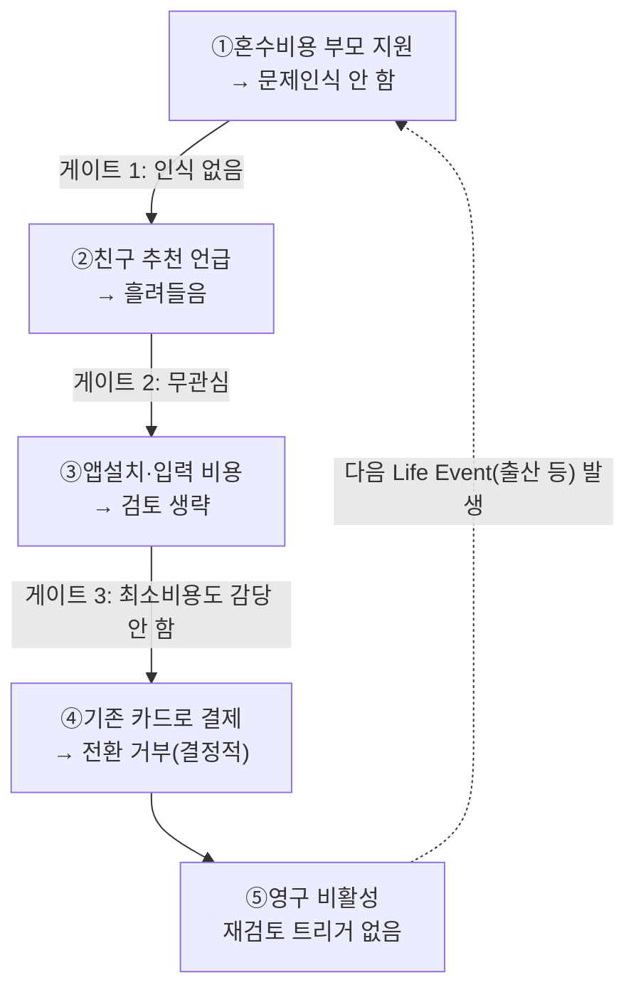
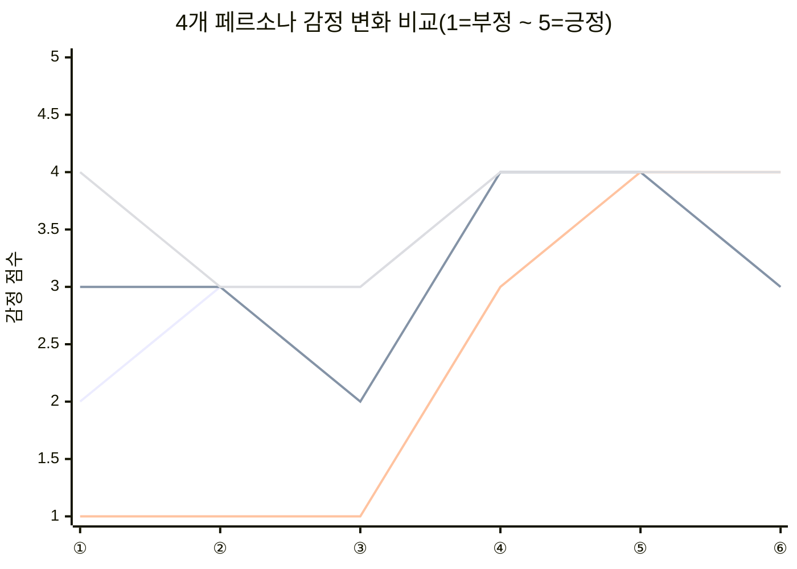
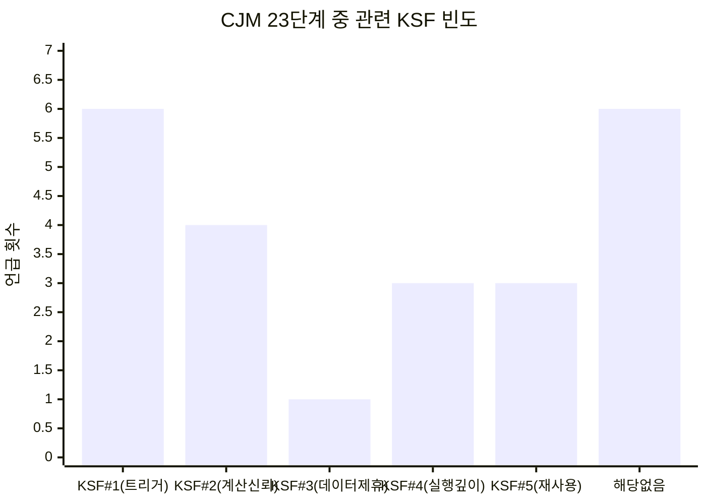

# 05-2. 고객 여정지도(Customer Journey Map) — 미래지출 결제설계 서비스

> **분석 대상 기획서:** [`proposal/미래지출 결제설계 서비스 기획서 v0.1.md`](<../proposal/미래지출 결제설계 서비스 기획서 v0.1.md>)
> **방법론 참고:** [business-analysis-frameworks/05_페르소나_고객여정지도/00_방법론.md](https://github.com/jennie-brain/business-analysis-frameworks/blob/main/05_%ED%8E%98%EB%A5%B4%EC%88%98%EB%98%98_%EA%B3%A0%EA%B0%9D%EC%97%AC%EC%A0%95%EC%A7%80%EB%8F%84/00_%EB%B0%A9%EB%B2%95%EB%A1%A0.md)
> **입력:** [`05-1 - 페르소나 스펙트럼.md`](<./05-1 - 페르소나 스펙트럼.md>) — 이 문서에서 확정한 4개 대표 페르소나(김지은·박준혁·이수민·최유리)
> **분석 기준일:** 2026-08-13
> **작성자 / 팀:** JENNIE / AI-PM-study

> **상태 표기** — CJM은 전부 가상 시나리오다. 구체 행동·대화는 가설(🟡)이며, 각 단계가 대응하는 KSF·마찰만 1~4단계에서 확인된 사실에 근거한다.
> - 🟢 확인된 사실 · 🔷 합리적 추론 · 🟡 가설(가상 시나리오) · ⬜ 미조사

## 개요

05-1에서 확정한 4개 페르소나(김지은·박준혁·이수민·최유리)의 여정을 각각 6단계(또는 5단계) CJM으로 추적했다. 관여주체·관련 KSF 컬럼을 추가해 배우자·부모님·카드사 심사 등 실제 관여자와 03단계 KSF 연결고리를 명시했다. 종합 비교 결과 KSF #1(트리거 포착)이 23개 단계 중 6회로 가장 빈번했고, 최유리(Non-user)의 감정 곡선이 거의 움직이지 않는다는 것 자체가 1단계 Non-consumption 판정의 시각적 증거였다.

### Decision Log

| 날짜 | 결정 | 이유 |
|---|---|---|
| 2026-08-13 | 페르소나(05-1)와 고객 여정지도(본 문서)를 별도 파일로 분리 | 각 문서의 분량과 목적(스펙트럼 도출 vs 여정 분석)이 달라 하나로 묶으면 탐색이 어려움 |
| 2026-08-13 | CJM 각 단계에 관여주체·관련 KSF 컬럼을 추가 | 배우자·부모님·카드사 심사 등 실제 관여자와, 각 단계가 03단계 어느 KSF와 연결되는지 명시해야 근거가 드러남 |

---

## 1. Core — 김지은

| 단계 | 관여 주체 | KSF | 고객 행동 | 고객 생각 | 감정 | Pain Point | 개선 기회 |
|---|---|---|---|---|---|---|---|
| ①문제인식 | 본인 | #1 | 예산·구매목록을 대략 세움 | "언제 뭘 사지?" | 🟠 막막 | 지출이 흩어져 전체를 못 봄 | 지출 일괄입력 온보딩 |
| ②탐색 | 본인 | #4 | 혼수 카드추천 검색 | "다 비슷하네" | 🟡 반신반의 | 카드 1장 단위 추천, 배분법 없음 | 카드조합·구매건별 배분 제시 |
| ③검토·결정 | 본인+**배우자** | #4 | 신규카드 발급 상의 | "새로 만드는 게 이득?" | 🟡 고민 | 신규·기존 비교 방법 없음 | 신규·기존 비교 화면(F-04) |
| ④입력(첫사용) | 본인 | 해당없음 | 지출계획 입력(§5.1) | "이 정도면 되네" | 🟢 기대 | 직접입력이 번거로움 | 입력 3단계 이내로 축소 |
| ⑤결과활용(반복) | 본인 | #2 | 구매건별 카드 역할 배정 | "이렇게 나누면 되겠다" | 🟢 만족 | 결제 순간 카드 재확인 필요 | 구매시점 알림·체크리스트 |
| ⑥유지·확장 | 본인 | #5 | 결혼식 후 사용 중단 | "이제 필요 없지" | 🟡 이탈위험 | KSF #5 예측대로 이탈 | 다음 Life Event 연계 알림 |

## 2. Adjacent — 박준혁

| 단계 | 관여 주체 | KSF | 고객 행동 | 고객 생각 | 감정 | Pain Point | 개선 기회 |
|---|---|---|---|---|---|---|---|
| ①문제인식 | 본인 단독 | #1 | 가전 교체목록 정리 | "혼자 알아봐야 하네" | 🟡 부담 | 외부신호 없어 스스로 시작(04단계 Q2, 감지 어려움) | 부동산 계약 연동 트리거 |
| ②탐색 | 본인 | #1 | 뱅크샐러드 카드추천만 받음 | "과거소비 기준이네" | 🟡 아쉬움 | 미래계획엔 안 맞음(1단계 §1) | 미래지출 입력형 추천 |
| ③검토·결정 | 본인 단독 | #2 | 스프레드시트 직접계산 | "이렇게까지?" | 🟠 피로 | 수작업 계산이 진입장벽 | 계산 대행 자체가 차별화 |
| ④입력(첫사용) | 본인 | 해당없음 | 지출계획 입력 | "진작 있었으면" | 🟢 반가움 | 인지경로 없어 도달 어려움 | 부동산·이사 플랫폼 제휴 |
| ⑤결과활용(반복) | 본인 | #4 | 카드 1장만 변경 채택 | "일부 도움됐다" | 🟢 절충 | Stakes 작아 유인 약함(강도 미확보) | 즉시 체감되는 소액 혜택 요약 |
| ⑥유지·확장 | 본인 | #5 | 재사용 빈도 낮음 | "다음 이사 때 쓰겠지" | 🟡 낮은재방문 | 재방문 유인 없음 | 소액 이벤트로도 재방문 유도 |

## 3. Extreme — 이수민

| 단계 | 관여 주체 | KSF | 고객 행동 | 고객 생각 | 감정 | Pain Point | 개선 기회 |
|---|---|---|---|---|---|---|---|
| ①문제인식 | 본인 | 해당없음 | 재혼으로 혼수를 다시 준비 | "또 해야 하네" | 🔴 지침 | 과거 계산 포기 경험(실패 경험) | "이번엔 다르다" 증명 데모 |
| ②탐색 | 본인+**카드사** | #3 | 신규발급 거절(연체이력) | "기존카드로 해야겠네" | 🔴 좌절 | 신규카드 시나리오(F-04) 성립 안함 | 기존카드 only 기본값(R-03) |
| ③검토·결정 | 본인 단독 | #2 | 카드 3장 비교 중단 | "뭐가 맞는지 모르겠다" | 🔴 신뢰부족 | 계산신뢰 없으면 최우선 이탈(KSF#2) | Explainable UI(§4.2) |
| ④입력(재도전) | 본인+**지인** | #1 | 지인 추천으로 재도전 | "믿어보자" | 🟡 조심스러운기대 | 낮은 신뢰라 오류에 취약 | 결과에 근거 항상 노출 |
| ⑤결과활용 | 본인 | #2 | 손해 감소 확인 | "계산이 맞네" | 🟢 안심 | 신규카드 옵션 막혀 상한선 있음 | 기존카드 최적화 범위 안내 |
| ⑥유지·확장 | 본인 | #5 | 재점검 목적 재방문 | "손해 안 보게 확인" | 🟢 실용적신뢰 | 객단가 낮을 수 있음 | 저빈도 유지관리 알림 |

## 4. Non-user — 최유리

다른 세 페르소나는 "탐색 → 도입"의 선형 흐름인 반면, 최유리는 매 단계가 곧 **이탈/거부 게이트**다. 이를 명확히 보여주기 위해 표 아래에 결정 흐름도를 추가한다.

| 단계 | 관여 주체 | KSF | 고객 행동 | 고객 생각 | 감정 | Pain Point | 개선 기회 |
|---|---|---|---|---|---|---|---|
| ①문제인식(약함) | 본인+**부모님** | #1(실패지점) | 부모가 혼수비용 지원 | "그냥 있는 카드로" | 🟢 무관심 | Non-consumption 그대로(1단계 §2) | 부모 대상 "내역 공유" 가치 |
| ②서비스인지 | 본인+**친구** | #1 | 추천을 흘려들음 | "난 필요없을 듯" | 🟡 무관심 | 내 일 아니라고 느낌 | 혼수지출 투명공유 가치 제시 |
| ③비교검토(생략) | 본인 | 해당없음 | 검토 자체 안 함 | "번거롭게 뭘" | 🟡 회피 | 최소 비용도 유인 없음 | 저마찰 채널(카드사 알림) |
| ④전환거부(**결정적**) | 본인 게이트키퍼 | 해당없음 | 기존 카드로 결제 | "문제없다" | 🟢 안정 | 손해를 인지 못함 | 사후 "놓친 혜택" 리포트 |
| ⑤기존유지 | 본인 | 해당없음 | 결혼 후에도 미사용 | "필요하면 그때" | 🟢 안정 | 재검토 트리거 없음 | 다음 Life Event 재접근 |

**게이트 3개 모두를 통과해야 전환이 일어난다** — 어느 하나만 막혀도 결과는 동일(비활성)하다. 이 서비스가 최유리를 전환시키려면 세 게이트 중 하나(예: 게이트 1 "손해 인지시키기")를 겨냥한 별도 기능이 필요하다는 뜻이다.

---

## 5. 종합 비교

### 5.1 감정 변화 비교

선 순서: 김지은(Core)·박준혁(Adjacent)·이수민(Extreme)·최유리(Non-user). **이수민(Extreme)만 초반 세 단계가 바닥(1점)에서 시작해 뒤에 회복하는 급격한 V자**이고, **최유리(Non-user)는 4점대에서 거의 움직이지 않는다** — 감정적으로 불편함을 느끼지 않는 것 자체가 왜 전환이 어려운지를 보여준다.

### 5.2 KSF 언급 빈도 — 어느 KSF가 실제로 가장 자주 걸리는가

4개 CJM의 총 23개 단계-셀을 "관련 KSF" 컬럼 기준으로 집계했다.

**KSF #1(트리거 포착력)이 가장 자주 걸린다(6회)** — 03단계는 실행 난이도 기준으로 KSF #3(데이터 제휴)을 최우선으로 뒀지만, CJM 관점에서는 KSF #1이 4개 페르소나 전원의 여정에 반복적으로 나타난다. **KSF #3(데이터 제휴)은 CJM에서는 딱 1번(이수민의 신규카드 거절 장면)만 나타나는데, 이는 KSF #3이 "사용자가 직접 겪는 마찰"이 아니라 "서비스가 성립하기 위한 전제조건"이기 때문이다** — 사용자 눈에는 안 보이지만 없으면 서비스 자체가 없다는 03단계의 결론과 정확히 일치한다.

### 5.3 페르소나별 결정적 Pain Point

| 페르소나 | 결정적 Pain Point | 잔존 마찰 | 개선기회 우선순위 |
|---|---|---|---|
| **Core(김지은)** | 지출이 여러 건에 흩어져 있어 전체를 한눈에 못 봄 | 결제 시점에 "어느 카드였는지" 재확인 필요 | 🟢 1순위 — MVP 핵심 검증 대상(04단계 SOM 그대로) |
| **Adjacent(박준혁)** | 외부 트리거가 없어 스스로 시작해야 함 | Stakes가 작아 비교 유인이 약함 | 🟡 2순위 — OQ-16(입주 강도 데이터) 확인 후 재평가 |
| **Extreme(이수민)** | 과거 실패 경험으로 신뢰가 낮게 시작 | 신규카드 옵션이 막혀 상한선이 있음 | 🟢 1순위(다른 이유) — KSF #2 계산신뢰성을 가장 먼저 검증할 대상 |
| **Non-user(최유리)** | 문제 인식 자체가 없음(게이트 1) | 전환 거부가 결정적 이탈 지점(게이트 3) | ⚪ 3순위 — 트리거 모니터링에 집중, 상시 전환 시도는 비효율 |

---

## 6. 이전 단계와의 연결

- **Core**는 04단계 SOM(혼인 Beachhead) 정의를 그대로 인물화한 것이다.
- **Non-user**는 1단계 Five Forces의 "Non-consumption이 가장 강력한 대체재"라는 판정을 CJM으로 구체화했다 — 감정 곡선이 거의 안 움직인다는 것 자체가 1단계 판정의 시각적 증거다.
- **Extreme**은 03단계 KSF #2(계산신뢰성)·#3(데이터제휴)가 실패했을 때 실제로 어떤 사용자가 가장 먼저, 가장 크게 이탈하는지를 보여준다.
- **Adjacent**는 04단계 Open Question(OQ-16, 입주 세그먼트 강도 데이터 공백)이 실제 사용자 경험에서도 "확신을 못 주는" 형태로 나타남을 보여준다.
- **5.2절의 KSF 빈도 분석**은 03단계의 "실행 난이도 순위(3→2→1→4→5)"와 "사용자가 실제로 체감하는 빈도(1→2→4·5→3)"가 다르다는 것을 새로 보여준다 — 이 차이 자체가 6단계 Opportunity Score에서 다뤄야 할 질문이다.

## Open Questions (다음 단계로 이월)

| ID | 내용 | 관련 단계 |
|---|---|---|
| OQ-23 | Non-user를 실제로 전환시킬 수 있는 트리거(예: 사후 손해 리포트, 게이트 1 우회)가 검증 가능한가 | 7단계 JTBD |
| OQ-26 | KSF #1이 CJM에서 가장 빈번하지만 03단계에서는 3순위 실행이었다 — 실행 순서를 KSF #1 우선으로 재검토해야 하는가 | 6단계 Opportunity Score |
