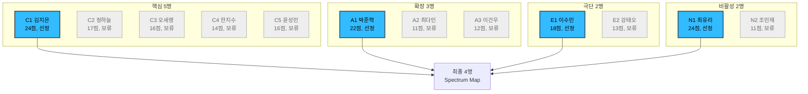
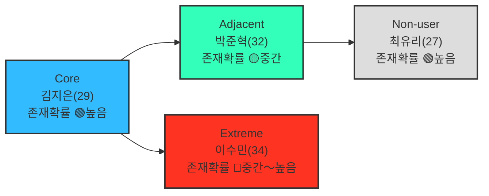

# 05-1. 페르소나, 페르소나 스펙트럼 — 미래지출 결제설계 서비스

> **분석 대상 기획서:** [`proposal/미래지출 결제설계 서비스 기획서 v0.1.md`](<../../proposal/미래지출 결제설계 서비스 기획서 v0.1.md>)
> **방법론 참고:** [business-analysis-frameworks/05_페르소나_고객여정지도/00_방법론.md](https://github.com/jennie-brain/business-analysis-frameworks/blob/main/05_%ED%8E%98%EB%A5%B4%EC%88%98%EB%98%98_%EA%B3%A0%EA%B0%9D%EC%97%AC%EC%A0%95%EC%A7%80%EB%8F%84/00_%EB%B0%A9%EB%B2%95%EB%A1%A0.md)
> **관련 문서:** [`02_고객여정지도.md`](<./02_고객여정지도.md>) — 이 문서에서 확정한 4개 페르소나의 CJM
> **입력:** [`01`](<../01_Porters_Five_Forces_모델/01_Porters_Five_Forces_모델.md>), [`02`](<../02_가치사슬_분석/01_가치사슬_분석.md>), [`03`](<../03_핵심성공요인_분석/01_핵심성공요인_분석.md>), [`04`](<../04_TAM-SAM-SOM_마켓세그먼트/01_TAM-SAM-SOM_마켓세그먼트.md>)
> **분석 기준일:** 2026-08-13
> **작성자 / 팀:** JENNIE / AI-PM-study
> **Decision Log:** [`00_Decision_Log.md`](<./00_Decision_Log.md>)

> **상태 표기** — 페르소나는 전부 가상 인물이다. 이름·나이·직무·구체 수치는 모두 가설(🟡)이며, 각 페르소나가 대응하는 **문제(Problem)와 마찰**만 1～4단계에서 이미 확인된 사실에 근거한다.
> - 🟢 확인된 사실(1～4단계 인용) · 🔷 그 사실에서의 합리적 추론 · 🟡 가설(가상 인물·시나리오 포함) · ⬜ 미조사

> **범위 참고**: 이 서비스는 신규카드 발급을 전제하지 않는다. 기획서 F-04(신규카드 포함/미포함 시나리오 비교)·R-03(기존카드 Only 시나리오 필수 제공)에 따라, "다음 달 가구 구매에 보유 카드 중 무엇을 쓸지"만 묻는 사용자도 정확히 이 서비스의 대상이다 — 아래 Extreme(이수민) 페르소나가 이 경로를 대표한다.

## 개요

04단계 SOM(혼인 Beachhead)을 그대로 페르소나로 쓰지 않고, 방법론 5단계 워크플로우(1차 생성→2차 평가→3차 보정→4차 검증→5차 통합)로 핵심·확장·극단·비활성 12명 후보를 만든 뒤 유형별 1명씩 4명(김지은·박준혁·이수민·최유리)을 선정했다. 2차 평가 기준은 5개 정량 지표(문제·행동·맥락 현실성·규모·제품적합성, 각 1～5점)로 세분화해 선정 근거를 재현 가능하게 했고, 4차 검증에서 각 페르소나의 실제 존재 확률까지 점검했다.

---

## 1. 1차 생성(Divergent Thinking) — 12명 후보

방법론 2.1절 ①단계를 그대로 적용해 핵심 5명·확장 3명·극단 2명·비활성 2명을 만들었다.

**핵심(Core) — 5명** (목적: 주력 타깃 설정 / 생성포인트: 매출·사용빈도 중심)

| ID | 이름 | 직무 | 문제 | 목표 |
|---|---|---|---|---|
| C1 | 김지은(29) | 예비신부·마케팅 | 혼인 3개월 전, 가전·가구 다건구매, 카드 2장, 신규발급 고민 | 최대 혜택 카드·조합 확인 |
| C2 | 정하늘(31) | 예비신랑·회계사 | 예산관리 직접 주도, 엑셀 비교가 시나리오 과다로 번거로움 | 계산 자동화 |
| C3 | 오세영(27) | 예비신부·간호사 | 혼인 2개월 전, 스드메+혼수 동시진행, 비교시간 부족 | 빠른 결정 |
| C4 | 한지수(33) | 예비신부·프리랜서 | 소득 불규칙, 할부·무이자 조건에 민감 | 부담 없는 결제 스케줄 |
| C5 | 윤성민(30) | 예비신랑·스타트업 | 카드 3장(카테고리별 특화) 보유, 조합 최적화 관심 높은 고급 사용자 | 보유 카드 조합 효율 극대화 |

**확장(Adjacent) — 3명** (목적: 확장 기회 탐색 / 생성포인트: 유사 니즈·다른 맥락)

| ID | 이름 | 직무 | 문제 | 목표 |
|---|---|---|---|---|
| A1 | 박준혁(32) | 1인가구·IT | 전세→자가 입주, 가전·가구 다건구매(04단계 Q2와 동일 Job) | 새 가전 구매 최적화 |
| A2 | 최다인(28) | 회사원·비혼 동거 | 동거 입주로 가전·가구 공동구매, 법적 지위가 혼인과 다름 | 두 사람 카드 공동 최적화 |
| A3 | 이건우(35) | 회사원·이혼 재정착 | 새 거처 마련, 가전·가구 재구매 필요 | 재정착 손해 최소화 |

**극단(Extreme) — 2명** (목적: 제품 개선·포용적 설계 / 생성포인트: 실패·불편·대안사용 중심)

| ID | 이름 | 직무 | 문제 | 목표 |
|---|---|---|---|---|
| E1 | 이수민(34) | 재혼 준비 | 과거 연체로 신규발급 제약, 기존 카드 비교가 복잡해 계산 포기 경험 | 기존 카드로 손해 최소화 |
| E2 | 강태오(29) | 예비신랑 | 신용점수 낮음, 체크카드 위주라 혜택 선택지 좁음 | 제한된 수단 내 최선 |

**비활성(Non-user) — 2명** (목적: 진입장벽·거부요인 파악 / 생성포인트: 인식·가치·신뢰 결여 중심)

| ID | 이름 | 직무 | 문제 | 목표 |
|---|---|---|---|---|
| N1 | 최유리(27) | 예비신부 | 혼수비용 부모 지원, 비교 필요성 못 느낌(1단계 Non-consumption) | 무난하게 넘어가기 |
| N2 | 조민재(31) | 예비신랑 | 소비 데이터 입력 자체를 꺼림(프라이버시 우려) | 노출 없이 혜택 확보 |

---

## 2. 2차 평가(Convergent Filtering) — 12명 → 4명, 정량 점수화

방법론 ②단계 기준("문제·행동·맥락의 현실성")을 아래 5개 지표(각 1～5점)로 세분화했다.

| 지표 | 약어 | 5점 기준 | 1점 기준 |
|---|---|---|---|
| 문제 현실성 | P | 1～4단계 확인된 통계·사실이 직접 뒷받침 | 통계 근거 전혀 없음 |
| 행동 현실성 | B | 묘사된 행동이 자연스럽고 흔함 | 창작 요소가 강해 부자연스러움 |
| 맥락 현실성 | C | 나이·직업·상황 조합이 통계적으로 흔함 | 조합이 이례적·좁음 |
| 규모(Scale) | S | 04단계 등 확인된 인원 데이터로 규모 추정 가능 | 규모 추정 근거 전무 |
| 제품 적합성(Fit) | F | 현재 MVP 스코프(§5.1 직접입력, 가전·가구)에 정확히 부합 | MVP 스코프 밖(§5.2 Out of Scope에 근접) |

### 2.1 전체 12명 점수표

| ID | 이름 | P | B | C | S | F | **합계(25점 만점)** |
|---|---|---|---|---|---|---|---|
| **C1** | **김지은** | 5 | 4 | 5 | 5 | 5 | **24** |
| C2 | 정하늘 | 3 | 4 | 3 | 3 | 4 | 17 |
| C3 | 오세영 | 3 | 4 | 3 | 2 | 4 | 16 |
| C5 | 윤성민 | 3 | 4 | 3 | 2 | 4 | 16 |
| C4 | 한지수 | 3 | 3 | 3 | 2 | 3 | 14 |
| **A1** | **박준혁** | 5 | 4 | 4 | 4 | 5 | **22** |
| **E1** | **이수민** | 4 | 4 | 3 | 3 | 4 | **18** |
| E2 | 강태오 | 3 | 3 | 3 | 2 | 2 | 13 |
| A3 | 이건우 | 2 | 3 | 2 | 1 | 4 | 12 |
| A2 | 최다인 | 2 | 3 | 2 | 1 | 3 | 11 |
| N2 | 조민재 | 2 | 3 | 2 | 1 | 3 | 11 |
| **N1** | **최유리** | 5 | 5 | 5 | 4 | 5 | **24** |

*(P=문제현실성, B=행동현실성, C=맥락현실성, S=규모, F=제품적합성. 굵게 표시된 4명이 유형별 최고점.)*

### 2.2 선정 결과 및 근거

| 유형 | 선정(점수) | 선정 근거 | 보류된 후보와 사유 |
|---|---|---|---|
| Core | **C1 김지은(24)** | S·F 만점 — 04단계 SOM 통계(48만 명/년)와 정확히 일치 | C2·C5(16～17점)는 KSF #4 논의로 3절에 별도 언급, C3·C4(14～16점)는 5단계 이후 재검토 |
| Adjacent | **A1 박준혁(22)** | S=4 — 04단계 Q2(입주 206만 명/년)로 유일하게 규모 확인 | A2·A3(11～12점)는 S=1(규모 추정 근거 전무) — OQ-24 |
| Extreme | **E1 이수민(18)** | F=4 — 카드 보유는 유지되는 극단이라 제품이 여전히 대응 가능 | E2(13점)는 F=2 — 카드 자체가 거의 없어 서비스 전제를 벗어나는 더 바깥의 극단(OQ-25) |
| Non-user | **N1 최유리(24)** | P·B·C 만점 — 1단계 E-04 실증 근거와 정확히 일치 | N2(11점)는 P=2 — 마이데이터 미연동 MVP(§5.1)라 프라이버시 리스크 실익이 낮아 근거가 약함(OQ-25) |

**임계값 원칙**: 점수 자체에 고정된 통과선을 두지 않고, 유형 내 최고점 1명만 선정한다 — 유형 간 점수를 직접 비교하지 않는다(예: Non-user 24점이 Extreme 18점보다 "더 우선"이라는 뜻은 아니다).

---

## 3. 3차 보정(Contextual Rewriting) — 최종 4장

| 유형 | 페르소나 | 근거(요약) | 목표 | 대체 솔루션 |
|---|---|---|---|---|
| **Core** | 김지은(29), 예비신부·마케팅 | 04단계 SOM(혼인) 그 자체 🟢 24점 | 최대 혜택 카드·조합 확인 | 카드고릴라·뱅크샐러드 검색 + 엑셀 계산 |
| **Adjacent** | 박준혁(32), 1인가구·IT, 입주예정 | 04단계 Q2(입주, 강도 데이터 미확보) 🟢 22점 | 새 가전 구매 최적화 | 뱅크샐러드(과거소비 기준이라 미래계획엔 미흡) |
| **Extreme** | 이수민(34), 재혼 준비 | 03단계 KSF #2·#3 실패 상황의 실사례 🔷 18점 | 기존 카드로 손해 최소화 | 판매직원 안내에 의존, 비교는 단념 |
| **Non-user** | 최유리(27), 예비신부, 부모 지원형 | 1단계 Non-consumption의 인물화 🟢 24점 | 무난하게 넘어가기 | 있는 카드로 결제, 비교 자체를 안 함 |

**핵심 질문 대응**: (확장) 유사 니즈를 다른 방식으로 해소 → 박준혁. (극단) 가장 자주 실패를 경험 → 이수민. (비활성) 사용을 안 하는 사람 → 최유리.

---

## 4. 4차 검증(AI Peer Review) — 존재 확률

| 페르소나 | 존재 확률 | 근거 |
|---|---|---|
| 김지은(Core) | 🟢 높음 | 04단계 SOM 통계(48만 명/년)로 직접 뒷받침 |
| 박준혁(Adjacent) | 🟡 중간 — 재검토 필요 | 입주 인구(206만 명/년)는 확인, "가전·가구 다건구매+비교의향" 결합 비율은 미확인(04단계 OQ-16과 동일 공백) |
| 이수민(Extreme) | 🔷 중간～높음 | 신용제약 자체는 드물지 않으나 "혼인 준비자 중 신용제약 비율"이라는 결합 통계는 미확인 |
| 최유리(Non-user) | 🟢 높음 | 1단계 실증 근거(E-04)로 직접 뒷받침 |

---

## 5. 5차 통합(Spectrum Map)

## Open Questions (다음 단계로 이월)

| ID | 내용 | 관련 단계 |
|---|---|---|
| OQ-21 | Adjacent(입주) 페르소나의 실제 규모 — 인터뷰로 검증 필요 | 6단계 Opportunity Score |
| OQ-22 | Extreme(신용제약) 유형이 혼인 Beachhead 중 차지하는 비중 | 6단계 Opportunity Score |
| OQ-24 | A2(비혼 동거)·A3(이혼 재정착)의 실제 규모를 추정할 통계가 있는가 | 6단계 Opportunity Score |
| OQ-25 | E2(신용점수 낮음)·N2(프라이버시 우려형)를 다음 라운드에서 재검토할 규모가 있는가 | 6단계 Opportunity Score |
