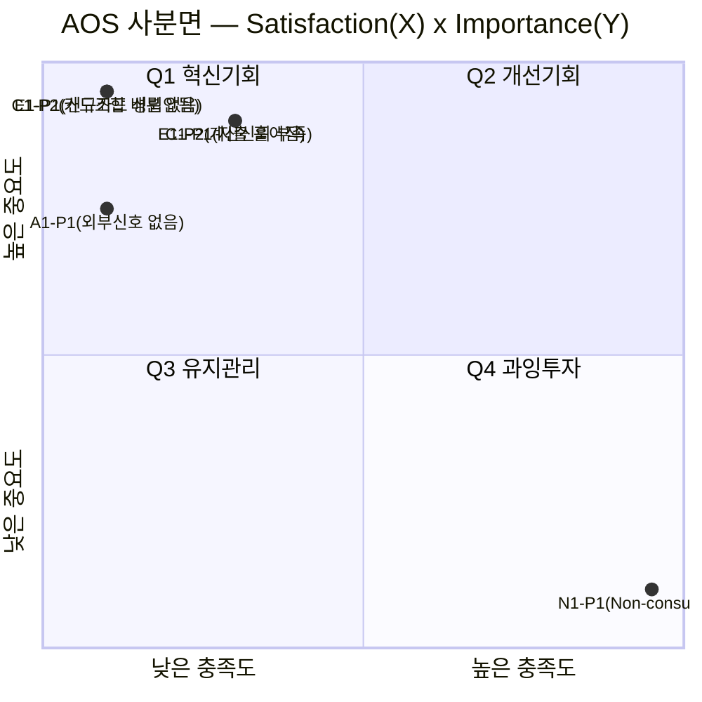
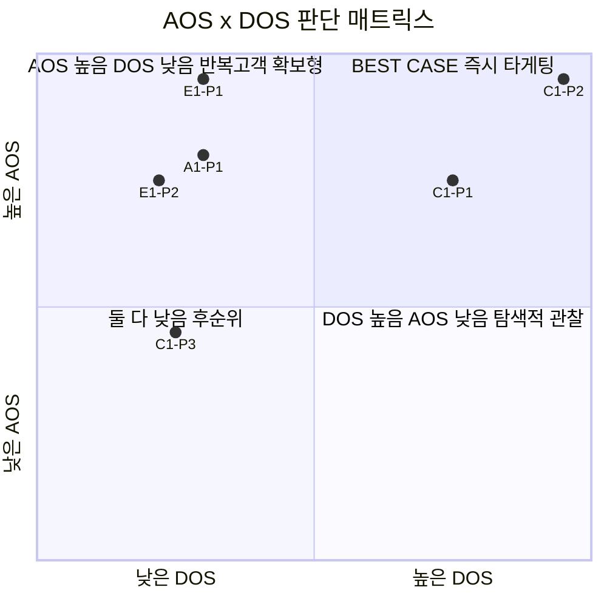

# 06. 시장기회 분석 : 기회점수(OS) 기반 우선순위 판단 — 미래지출 결제설계 서비스

> **분석 대상 기획서:** [`proposal/미래지출 결제설계 서비스 기획서 v0.1.md`](<../../proposal/미래지출 결제설계 서비스 기획서 v0.1.md>)
> **방법론 참고:** [business-analysis-frameworks/06_시장기회분석/00_방법론.md](https://github.com/jennie-brain/business-analysis-frameworks/blob/main/06_%EC%8B%9C%EC%9E%A5%EA%B8%B0%ED%9A%8C%EB%B6%84%EC%84%9D/00_%EB%B0%A9%EB%B2%95%EB%A1%A0.md)
> **입력:** [`05-1`](<../05_페르소나_고객여정지도/01_페르소나_스펙트럼.md>), [`05-2`](<../05_페르소나_고객여정지도/02_고객여정지도.md>), [`04`](<../04_TAM-SAM-SOM_마켓세그먼트/01_TAM-SAM-SOM_마켓세그먼트.md>)
> **분석 기준일:** 2026-08-13
> **작성자 / 팀:** JENNIE / AI-PM-study

> **상태 표기** — Importance·Satisfaction 점수는 실제 고객 조사 없이 05단계 근거를 바탕으로 매긴 가설(🟡)이다. Pain 자체의 존재와 관련 KSF/단계 근거만 🟢/🔷다.

## 개요

05-1(1차 생성 12명)·05-2(4개 CJM)에서 나온 Pain 20개를 AOS(Importance×(1−Satisfaction/5))로 채점한 결과 Q1(혁신기회)에 13건이 몰렸고, 최상위는 김지은(Core)의 두 Pain이었다. 04단계 헤드카운트를 Market Relevance로 써서 DOS(시장가중)까지 확장하니, Extreme·Adjacent는 AOS는 높지만 시장 확신(DOS)이 낮아 **BEST CASE(즉시 타게팅)는 Core의 두 Pain으로 좁혀졌다** — 나머지는 07단계 인터뷰로 Market Relevance를 실측해야 순위가 확정되는 잠정 상태다.

### Decision Log

| 날짜 | 결정 | 이유 |
|---|---|---|
| 2026-08-13 | 새 Pain 리스트를 만들지 않고 05-1(1차 생성 12명)·05-2(4개 CJM)를 그대로 재료로 사용 | 방법론 2절 원칙 — 페르소나 단계 이전의 Pain List는 특정 고객 타깃에 대응되지 않아 Importance·Satisfaction을 평가할 수 없음 |
| 2026-08-13 | 4개 선정 페르소나는 CJM 기준 3개씩, 보류된 8명은 05-1의 대표 문제 1개씩 — 총 20개 Pain 채점 | 선정 페르소나는 여정 근거가 풍부하고, 보류 후보는 근거가 한 줄뿐이라 과대 확장하지 않음 |
| 2026-08-13 | AOS(고객 체감) 산출 후 DOS(시장가중)까지 확장, 04단계 SAM/헤드카운트를 Market Relevance로 사용 | 방법론 4절 — AOS만으로는 "혁신 가능성"만 보이고 "시장 현실성"이 빠짐 |

---

## 1. Pain List — 20개

| ID | 페르소나 | Pain | 근거 |
|---|---|---|---|
| C1-P1 | 김지은(Core) | 지출이 여러 건·여러 달에 흩어져 전체를 못 봄 | 05-2 ①문제인식 |
| C1-P2 | 김지은(Core) | 추천이 카드 1장 단위, 배분법을 안 알려줌 | 05-2 ②탐색 |
| C1-P3 | 김지은(Core) | 결제 시점에 "어느 카드였는지" 재확인 필요 | 05-2 ⑤결과활용 |
| A1-P1 | 박준혁(Adjacent) | 외부신호 없어 스스로 시작해야 함(감지 어려움) | 05-2 ①문제인식 |
| A1-P2 | 박준혁(Adjacent) | 과거소비 기반 추천이라 미래계획엔 안 맞음 | 05-2 ②탐색 |
| A1-P3 | 박준혁(Adjacent) | Stakes 작아 비교 유인 약함 | 05-2 ⑤결과활용 |
| E1-P1 | 이수민(Extreme) | 신규카드 시나리오 자체가 성립 안 함(연체이력) | 05-2 ②탐색 |
| E1-P2 | 이수민(Extreme) | 계산신뢰 없으면 최우선 이탈 | 05-2 ③검토·결정 |
| E1-P3 | 이수민(Extreme) | 신규카드 옵션 막혀 상한선 있음 | 05-2 ⑤결과활용 |
| N1-P1 | 최유리(Non-user) | Non-consumption, 문제인식 자체가 없음 | 05-2 ①문제인식 |
| N1-P2 | 최유리(Non-user) | 손해를 인지 못함 | 05-2 ④전환거부 |
| N1-P3 | 최유리(Non-user) | 재검토 트리거 없어 영구 비활성 | 05-2 ⑤기존유지 |
| C2-P1 | 정하늘(보류) | 엑셀 비교가 시나리오 과다로 번거로움 | 05-1 §1 |
| C3-P1 | 오세영(보류) | 스드메+혼수 동시진행, 비교시간 부족 | 05-1 §1 |
| C4-P1 | 한지수(보류) | 소득 불규칙, 할부·무이자 조건에 민감 | 05-1 §1 |
| C5-P1 | 윤성민(보류) | 카드 3장 보유, 조합 최적화 니즈는 있으나 도구 없음 | 05-1 §1 |
| A2-P1 | 최다인(보류) | 동거 커플, 법적 지위 달라 참고정보 부족 | 05-1 §1 |
| A3-P1 | 이건우(보류) | 이혼 재정착, 재구매 손해 우려 | 05-1 §1 |
| E2-P1 | 강태오(보류) | 신용점수 낮아 카드 자체가 제한적 | 05-1 §1 |
| N2-P1 | 조민재(보류) | 소비 데이터 입력 자체를 꺼림(프라이버시) | 05-1 §1 |

---

## 2. AOS(조정형 기회점수) 계산

`AOS = Importance × (1 − Satisfaction/5)`

| ID | Importance | Satisfaction | AOS | 사분면 |
|---|---|---|---|---|
| **C1-P2** | 5 | 1 | **4.0** | Q1 혁신기회 |
| **E1-P1** | 5 | 1 | **4.0** | Q1 혁신기회 |
| A1-P1 | 4 | 1 | 3.2 | Q1 혁신기회 |
| C1-P1 | 5 | 2 | 3.0 | Q1 혁신기회 |
| E1-P2 | 5 | 2 | 3.0 | Q1 혁신기회 |
| A1-P2 | 4 | 2 | 2.4 | Q1 혁신기회 |
| C3-P1 | 4 | 2 | 2.4 | Q1 혁신기회 |
| C1-P3 | 3 | 2 | 1.8 | Q1 혁신기회 |
| E1-P3 | 3 | 2 | 1.8 | Q1 혁신기회 |
| C4-P1 | 3 | 2 | 1.8 | Q1 혁신기회 |
| C5-P1 | 3 | 2 | 1.8 | Q1 혁신기회 |
| A2-P1 | 3 | 2 | 1.8 | Q1 혁신기회 |
| A3-P1 | 3 | 2 | 1.8 | Q1 혁신기회 |
| E2-P1 | 2 | 1 | 1.6 | Q3 유지관리 |
| C2-P1 | 3 | 3 | 1.2 | Q2 개선기회 |
| A1-P3 | 2 | 3 | 0.8 | Q4 과잉투자 |
| N1-P2 | 2 | 4 | 0.4 | Q4 과잉투자 |
| N1-P3 | 2 | 4 | 0.4 | Q4 과잉투자 |
| N2-P1 | 2 | 4 | 0.4 | Q4 과잉투자 |
| N1-P1 | 1 | 5 | 0.0 | Q4 과잉투자 |

*(사분면 기준선: 척도 중간값 3점 — I≥3&S<3=Q1, I≥3&S≥3=Q2, I<3&S<3=Q3, I<3&S≥3=Q4)*

**요약: Q1(혁신기회) 13건, Q2(개선기회) 1건, Q3(유지관리) 1건, Q4(과잉투자) 5건.** Q1이 압도적으로 많다는 것은 이 산업 자체가 아직 초기(01단계 Five Forces의 "산업구조 자체는 우호적이지 않다"는 판정과 별개로, 사용자 Pain 대부분이 아직 잘 해결되지 않았다는 뜻)라는 신호다. **최상위 두 건(C1-P2, E1-P1)이 각각 Core·Extreme에서 나왔다는 것은 03단계 KSF #4(실행깊이)·#2(계산신뢰성)가 왜 우선순위였는지를 사용자 관점에서 재확인한다.**

---

## 3. Market Relevance — DOS 확장을 위한 시장가중치 판단

04단계 헤드카운트 데이터를 근거로 세그먼트별 가중치를 매겼다.

| 세그먼트 | Market Relevance | 근거 |
|---|---|---|
| Core(김지은, 혼인) | **1.0** | 04단계 SAM(확실, 48만 명/년)으로 직접 확인된 세그먼트 |
| Adjacent(박준혁, 입주) | 0.4(잠정) | 04단계 인원(206만 명/년)은 크나 강도 데이터 미확보(OQ-16) — 절반 이하로 할인 |
| Extreme(이수민, 신용제약) | 0.3(잠정) | 혼인 세그먼트의 하위집합, 정확한 결합비율 미확인(OQ-22) |
| Non-user(최유리) | 0.1(잠정) | 정의상 전환이 안 되는 세그먼트 — 시장 파급력 최소 |
| 보류 8명(C2~N2) | 0.15(잠정) | 05-1에서 규모 추정 근거가 없다고 이미 명시한 후보들 — 균일하게 낮은 값 |

---

## 4. DOS(발견된 기회점수) 계산

`DOS = (Importance − Satisfaction) × Market Relevance`

| ID | Importance − Satisfaction | Market Relevance | DOS |
|---|---|---|---|
| **C1-P2** | 4 | 1.0 | **4.0** |
| C1-P1 | 3 | 1.0 | 3.0 |
| C1-P3 | 1 | 1.0 | 1.0 |
| A1-P1 | 3 | 0.4 | 1.2 |
| E1-P1 | 4 | 0.3 | 1.2 |
| E1-P2 | 3 | 0.3 | 0.9 |
| A1-P2 | 2 | 0.4 | 0.8 |
| C3-P1 | 2 | 0.15 | 0.3 |
| E1-P3 | 1 | 0.3 | 0.3 |
| C4-P1·C5-P1·A2-P1·A3-P1 | 1 | 0.15 | 0.15 (각) |
| E2-P1 | 1 | 0.15 | 0.15 |
| C2-P1 | 0 | 0.15 | 0.0 |
| N1-P2·N1-P3 | −2 | 0.1 | −0.2 (각) |
| N2-P1 | −2 | 0.15 | −0.3 |
| A1-P3 | −1 | 0.4 | −0.4 |
| N1-P1 | −4 | 0.1 | −0.4 |

**DOS 1위는 AOS와 마찬가지로 C1-P2(카드조합 배분 없음)다** — Market Relevance가 1.0(확인)이라는 이점이 그대로 반영됐다. **반면 E1-P1(AOS 공동 1위)은 DOS에서는 3위로 내려간다** — Extreme 세그먼트의 Market Relevance가 0.3(잠정)에 불과하기 때문이다. 이 격차 자체가 5절의 판단 대상이다.

---

## 5. AOS·DOS 비교 판단

방법론 5절 기준(BEST CASE / AOS高DOS低 / DOS高AOS低 / 둘 다 낮음, 임계값 AOS≥3.0·DOS≥1.0)으로 상위 항목을 분류했다.

| 케이스 | 해당 Pain | 전략 방향 |
|---|---|---|
| **BEST CASE** | C1-P1, C1-P2 (Core 전원) | 즉시 타게팅 — 04단계 SOM 그대로, 03단계 KSF #4 실행이 최우선 실행 항목 |
| **AOS高 DOS低** | A1-P1, E1-P1, E1-P2 | 고객은 고통스럽지만 시장 규모가 아직 잠정치 — Q2 타게팅(반복 고객 확보·유지에 유리), Market Relevance 실측이 우선 과제(OQ-16, OQ-22) |
| **DOS高 AOS低** | (해당 없음) | 시장은 큰데 고객은 안 아픈 조합 — 이번 20개 중에는 없음. 이 조합이 나타나려면 Adjacent(입주)의 Importance가 지금보다 높게 재평가돼야 함 |
| **둘 다 낮음** | 나머지 13개(보류 8명 전원 + N1 전원 + A1-P3) | 후순위 — 특히 N1(Non-user) 전원이 이 칸에 있다는 것 자체가 1단계 Non-consumption 판정과 일치 |

**결론**: 이 서비스가 지금 당장 자원을 써야 할 곳은 **Core(김지은)의 두 Pain(C1-P1, C1-P2)** 이다 — AOS·DOS 모두 최상위이고 시장 데이터도 확실하다. Extreme·Adjacent의 Pain은 사용자 체감(AOS)은 크지만 시장 규모 확신(DOS)이 아직 약해, **07단계 JTBD 인터뷰로 Market Relevance를 실측치로 바꾸는 것이 다음 우선순위**다.

---

## 6. 이전 단계와의 연결

- Q1(혁신기회)에 13개나 몰린 것은, 01단계에서 "산업구조가 우호적이지 않다"고 판정한 것과 모순되지 않는다 — 산업 전체의 수익성(Five Forces)과 개별 사용자 Pain의 미해결 정도(AOS)는 서로 다른 질문이다.
- DOS가 Extreme(E1)의 AOS 순위를 낮춘 것은, 03단계에서 KSF #3(데이터 제휴)을 최우선 실행으로 두고 KSF #2(계산신뢰성)를 그다음으로 둔 순서와 방향이 같다 — "사용자에게 중요한 것"과 "지금 시장 확신이 있는 것"이 다르다는 05-2 §5.2의 발견이 여기서도 반복된다.
- N1(Non-user)이 AOS·DOS 모두 최하위라는 것은 1단계·05단계에서 이미 여러 번 확인한 Non-consumption 판정의 세 번째 독립적 확인이다.

## Open Questions (다음 단계로 이월)

| ID | 내용 | 관련 단계 |
|---|---|---|
| OQ-27 | Core(김지은)의 두 BEST CASE Pain(C1-P1, C1-P2)을 해결하는 MVP 기능(F-01~F-05)의 실제 사용성 검증 | 7단계 JTBD |
| OQ-28 | Adjacent·Extreme의 Market Relevance(0.4/0.3, 잠정)를 실측치로 교체할 인터뷰·데이터 확보 | 7단계 JTBD |
| OQ-29 | DOS高 AOS低 칸이 비어 있다 — Adjacent(입주)의 Importance가 실제로는 더 높을 가능성을 인터뷰로 확인 | 7단계 JTBD |
