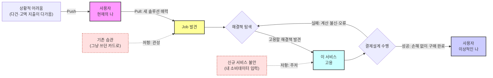

# 07. 고객 상황을 객관화하는 JTBD(Jobs-To-Be-Done) 분석 — 미래지출 결제설계 서비스

> **분석 대상 기획서:** [`proposal/미래지출 결제설계 서비스 기획서 v0.1.md`](<../proposal/미래지출 결제설계 서비스 기획서 v0.1.md>)
> **방법론 참고:** [business-analysis-frameworks/07_JTBD분석/00_방법론.md](https://github.com/jennie-brain/business-analysis-frameworks/blob/main/07_JTBD%EB%B6%84%EC%84%9D/00_%EB%B0%A9%EB%B2%95%EB%A1%A0.md)
> **입력:** [`05-1`](<./05-1 - 페르소나 스펙트럼.md>), [`05-2`](<./05-2 - 고객 여정지도.md>), [`06`](<./06 - 시장기회 분석(기회점수 OS).md>)
> **분석 기준일:** 2026-08-13
> **작성자 / 팀:** JENNIE / AI-PM-study

> **상태 표기** — 이 문서는 **아직 실제로 인터뷰를 수행하지 않았다.** 여기 있는 것은 (a) 06단계 미검증 항목을 인터뷰 대상·질문으로 번역한 설계도이며, (b) 실제 인터뷰 수행·코딩은 다음 실행 단계다.

### Decision Log

| 날짜 | 결정 | 이유 |
|---|---|---|
| 2026-08-13 | 06단계 Open Question(OQ-27~29) 3개를 이 챕터의 검증 대상으로 그대로 승계 | JTBD는 새 가설을 만드는 단계가 아니라 06단계에서 잠정치로 남은 것을 실측하는 단계 |
| 2026-08-13 | 인터뷰 대상자를 05-1의 페르소나 스펙트럼(Core·Adjacent·Extreme·Non-user)에서 직접 스크리닝 기준으로 재사용 | 방법론 3절 원칙 — 페르소나 스펙트럼 자체가 JTBD 3그룹 모집 기준과 대응됨 |

---

## 1. Forces of Progress — 이 서비스에 적용

| 힘 | 이 서비스에서의 구체적 형태 | 관련 근거 |
|---|---|---|
| Push(상황 불만) | 혼인·입주 등으로 곧 다건·고액 지출이 닥침, 지금 방식(개별 검색·수동계산)이 불편함 | 06단계 C1-P1(AOS 3.0) |
| Pull(새 해결책 매력) | 카드 조합·구매건별 배분까지 보여준다는 차별점 | 06단계 C1-P2(AOS 4.0) |
| Habit(기존 습관) | "그냥 쓰던 카드로 결제하면 되지" — Non-consumption | 06단계 N1-P1(AOS 0.0) |
| Anxiety(신규 불안) | 소비·지출 데이터를 앱에 입력하는 것에 대한 거부감 | 06단계 N2-P1(AOS 0.4) |

---

## 2. JTBD 중심 사고 vs 05단계 페르소나 중심 사고

| 구분 | 05단계(페르소나) | 07단계(JTBD) |
|---|---|---|
| 초점 | 김지은·박준혁·이수민·최유리가 "누구인가" | 이들이 "어떤 변화를 위해 무엇을 고용/해고했는가" |
| 데이터 신뢰도 문제 | 속성(나이·직업)은 비교적 정확 | 06단계 Importance·Satisfaction은 실측이 아니라 가설(🟡) — 응답자가 자기 동기를 모르거나 숨길 수 있음 |
| 이번 단계가 할 일 | (완료) | 표면적 답변이 아니라 전환 사건(switch event) 중심 인터뷰로 4가지 힘을 실측 |

---

## 3. 06단계 검증 대상 → 인터뷰 모집군 매핑

| 06단계 검증 대상 | 모집군 | 확인할 힘 |
|---|---|---|
| **OQ-27** Core(김지은) BEST CASE Pain(C1-P1·C1-P2)의 실제 사용성 | 최근 혼수 준비 중 카드고릴라·뱅크샐러드 등 카드추천을 실제로 써 본 사람 | Push·Pull의 실재 여부·강도 |
| **OQ-28** Adjacent(박준혁)·Extreme(이수민) Market Relevance 실측 | 입주 1인가구(Adjacent), 신규발급 거절 경험이 있는 혼인 준비자(Extreme) | Adjacent=Pull이 실제로 존재하는지, Extreme=Push(과거 실패 경험)의 강도 |
| **OQ-29** DOS高 AOS低 빈칸 — Adjacent Importance 재평가 | 입주 1인가구 중 실제 가전·가구 다건구매 경험자 | Push의 실제 강도(04단계 인원은 큰데 강도는 미확인) |
| Non-user(최유리) 검증 | 혼수비용을 부모가 지원했거나, 서비스를 인지했으나 쓰지 않은 사람 | Habit("이미 충분하다")의 정체, Anxiety와의 구분 |

---

## 4. 인터뷰 대상자 우선순위 (10명)

05-1의 페르소나 스펙트럼과 06단계 AOS/DOS 사분면을 교차해 우선순위를 정했다.

| 순위 | 모집군 | 인원 | 대응 페르소나 | 사분면(06단계) |
|---|---|---|---|---|
| 1 | 카드추천 서비스 실사용 경험자(혼인 준비 중) | 3명 | Core(김지은) | Q1, BEST CASE |
| 2 | 신규카드 거절 경험이 있는 혼인 준비자 | 2명 | Extreme(이수민) | Q1, AOS高DOS低 |
| 3 | 입주 1인가구(가전·가구 다건구매 예정/경험) | 3명 | Adjacent(박준혁) | Q1, AOS高DOS低 |
| 4 | 서비스 인지했으나 미사용/거부 | 2명 | Non-user(최유리) | Q4, 과잉투자(검증용 대조군) |

**모집 기준(방법론 2.1절 3그룹)과의 매핑**: 순위 1(최근 사용 시작)·순위 2·3(사용 중단 또는 대체행동으로 회귀)·순위 4(들어본 적 없음/거부)가 각각 방법론의 3그룹에 대응한다.

---

## 5. 인터뷰 문항지

### 5.1 공통 문항 — 대안 및 맥락 파악

| # | 질문 |
|---|---|
| 1 | 카드나 결제수단을 알아보기 전에 다른 어떤 방법을 고려하셨나요? |
| 2 | 그 방법들을 고려할 때 무엇을 찾고 있었나요? |
| 3 | 구체적으로 무엇을 해결하려고 하셨나요? |
| 4 | 카드 혜택이나 결제 방법을 어떻게 찾아보셨는지 이야기해 주세요 |
| 5 | 실제로 사용해 본 카드추천 서비스나 방법은 무엇인가요? |
| 6 | 그중 좋았던 점과 불편했던 점은 무엇인가요? |
| 7 | 이런 서비스가 없었다면 대신 무엇을 하셨을까요? |
| 8 | 주변 사람들은 이런 상황에서 어떻게 하던가요? |

### 5.2 공통 문항 — 맥락 및 감정

| # | 질문 |
|---|---|
| 1 | 카드·결제수단을 고민할 필요가 있다는 걸 언제 처음 느끼셨나요? |
| 2 | 이 고민을 다른 사람과 이야기해 보셨나요? 어떤 대화였나요? |
| 3 | 이런 서비스를 쓴다면 어떤 모습일지 상상해 보셨나요? |
| 4 | 이런 서비스에서 무엇을 원하셨나요? |
| 5 | 새로운 카드나 서비스를 쓰는 것에 대한 불안감이 있었나요? |

### 5.3 페르소나별 추가 문항

| 대상 | 추가 문항 |
|---|---|
| Core(카드추천 실사용자) | "카드 한 장 추천"과 "여러 구매를 어떻게 나눠 쓸지"는 다른 질문인데, 실제로 나눠서 결제 계획을 세워보셨나요? 그 과정이 어땠나요? |
| Extreme(신규발급 거절 경험자) | 신규카드가 막혔을 때 기존 카드로 대신 어떻게 해결하셨나요? 그때 계산이 맞는지 얼마나 믿으셨나요? |
| Adjacent(입주 1인가구) | 이사·입주 준비 중 가전·가구를 살 때 카드 혜택을 실제로 비교해 보셨나요? 혼인 준비와 비교해 이 준비 기간이 얼마나 급박했나요? |
| Non-user(미사용/거부) | 그냥 있는 카드로 결제하기로 한 이유는 무엇이었나요? 나중에 "더 아낄 수 있었다"는 걸 알게 된다면 어떤 느낌일 것 같나요? |

---

## 6. 이 챕터의 현재 상태

- [x] Forces of Progress 프레임을 이 서비스에 적용
- [x] 06단계 미검증 항목(OQ-27~29)을 인터뷰 모집군에 매핑
- [x] 인터뷰 대상자 우선순위 10명, 공통·페르소나별 문항지 확정
- [ ] **실제 인터뷰 수행·전사** — 아직 수행 전
- [ ] Push/Pull/Habit/Anxiety 코딩, 06단계 AOS·DOS 재계산

이 문서가 설계한 인터뷰를 실제로 수행하기 전까지, 06단계의 BEST CASE(Core)를 제외한 나머지 순위는 전부 **잠정치로 남는다.**

## Open Questions (다음 실행 단계)

| ID | 내용 |
|---|---|
| OQ-30 | 위 10명 인터뷰를 실제로 언제, 어떤 채널로 모집할 것인가(웨딩 커뮤니티, 부동산 커뮤니티 등) |
| OQ-31 | 인터뷰 결과로 Adjacent의 Market Relevance(0.4→실측)가 Core를 넘어서면, 04단계 Beachhead 자체를 재정의해야 하는가 |
