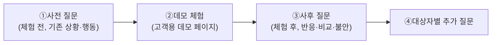

# 07-2. 데모체험 기반 JTBD 인터뷰 문항지 — 미래지출 카드결제 설계 서비스

> **관련 문서:** [`07`](<./07 - JTBD 분석.md>)(방법론·필터링), [`07-1`](<./07-1 - JTBD 인터뷰 종합 계획서.md>)(종합 계획서) — 이 문서는 그 대상자 확정 결과에 **고객용 데모 페이지 체험** 절차를 결합해 문항지를 다시 짠 것이다.
> **분석 기준일:** 2026-08-14

> **상태 표기** — 이 문항지는 아직 실제 인터뷰에 쓰이지 않았다. 01~06단계 인용 근거는 전부 가설(🟡)이다.

### Decision Log

| 날짜 | 결정 | 이유 |
|---|---|---|
| 2026-08-14 | 인터뷰 대상 필터②를 "AOS Q1(혁신기회)"에서 **"AOS Q1(혁신기회) ∪ AOS-DOS 니치마켓(AOS高DOS低)"** 으로 명시적으로 확장해 재검증 | 06단계 §5의 니치마켓(A1-P1·E1-P1·E1-P2)이 실제로 필터②에 반영됐는지 검증이 필요했음 |
| 2026-08-14 | 재검증 결과 니치마켓 3건이 전부 기존 AOS Q1(13건)의 부분집합이라 합집합이 늘지 않음을 확인 — **대상자 명단은 07-1과 동일하게 확정** | 니치마켓의 이수민(E1) 지분은 이미 07단계에서 "중단자" 모집군으로 흡수 처리되어 있어 별도 인물 추가가 필요 없음 |
| 2026-08-14 | 인터뷰 방식을 "과거 대안 회고" 단독에서 **"사전 질문 → 데모 체험 → 사후 질문"** 3단 구조로 재설계 | 사용자 요청 — 참가자가 실제 데모 페이지를 체험한 뒤 그 경험을 근거로 응답하도록 함. 순수 회고형 질문(07-1)만으로는 "이 서비스를 실제 써보니 어떤가"를 확인할 수 없음 |
| 2026-08-14 | 공통 문항을 1차로 배치하고 대상자별 문항을 뒤에 첨부하는 단일 마크다운으로 통합 | 사용자 요청 — 진행자가 한 파일로 전체 흐름을 따라갈 수 있게 함 |

---

## 0. 인터뷰 대상 재확인 (필터 검증 결과)

**필터①(스펙트럼 유형)**: Core + Adjacent만 — Extreme·Non-user 제외.
**필터②(기회 사분면, 이번에 확장 검증)**: 06단계 AOS Q1(혁신기회, 13건) **∪** AOS-DOS 니치마켓(AOS高DOS低, 3건: A1-P1·E1-P1·E1-P2).

| 확인 항목 | 결과 |
|---|---|
| 니치마켓 3건이 Q1 밖에 있는가? | 아니오 — A1-P1·E1-P1·E1-P2 전부 Q1에 이미 포함됨 |
| 합집합 크기 | Q1(13건)과 동일 — 새로 추가되는 Pain 없음 |
| 니치마켓의 이수민(E1) 지분 처리 | 필터①(Extreme 제외)에 의해 별도 인물로는 제외되나, **"중단자" 모집군의 스크리닝 조건**(신용제약으로 계산을 포기한 경우 포함)으로 이미 흡수됨 — 재확인 완료 |

**최종 대상자(8개 모집군, 07-1과 동일)**

| 순위 | 대상 | 유형 | 근거 Pain |
|---|---|---|---|
| 1 | 김지은형(Core) | 핵심 | C1-P1·P2·P3 |
| 2 | (신규) 카드비교 중단자 — 이수민형 흡수 | 핵심의 중단 상태 | E1-P1·P2(니치마켓 포함) |
| 3 | 박준혁형(Adjacent) | 확장 | A1-P1·P2(A1-P1은 니치마켓 겸함) |
| 4 | 오세영형(시간부족) | 핵심 | C3-P1 |
| 5 | 한지수형(재정불안) | 핵심 | C4-P1 |
| 6 | 윤성민형(고급유저) | 핵심 | C5-P1 |
| 7 | 최다인형(동거) | 확장 | A2-P1 |
| 8 | 이건우형(재정착) | 확장 | A3-P1 |
| 참고 | 최유리형(Non-user, 대조군) | 비활성 — 필터①②모두 탈락이나 Habit/Anxiety 대조군으로 소수 권고 | N1-P1~P3 |

---

## 1. 인터뷰 진행 구조

- **①사전 질문**: 데모를 보여주기 전, 07-1의 회고형 질문(기존 상황·대안·Push·Habit)을 그대로 쓴다 — 데모 체험이 답변에 영향을 주지 않도록 반드시 먼저 진행한다.
- **②데모 체험**: 진행자가 데모 페이지 링크(또는 화면 공유)를 제공하고, "다가오는 지출을 실제로 입력한다고 생각하고 사용해 보세요"라고 안내한다. Think-aloud(생각을 소리 내어 말하며 진행)를 권장하고, 막히는 지점은 개입 없이 관찰·기록한다.
- **③사후 질문**: 체험 직후 Pull·Anxiety·Fit(적합도)을 확인하는 공통 질문을 진행한다.
- **④대상자별 추가 질문**: 3절의 대상자별 문항으로 마무리한다.

---

## 2. 공통 문항 — 전체 대상자 1차 적용

### 2.1 사전 질문(체험 전)

| # | 질문 | 검증 대상 |
|---|---|---|
| 1 | 최근 혼인·입주 등으로 가전·가구를 여러 건 구매할 계획이 있으신가요? 어떤 상황인가요? | Situation 확인 |
| 2 | 이런 지출을 준비하면서 카드나 결제수단을 알아본 경험이 있으신가요? | Job 발생 여부 |
| 3 | 그때 어떤 방법(서비스·검색·지인상담·직접계산)을 쓰셨나요? | Current Solutions |
| 4 | 그 방법에서 좋았던 점과 아쉬웠던 점은 무엇인가요? | Satisfaction 실측 |
| 5 | 지금 카드 혜택을 비교하는 데 있어 가장 큰 어려움은 무엇인가요? | Push 강도 |
| 6 | 카드 비교를 시도했다가 중간에 그만두신 적이 있나요? 있다면 이유는 무엇이었나요? | Habit/중단 이력(2순위 스크리닝과 연결) |

### 2.2 데모 체험 안내(진행자 스크립트)

> "지금부터 화면(링크)을 보여드리겠습니다. 실제로 앞으로 예정된 지출이 있다고 생각하시고, 편하게 사용해 보시면서 드는 생각을 그대로 말씀해 주세요. 중간에 막히는 부분이 있어도 제가 먼저 알려드리지 않을 테니 편하게 시도해 보세요."

### 2.3 사후 질문(체험 후)

| # | 질문 | 검증 대상 |
|---|---|---|
| 1 | 방금 체험한 화면이 실제 본인 상황에 도움이 될 것 같나요? 어떤 부분이 특히 그런가요? | Pull 실재 여부 |
| 2 | 이전에 쓰시던 방법(2.1-③)과 비교하면 무엇이 다르게 느껴지나요? | 차별점 인지 |
| 3 | 이 서비스를 실제로 쓴다면 어떤 점이 망설여지시나요? | Anxiety |
| 4 | 입력하는 과정에서 불편하거나 이해가 안 되는 부분이 있었나요? | 사용성(§5.1 MVP 제약 검증) |
| 5 | 계산 결과를 얼마나 믿을 수 있을 것 같나요? 그 이유는 무엇인가요? | KSF #2(계산신뢰) 검증 |
| 6 | 방금 답하신 기존 방법 대신, 이 서비스가 있었다면 이걸 쓰셨을 것 같나요? 왜 그렇게 생각하시나요? | Hire 의향 |
| 7 | 체험한 것 중에 없어서 아쉬운 기능이 있다면 무엇인가요? | Desired Outcome 추가 발견 |

> ⚠️ **표면적 질문 금지**: "카드조합 배분 기능이 마음에 드셨나요?"처럼 06단계 산출물을 직접 겨냥해 묻지 않는다. 위 질문으로 반응을 끌어낸 뒤, 인터뷰가 끝나고 06단계 가설과 대조한다.

---

## 3. 대상자별 추가 문항

### 3.1 1순위 — 김지은형(Core, 혼인)

| # | 질문 |
|---|---|
| 1 | 데모에서 구매 건들을 카드별로 나눠주는 화면을 보셨을 때, 실제로 본인이 예정한 구매 목록과 비교해 얼마나 정확하다고 느끼셨나요? |
| 2 | 신규카드 발급 여부를 비교해주는 화면은 배우자와 상의하는 상황에 실제로 도움이 될 것 같나요? |

### 3.2 2순위 — 카드비교 중단자(이수민형 흡수)

| # | 질문 |
|---|---|
| 1 | 예전에 복잡해서 포기하셨던 계산을, 이번 데모에서는 신뢰할 수 있으셨나요? 무엇이 달랐나요? |
| 2 | (신규카드 발급이 막히는 경우를 가정한 화면이 있었다면) 그 화면이 실제 상황과 얼마나 맞았나요? |

### 3.3 3순위 — 박준혁형(Adjacent, 입주)

| # | 질문 |
|---|---|
| 1 | 이 데모 같은 서비스가 있다는 걸 미리 알았다면 어디서 접했을 것 같나요? (트리거 채널 확인) |
| 2 | 이 데모가 "혼인"이 아니라 "입주" 상황에 얼마나 잘 맞는다고 느끼셨나요? 다르게 느껴진 부분이 있다면요? |

### 3.4 4순위 — 오세영형(시간부족)

| # | 질문 |
|---|---|
| 1 | 시간이 부족한 상황에서 이 데모의 입력 과정이 얼마나 빠르게 느껴지셨나요? |

### 3.5 5순위 — 한지수형(재정불안·소득 불규칙)

| # | 질문 |
|---|---|
| 1 | 할부·무이자 조건을 고려하는 화면이 있었다면, 본인의 소득 변동성을 반영하기에 충분했나요? |

### 3.6 6순위 — 윤성민형(고급유저, 다카드 보유)

| # | 질문 |
|---|---|
| 1 | 이미 여러 장의 카드를 나눠 쓰고 계신데, 이 데모가 그 이상의 가치를 주었나요, 아니면 이미 알고 계신 걸 반복하는 느낌이었나요? |

### 3.7 7순위 — 최다인형(비혼 동거)

| # | 질문 |
|---|---|
| 1 | 두 사람이 함께 결정해야 하는 상황인데, 데모가 공동 입력·공동 결정을 지원하는 것처럼 보였나요? |

### 3.8 8순위 — 이건우형(이혼 재정착)

| # | 질문 |
|---|---|
| 1 | 새로 시작하는 상황에서 이 데모를 쓰는 것이 심리적으로 부담을 줄여주는 느낌이었나요? |

### 3.9 참고 — 최유리형(Non-user, 대조군)

| # | 질문 |
|---|---|
| 1 | 부모님이 비용을 지원해 주시는 상황이라면, 이 데모를 굳이 써야 할 이유가 있다고 느끼셨나요? |
| 2 | 어떤 정보가 미리 있었다면 이 데모를 써봤을 것 같나요? |

---

## Open Questions

| ID | 내용 |
|---|---|
| OQ-36 | 데모 페이지의 실제 URL·접근 방식(웹 프로토타입 vs 클릭더미)을 언제까지 확정할 것인가 |
| OQ-37 | Think-aloud 중 관찰된 막힘 지점을 정량 지표(막힌 단계, 소요 시간)로 별도 기록할 것인가 |
