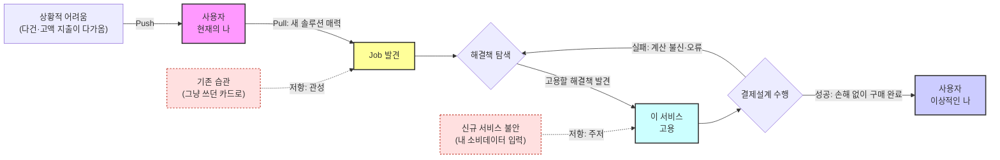

# 07. 고객 상황을 객관화하는 JTBD(Jobs-To-Be-Done) 분석 — 미래지출 결제설계 서비스

> **분석 대상 기획서:** [`proposal/미래지출 결제설계 서비스 기획서 v0.1.md`](<../../proposal/미래지출 결제설계 서비스 기획서 v0.1.md>)
> **방법론:** 사용자가 제공한 JTBD 인터뷰 방법론 문서(§1~4 인터뷰 수행 지침, §5 결과 보고서 작성법)를 따른다. **타임라인 모델(First Thought → Passive Looking → Active Looking → Deciding → Consuming)은 아직 반입되지 않아 6절에 빈 자리로만 남긴다.**
> **입력:** [`05-1`](<../05_페르소나_고객여정지도/01_페르소나_스펙트럼.md>), [`05-2`](<../05_페르소나_고객여정지도/02_고객여정지도.md>), [`06`](<../06_시장기회분석/01_시장기회분석.md>)
> **분석 기준일:** 2026-08-13
> **작성자 / 팀:** JENNIE / AI-PM-study
> **Decision Log:** [`00_Decision_Log.md`](<./00_Decision_Log.md>)

> **상태 표기** — 이 문서는 **아직 실제로 인터뷰를 수행하지 않았다.** 05·06단계 전체가 인터뷰 없이 작성됐고, 각 문서가 근거 등급(🟡)으로 그 사실을 반복 경고했다. 이 챕터는 그 공백을 메우기 위한 **인터뷰 설계도**이며, 지금까지의 페르소나·Pain·점수는 전부 여기서 검증되거나 폐기될 대상이다.

## 개요

Forces of Progress(Push/Pull/Habit/Anxiety) 프레임을 이 서비스에 적용하고, 모집 기준을 "우리 제품"에서 "기존 대안"으로 치환했다. 05-1의 12명 후보에 ①스펙트럼 유형(Core+Adjacent만) ②06단계 AOS Q1 보유 두 필터를 교차해 7명으로 좁혔고, 필터①에서 제외된 이수민(Extreme)의 Q1 Pain 손실은 "중단자" 모집군으로 흡수했다. 인터뷰 질문지·결과 보고서 형식(Job Statement, Pain→Outcome 변환)까지 이 문서에서 설계했다.

---

## 1. Forces of Progress — 이 서비스에 적용

### 1.1 4가지 힘이 06단계 결과와 맞물리는 지점

| 동인 | 지금까지의 대응물 | 인터뷰에서 검증할 것 |
|---|---|---|
| Push(상황 불만) | C1-P1 "지출이 흩어져 전체를 못 봄"(AOS 3.0) | 무엇이 실제로 비교를 시작하게 만드는가 — 웨딩업체 계약인지, 배우자와의 대화인지 |
| Pull(새 해결책 매력) | C1-P2 "카드조합·구매건별 배분"(AOS·DOS 공동 1위) | 이 차별점이 실제로 끌어당기는 힘인지, 아니면 "그럴듯하지만 안 써도 되는" 부가기능인지 |
| Habit(관성) | N1-P1 Non-consumption(AOS 0.0) | "그냥 있는 카드로" 라는 관성의 실체 — 정말 무관심인지, 다른 이유(신뢰 부족)를 관성으로 착각한 것인지 |
| Anxiety(불안) | N2-P1 프라이버시 우려(AOS 0.4, 보류 후보) | 소비데이터 입력에 대한 불안이 실제 장벽인지, 이미 마이데이터에 익숙해 무의미한지 |

---

## 2. 모집 기준 3그룹 — "우리 제품"에서 "기존 대안"으로 치환

방법론 §1의 세 그룹은 "우리 제품"을 기준으로 하지만, 이 서비스는 아직 없다. JTBD의 핵심은 전환 행동이므로, 기준을 **"이 문제를 푸는 기존 대안"** 으로 치환한다.

| 원문의 그룹 | 치환 기준 | 대응 인물(05-1) |
|---|---|---|
| 최근 우리 제품 사용을 시작한 사람 | 최근 카드추천 서비스(뱅크샐러드·카드고릴라)를 실제로 써 본 사람 | 김지은(C1)·오세영(C3)·한지수(C4)·윤성민(C5), 박준혁(A1)·최다인(A2)·이건우(A3) |
| 최근 우리 제품 사용을 중단한 사람 | 최근 카드 비교를 시도했다가 복잡해서 그만둔 사람 | **05-1에 명시적 인물이 없다 — 아래 3절에서 새로 정의** |
| 우리 제품에 대해 들어본 적 없는 사람 | 이런 서비스 자체를 모르거나, 알아도 검토하지 않은 사람 | 최유리(N1)·조민재(N2) — 다만 4절에서 필터로 제외 |

> ⚠️ **세 번째 그룹을 "카드 비교를 아예 안 하는 사람"으로 잡으면 안 된다.** 원문 기준은 "이 서비스를 모르는"이지 "카드 혜택 비교 자체를 모르는"이 아니다. 카드 혜택 비교라는 개념 자체를 모르는 사람은 이 시장 진입 조사의 대상이 아니라 별도 조사 대상이다.

> ⚠️ **"중단자" 그룹이 비어 있다는 사실 자체가 발견이다.** 05단계는 유입 경로(Core·Adjacent)와 이탈 이후 상태(Non-user)만 인물로 세웠고, "시도했다가 중단한" 상태의 인물을 별도로 만들지 않았다. 05-2의 이수민(Extreme)이 유일하게 "③검토·의사결정 단계에서 중단 → ④입력 단계에서 재도전"이라는 중단·재시도 서사를 갖고 있지만, 이수민은 신용제약이라는 특정 원인에 묶여 있어 "중단" 일반을 대표하지 못한다. **신규 중단자 그룹을 3절에 별도로 세운다.**

---

## 3. 인터뷰 대상자 재선정 — 두 필터의 교집합

**필터①(스펙트럼 유형)**: Core + Adjacent만 — Extreme·Non-user 제외.
**필터②(기회 사분면)**: 06단계 AOS Q1(혁신기회) Pain을 1개 이상 보유.

### 3.1 필터 적용 결과

| 후보 | 유형 | Q1 Pain 보유 | 필터① | 필터② | 통과 |
|---|---|---|---|---|---|
| 김지은(C1) | Core | P1·P2·P3 전부 | ✅ | ✅ | ✅ |
| 박준혁(A1) | Adjacent | P1·P2(P3는 Q4) | ✅ | ✅ | ✅ |
| 오세영(C3) | Core | P1 | ✅ | ✅ | ✅ |
| 한지수(C4) | Core | P1 | ✅ | ✅ | ✅ |
| 윤성민(C5) | Core | P1 | ✅ | ✅ | ✅ |
| 최다인(A2) | Adjacent | P1 | ✅ | ✅ | ✅ |
| 이건우(A3) | Adjacent | P1 | ✅ | ✅ | ✅ |
| 정하늘(C2) | Core | 없음(Q2만) | ✅ | ❌ | ❌ |
| 이수민(E1) | **Extreme** | P1·P2·P3 전부 | ❌ | ✅ | ❌ *(3.2 참고)* |
| 강태오(E2) | Extreme | 없음(Q3만) | ❌ | ❌ | ❌ |
| 최유리(N1) | Non-user | 없음(Q4만) | ❌ | ❌ | ❌ |
| 조민재(N2) | Non-user | 없음(Q4만) | ❌ | ❌ | ❌ |

두 필터를 교차하면 **7명**이 남는다.

### 3.2 최종 인터뷰 대상 우선순위

인물 단위 DOS 합(06단계 값 재사용)으로 정렬했다.

| 순위 | 인물/모집군 | 유형 | 해당 Pain | DOS 합 | 모집 기준(치환) |
|---|---|---|---|---|---|
| 1 | 김지은 | Core | C1-P1·P2·P3 | 8.0 | 시작(카드추천 실사용) |
| 2 | **(신규) 카드비교 중단자** | Core형 중단 상태 | — | — | 중단 — "복잡해서 그만뒀다" 전반을 스크리닝, **이수민형(신용제약으로 그만둔 경우)도 이 안에 포함해 모집** |
| 3 | 박준혁 | Adjacent | A1-P1·P2 | 2.0 | 시작·미경험(입주) |
| 4 | 오세영 | Core | C3-P1 | 0.3 | 시작(시간부족형) |
| 5 | 한지수 | Core | C4-P1 | 0.15 | 시작(재정불안형) |
| 6 | 윤성민 | Core | C5-P1 | 0.15 | 시작(고급유저형) |
| 7 | 최다인 | Adjacent | A2-P1 | 0.15 | 시작·미경험(동거) |
| 8 | 이건우 | Adjacent | A3-P1 | 0.15 | 시작·미경험(재정착) |

**중요도 순서와 실행 순서는 다르다** — 4~8순위는 DOS가 비슷해 실제 섭외는 접근 용이성(지인 네트워크, 커뮤니티) 순으로 진행해도 무방하다. 1~3순위(김지은·중단자·박준혁)는 06단계 상위 발견을 직접 검증하는 자리라 순서를 지킨다.

### 3.3 걸러진 인물과 사유

| 인물 | 걸러진 필터 | 사유 |
|---|---|---|
| 정하늘(C2) | ② | Core 유형이지만 보유 Pain(C2-P1)이 Q2(개선기회)뿐 — 기존 대안(엑셀)이 이미 어느 정도 작동 중 |
| **이수민(E1)** | ① | Extreme 유형. **Q1 Pain 3개(DOS 합 2.4, 박준혁보다 높음)를 보유해 손실이 크다** — 별도 인물로 세우지 않고 2순위 "중단자" 모집 시 스크리닝 조건으로 흡수 |
| 강태오(E2) | ①② | Extreme 유형이며 보유 Pain도 Q3(유지관리)뿐 |
| 최유리(N1) | ①② | Non-user 유형이며 보유 Pain 전부 Q4(과잉투자) — 06·05단계 모두에서 이미 Non-consumption으로 결론 |
| 조민재(N2) | ①② | Non-user 유형이며 보유 Pain도 Q4뿐 |

---

## 4. JTBD 중심 사고 vs 05단계 페르소나 중심 사고

| 구분 | 05단계(페르소나) | 07단계(JTBD) |
|---|---|---|
| 초점 | 김지은·박준혁 등이 "누구인가" | 이들이 "어떤 변화를 위해 무엇을 고용/해고했는가" |
| 데이터 신뢰도 문제 | 속성(나이·직업)은 비교적 정확 | 06단계 Importance·Satisfaction은 실측이 아니라 가설(🟡) |
| 질문 원칙 | — | **표면적 질문 금지**: "C1-P2가 중요하신가요?"처럼 기존 산출물을 직접 묻지 않는다. 05·06 산출물은 질문지가 아니라 인터뷰 후 대조할 검증 대상이다 |

---

## 5. 인터뷰 문항지

### 5.1 공통 문항 — 대안 및 맥락 파악

| # | 질문 |
|---|---|
| 1 | 카드나 결제수단을 알아보기 전에 다른 어떤 방법을 고려하셨나요? |
| 2 | 그 방법들을 고려할 때 무엇을 찾고 있었나요? |
| 3 | 구체적으로 무엇을 해결하려고 하셨나요? |
| 4 | 카드 혜택이나 결제 방법을 어떻게 찾아보셨는지 이야기해 주세요 |
| 5 | 실제로 사용해 본 카드추천 서비스나 방법은 무엇인가요? |
| 6 | 그중 좋았던 점과 불편했던 점은 무엇인가요? |
| 7 | 이런 서비스가 없었다면 대신 무엇을 하셨을까요? |
| 8 | 주변 사람들은 이런 상황에서 어떻게 하던가요? |
| 9 | (중단자 전용) 비교를 시작했다가 그만두신 시점은 언제였고, 무엇 때문이었나요? |

### 5.2 공통 문항 — 맥락 및 감정

| # | 질문 |
|---|---|
| 1 | 카드·결제수단을 고민할 필요가 있다는 걸 언제 처음 느끼셨나요? |
| 2 | 이 고민을 다른 사람과 이야기해 보셨나요? 어떤 대화였나요? |
| 3 | 이런 서비스를 쓴다면 어떤 모습일지 상상해 보셨나요? |
| 4 | 이런 서비스에서 무엇을 원하셨나요? |
| 5 | 새로운 카드나 서비스를 쓰는 것에 대한 불안감이 있었나요? |

### 5.3 대상자별 추가 문항

| 대상 | 추가 문항 |
|---|---|
| 김지은형(1순위) | "카드 한 장 추천"과 "여러 구매를 나눠 쓰는 계획"은 다른데, 실제로 나눠서 결제 계획을 세워보셨나요? |
| 중단자(2순위) | 판단하는 데 시간이 얼마나 걸렸나요? 다시 시도한다면 무엇이 달라야 계속하시겠어요? |
| 박준혁형(3순위) | 이사·입주 준비 중 가전·가구 살 때 카드 혜택을 실제로 비교해 보셨나요? 준비 기간이 혼인 준비보다 얼마나 급박했나요? |

---

## 6. 인터뷰 결과 보고서 작성법

### 6.1 Job Statement 3단 구조

`When(상황) … I want to(핵심 Job) … so I can(원하는 결과) …`

**예시(김지은형, 가설 — 인터뷰로 검증 대상)**: *"결혼 준비로 3개월 안에 가전·가구를 여러 건 사야 할 때(When), 어떤 카드를 뭐에 써야 손해가 없을지 한 번에 확인하고 싶다(I want to), 그래야 나중에 '이 카드 아니었으면 더 아꼈을 텐데'라는 후회 없이 넘어갈 수 있다(so I can)."*

### 6.2 결과 보고서 필드

| 필드 | 작성 가이드 |
|---|---|
| Persona / Segment | Core·Adjacent·Extreme·Non-user 중 분류 + 짧은 설명 |
| Situation (When…) | 전환을 유발한 상황적 맥락 한 문장 |
| Job Statement (…I want to…) | 해결하려는 핵심 일(진보) 한 문장 |
| Desired Outcome (…so I can…) | 달성하고 싶은 결과(측정 가능 표현) |
| 4 Forces | Push/Pull/Habit/Anxiety 각 1~2줄 |
| Current Solutions | 현재 쓰는 대체수단 |
| Switch Triggers/Barriers | 채택·이탈 계기와 장애요인 |
| Evidence | 인터뷰 인용 1~2개 + 근거 |
| Priority (AOS/DOS) | 06단계 값 또는 인터뷰 후 재계산값, **모수(SAM/SOM 중 무엇인지) 반드시 명시** |
| Notes | 실험 아이디어, 리스크, 추정 가설 |

### 6.3 요약 카드 예시(가상 — 인터뷰 전 템플릿)

| 구분 | 내용 |
|---|---|
| Persona / Segment | Core — 혼인 3개월 앞둔 예비신부(마케팅 회사원) |
| Situation | 예식 3개월 전, 가전·가구 목록·예산을 처음 정리하는 시점 |
| Job Statement | 여러 구매건을 어떤 카드로 나눠 결제할지 한 번에 확인하고 싶다 |
| Desired Outcome | 지출계획 입력 후 O분 안에 카드별 배분안을 확인, 놓친 혜택 0건 |
| 4 Forces | Push: 지출이 흩어져 전체를 못 봄 / Pull: 카드조합 배분 제시 / Habit: 엑셀·개별검색 / Anxiety: 소비데이터 입력 |
| Current Solutions | 카드고릴라·뱅크샐러드 개별 검색, 엑셀 수기 계산 |
| Switch Triggers/Barriers | Trigger: 배우자와 신규카드 발급 논의 / Barrier: 직접입력 자체가 번거로움(§5.1) |
| Evidence | ⚠️ **인터뷰 전 — 값 없음.** 인터뷰 후 실제 인용으로 교체 |
| Priority (AOS/DOS) | AOS 4.0 / DOS 4.0(SAM 기준, MR 1.0) — 06단계 C1-P2 |
| Notes | 신규/기존카드 비교 화면(F-04)이 이 Job Statement를 그대로 구현하는지 검증 필요 |

> ⚠️ **Evidence 필드는 지금 채울 수 없다.** 서비스가 없어 자체 로그가 없고, 인터뷰도 아직 없다. 빈칸을 그럴듯한 숫자로 메우지 않는다 — 뱅크샐러드·카드고릴라 앱스토어 공개 리뷰로 일부만 대체 가능하며, 나머지는 인터뷰에서 참가자가 말한 현재 수치("판단하는 데 얼마나 걸렸나요?")로만 채운다.

### 6.4 Pain → Outcome 변환 — 06단계 상위 3건

06단계는 Pain(무엇이 막혔는가)에 점수를 매겼다. 이 챕터의 결과 카드는 Outcome(무엇을 달성하고 싶은가)에 점수를 매긴다. 변환의 숫자(O분, O건)는 인터뷰 전까지 확정하지 않는다 — 지금 채우면 그 자체가 새로운 가정이 된다.

| ID | 06단계 Pain | Outcome(측정 표현은 인터뷰 후 확정) | Importance | Satisfaction | AOS | MR(SAM 기준) | DOS |
|---|---|---|---|---|---|---|---|
| C1-P2 | 추천이 카드 1장 단위, 배분법 없음 | 구매 목록 입력 후 [O분] 안에 카드별 배분안을 받을 수 있다 | 5 | 1 | 4.0 | 1.0 | 4.0 |
| C1-P1 | 지출이 흩어져 전체를 못 봄 | 모든 예정 지출을 [O건] 한 화면에서 확인할 수 있다 | 5 | 2 | 3.0 | 1.0 | 3.0 |
| A1-P1 | 외부신호 없어 스스로 시작 | [특정 시점]에 서비스가 먼저 지출계획 입력을 제안해 준다 | 4 | 1 | 3.2 | 0.4 | 1.2 |

**모수 명시**: 이 표의 MR·DOS는 04단계 SAM(확인된 헤드카운트) 기준이다. TAM(마이데이터 이용자 약 3,000만 명) 기준으로 잡으면 어느 Pain을 고쳐도 비중이 0에 가깝게 수렴해 변별력이 없다 — 06단계에서 이미 이 이유로 TAM을 기각하고 SAM/헤드카운트를 채택했다.

---

## 7. 타임라인 모델 — 미반입

방법론 원문에 언급된 **First Thought → Passive Looking → Active Looking → Deciding → Consuming** 단계 모델은 아직 반입되지 않았다. 반입되면 이 절에 05-2 CJM의 6단계와 대조하는 표를 추가한다.

## 8. 이전 단계와의 연결

- 3.3절에서 이수민(Extreme)을 완전히 제외하지 않고 "중단자" 모집군에 흡수한 것은, 06단계가 이미 지적한 "AOS 高·DOS 低" 문제(Market Relevance가 잠정치)를 인터뷰로 실측하는 것과 같은 목적이다.
- 6.4절의 Outcome 변환 대상 3건은 정확히 06단계 BEST CASE(C1-P1, C1-P2) + AOS高DOS低 대표(A1-P1)다 — 06단계 결론을 그대로 이어받았다.

## Open Questions (다음 실행 단계)

| ID | 내용 |
|---|---|
| OQ-30 | 8개 모집군을 실제로 언제, 어떤 채널로 모집할 것인가(웨딩 커뮤니티, 부동산 커뮤니티, 지인 네트워크 등) |
| OQ-31 | 인터뷰 결과로 박준혁(Adjacent)의 Market Relevance가 김지은(Core)을 넘어서면 04단계 Beachhead 자체를 재정의해야 하는가 |
| OQ-32 | "중단자" 모집군 인터뷰에서 이수민형(신용제약)과 그 외 중단 이유(단순 복잡함 등)의 비중이 실제로 어떻게 나뉘는지 |
| OQ-33 | 타임라인 모델이 반입되면 05-2 CJM 6단계와 어떻게 대응되는지 재정리 |
