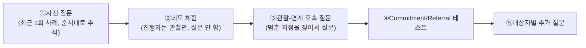

# 07-2. 데모체험 기반 JTBD 인터뷰 문항지 — 미래지출 카드결제 설계 서비스

> **관련 문서:** [`07`](<./01_JTBD분석.md>)(방법론·필터링), [`07-1`](<./02_인터뷰_종합계획서.md>)(종합 계획서) — 이 문서는 그 대상자 확정 결과에 **고객용 데모 페이지 체험** 절차를 결합해 문항지를 다시 짠 것이다.
> **분석 기준일:** 2026-08-14

> **상태 표기** — 이 문항지는 아직 실제 인터뷰에 쓰이지 않았다. 01~06단계 인용 근거는 전부 가설(🟡)이다.

### Decision Log

| 날짜 | 결정 | 이유 |
|---|---|---|
| 2026-08-14 | 필터② 재검증(AOS Q1 ∪ 니치마켓, 합집합 불변) — 대상자 8개 모집군 확정 유지 | 앞선 검증에서 이미 확인, 이번 개정과 무관하게 그대로 둠 |
| 2026-08-14 | "도움이 될 것 같나요", "쓰실 것 같나요"류 **직접 호불호·의향 질문을 전량 제거** | 응답자는 예의상 긍정 답변으로 기우는 경향이 있어(사회적 바람직성 편향), 가정된 미래 의향은 실제 채택 행동을 예측하지 못한다 — JTBD·Mom Test가 공통으로 경계하는 표면적 답변의 전형 |
| 2026-08-14 | 질문 중심 구조에서 **"진행자 행동 관찰 체크리스트" + "관찰-연계형 후속 질문"** 구조로 재설계 | 감정·행동 데이터는 질문에 대한 답이 아니라 **데모를 쓰는 동안 실제로 무엇을 했는지**에서 나와야 한다 — 관찰 없이 질문만 있으면 다시 자기보고(self-report)에 의존하게 됨 |
| 2026-08-14 | 사전 질문을 "그때 어떤 방법을 쓰셨나요"류 일반형에서 **"가장 최근 1회, 순서대로"** 형태로 재작성 | Mom Test 원칙 — 일반화된 습관 질문("보통 어떻게 하세요")은 응답자가 이상화해서 답하기 쉽고, 특정 사건 하나를 순서대로 추적하면 실제 행동이 드러난다 |
| 2026-08-14 | 사후 질문을 "쓰시겠어요?"(가정된 의향) 대신 **Commitment/Referral 테스트**(지금 실제 정보를 입력해볼 수 있는지, 누구에게 먼저 알리고 싶은지)로 대체 | 의향은 공짜 발언이지만, 실제 행동(데이터 입력, 지인 소개)에 대한 요청에 응하는지는 진짜 신호다 |

---

## 0. 설계 원칙 — 무엇을 묻지 않고 무엇을 관찰하는가

| 하지 않는 것 | 하는 것 |
|---|---|
| "이 화면이 도움이 될 것 같나요?" | 그 화면에서 실제로 몇 초 머물렀는지, 다시 돌아갔는지 관찰 |
| "쓰신다면 이 서비스를 쓰시겠어요?" | "지금 실제 지출 정보를 입력해 보시겠어요?"(진짜 실행 요청) |
| "불안하셨나요?" | 특정 입력 단계 직전에 멈칫거렸는지 관찰하고, 그 순간을 짚어 "방금 여기서 멈추셨는데 무슨 생각이셨나요?" |
| "기존 방법과 비교해 어떠셨나요?"(추상적) | 가장 최근 실제 사례 하나를 순서대로 재현시킨 뒤, 데모의 같은 단계와 나란히 대조 |
| "만족하셨나요?" | 데모 종료 후 아무 말 없이 3초 기다리기 — 자발적으로 나오는 첫 반응을 그대로 기록 |

---

## 1. 인터뷰 대상 재확인 (07-2 이전 버전과 동일)

**필터①**: Core+Adjacent만. **필터②**: AOS Q1(13건) ∪ 니치마켓(3건, 전부 Q1의 부분집합 — 합집합 불변, 이전 검증 유지).

| 순위 | 대상 | 근거 Pain |
|---|---|---|
| 1 | 김지은형(Core) | C1-P1·P2·P3 |
| 2 | 카드비교 중단자(이수민형 흡수) | E1-P1·P2 |
| 3 | 박준혁형(Adjacent) | A1-P1·P2 |
| 4~8 | 오세영·한지수·윤성민·최다인·이건우형 | C3/C4/C5/A2/A3-P1 |
| 참고 | 최유리형(Non-user, 대조군) | N1-P1~P3 |

---

## 2. 진행자용 행동 관찰 체크리스트 (데모 체험 중 내내 기록)

진행자는 데모 체험 동안 **질문하지 않고** 아래 항목만 실시간으로 표시한다. 이 체크리스트가 이번 개정의 핵심이다 — 감정·행동 분석의 원자료가 여기서 나온다.

| 관찰 항목 | 표시 방법 | 어느 힘(Force)의 신호인가 |
|---|---|---|
| 특정 화면에서 5초 이상 정지 | 화면명 + 정지 시간 기록 | Anxiety 또는 이해 실패 |
| 같은 화면을 다시 읽음(스크롤 되돌리기) | 화면명 + 횟수 | 신뢰 부족(KSF #2) 또는 정보 과부하 |
| 뒤로 가기·입력값 수정 | 어느 입력값을 왜 고쳤는지 짧게 메모 | 계산 신뢰 또는 실수 |
| 무의식적 혼잣말("어…", "음", 한숨) | 발화 그대로 인용 + 시점 | 감정 신호(생 데이터) |
| 다른 도구(계산기·메모앱·엑셀)를 켜려는 시도 | 시도 여부 + 어느 단계에서 | Habit(기존 습관으로의 회귀) |
| 특정 화면을 오래 보거나 스크린샷 시도 | 화면명 | Pull(끌리는 지점) |
| 완료까지 걸린 총 시간 | 분:초 | 전반적 마찰 수준 |
| 중도 이탈 여부(포기) | 이탈 화면명 + 그 직전 발화 | 결정적 이탈 지점 |

---

## 3. 인터뷰 진행 구조

---

## 4. 사전 질문 — "최근 1회, 순서대로" (체험 전)

일반화된 습관 질문("보통 어떻게 하세요")을 쓰지 않는다. 가장 최근 실제 사례 하나를 시간 순서대로 추적한다.

| # | 질문 |
|---|---|
| 1 | 가전이나 가구를 사려고 카드 혜택을 알아본 게 가장 최근 언제였나요? 그날 무슨 요일, 어디에 있을 때였는지 기억나시나요? |
| 2 | 그날 제일 처음 무엇을 하셨나요? (검색? 앱? 누구에게 물어봄?) 그다음엔 무엇을 하셨나요 — 순서대로 이어서 말씀해 주세요 |
| 3 | 그 과정에서 실제로 시간이 얼마나 걸렸나요? |
| 4 | 그 결과로 최종적으로 어떤 카드로, 무엇을 결제하셨나요? |
| 5 | 그 결정에 대해 나중에 다시 생각해 본 적 있나요? 있다면 무슨 계기였나요? |
| 6 | 카드 비교를 시작했다가 도중에 멈춘 적이 있다면, 그날도 순서대로 말씀해 주실 수 있나요 — 어디까지 하다가 멈추셨나요? |

> 이 질문들에 나온 **행동(무엇을, 어떤 순서로)** 만 기록한다. "왜 그렇게 느끼세요"류 이유를 캐묻는 대신, 다음 질문에서 실제 행동을 더 따라간다.

---

## 5. 데모 체험 안내(진행자 스크립트)

> "지금부터 화면을 보여드리겠습니다. 실제로 앞으로 그 지출이 있다고 생각하시고 사용해 보세요. 생각나는 걸 편하게 소리 내어 말씀해 주시면 되고, 제가 먼저 설명드리지는 않겠습니다."

진행자는 2절 체크리스트만 기록하고, 참가자가 멈추거나 질문해도 **"편하게 계속해 보세요"** 로만 응대한다.

---

## 6. 관찰-연계 후속 질문 (체험 직후, 2절 기록에 따라 선택적으로 사용)

일반형 질문이 아니라, **방금 관찰된 특정 행동을 그대로 되짚는** 질문이다. 해당 행동이 실제로 나타난 경우에만 사용한다.

| 관찰된 행동 | 후속 질문 |
|---|---|
| 특정 화면에서 오래 멈췄다 | "방금 이 화면에서 잠시 멈추셨는데, 그때 어떤 생각이 있으셨나요?" |
| 같은 화면을 다시 읽었다 | "이 부분을 다시 보셨는데, 뭘 다시 확인하고 싶으셨나요?" |
| 입력값을 고쳤다 | "방금 입력하신 걸 바꾸셨는데, 처음엔 왜 그렇게 넣으셨었나요?" |
| 계산기·메모앱을 켜려 했다 | "다른 걸 켜려고 하셨는데, 여기서 뭘 직접 확인하고 싶으셨나요?" |
| 특정 화면을 오래 보거나 캡처하려 했다 | "이 화면은 좀 더 보셨는데, 어떤 점이 눈에 띄셨나요?" |
| 중간에 멈추고 완료하지 않았다 | "여기서 멈추셨는데, 지금 이 시점에 필요한 게 무엇이었을까요?" |
| 혼잣말·한숨이 나왔다 | "방금 '(그대로 인용)'라고 하셨는데, 조금 더 말씀해 주실 수 있나요?" |

> ⚠️ 관찰되지 않은 행동에 대해 억지로 질문을 만들지 않는다. 표에 해당하는 행동이 없으면 그 항목은 비워 둔다 — 없다는 사실 자체가 데이터다("이 유형은 막힘 없이 완료했다").

---

## 7. Commitment/Referral 테스트 (가정된 의향 질문을 대체)

"쓰시겠어요?"(의향, 공짜 발언) 대신 **실제 행동을 요청**해 반응을 관찰한다.

| # | 요청/질문 | 관찰할 것 |
|---|---|---|
| 1 | "혹시 실제로 예정하신 지출 정보를 지금 여기 입력해 보시겠어요?" | 응하는지, 망설이는지, 어떤 정보를 빼고 입력하는지 |
| 2 | "이런 게 있다는 걸 알게 되면 제일 먼저 누구한테 이야기하고 싶으세요?" | 구체적 인물이 즉시 나오는지, "글쎄요"로 얼버무리는지 |
| 3 | "실제로 나오면 알려드릴까요? 연락처를 남기시겠어요?" | 실제로 연락처를 남기는지(가장 강한 신호) |
| 4 | "방금 보신 화면 중에 지금 당장 다시 보고 싶은 화면이 있나요?" | 구체적 화면을 지목하는지 |

---

## 8. 대상자별 추가 질문 (관찰-행동 기반으로 재작성)

### 8.1 1순위 — 김지은형(Core, 혼인)

| # | 질문 |
|---|---|
| 1 | (카드 배분 화면에서) 방금 나온 배분안에서 실제 예정하신 목록과 다른 부분이 있다면, 어디를 먼저 고치고 싶으세요? |
| 2 | 신규카드 발급 화면에서, 지금 배우자에게 바로 보여준다면 어떤 부분부터 이야기하실 것 같으세요? |
| 3 | (지출 목록 입력 중 항목을 넣었다 지우셨다면) 방금 그 항목을 빼셨는데, 실제 예정에서는 확정된 건가요, 아직 미정인가요? |
| 4 | (결과 화면의 구매 순서를 보고) 이 순서대로 실제로 결제하실 것 같나요, 아니면 바꾸고 싶은 부분이 있나요? 어디를요? |
| 5 | 결제 시점 알림 같은 게 있었다면, 최근 실제 결제하면서 "이때 알림이 있었으면" 싶었던 순간이 있었나요 — 언제였나요? |
| 6 | 지금까지 본 화면 중에 결혼식이 끝난 뒤에도 다시 열어볼 것 같은 화면이 있다면 어느 화면인가요? |

### 8.2 2순위 — 카드비교 중단자(이수민형 흡수)

| # | 질문 |
|---|---|
| 1 | (계산 결과 화면에서) 예전에 포기하셨을 때와 비교해서, 이번엔 어디까지 직접 눈으로 확인하고 싶으신가요? |
| 2 | (기존카드 only 화면이 있었다면) 그 결과를 실제 지금 상황에 그대로 적용해 보시겠어요? |
| 3 | (신규카드 관련 화면을 건너뛰셨다면) 방금 이 부분을 건너뛰셨는데, 실제로도 이 단계는 안 보실 것 같나요? |
| 4 | 계산 근거·설명이 나오는 화면에서 오래 보셨다면, 그중 어떤 부분을 특히 확인하고 싶으셨나요? |
| 5 | 예전에 복잡해서 그만두셨던 그 지점과, 방금 데모에서 비슷하게 복잡하다고 느낀 지점이 있었나요 — 있다면 어디였나요? |
| 6 | 만약 이 결과 중 하나가 틀렸다면, 어떻게 알아차리실 것 같으세요? |

### 8.2 2순위 — 카드비교 중단자(이수민형 흡수)

| # | 질문 |
|---|---|
| 1 | (계산 결과 화면에서) 예전에 포기하셨을 때와 비교해서, 이번엔 어디까지 직접 눈으로 확인하고 싶으신가요? |
| 2 | (기존카드 only 화면이 있었다면) 그 결과를 실제 지금 상황에 그대로 적용해 보시겠어요? |

### 8.3 3순위 — 박준혁형(Adjacent, 입주)

| # | 질문 |
|---|---|
| 1 | 이 화면을 입주 준비 중 어느 시점에 마주쳤다면 가장 자연스러웠을까요 — 계약 직후? 잔금 치를 때? |
| 2 | (탐색 화면에서) 지금 이 정보를 어디서 찾아보고 계셨을지, 실제로 최근에 썼던 앱이나 카페 이름이 있다면요? |
| 3 | (가전·가구 카테고리 선택 화면에서) 실제 예정 목록과 비교해 빠진 항목이 있다면 무엇인가요? |
| 4 | 결과 화면에 나온 예상 절감액 정도면, 실제로 카드를 비교할 만한 가치가 있다고 느끼시나요, 아니면 그냥 넘어갈 수준으로 느껴지시나요? |
| 5 | 이 절감액이 최근 다른 지출(예: 월세·생활비)과 비교하면 어느 정도 크기로 느껴지세요? |
| 6 | 이 화면을 다시 열어본다면 언제일 것 같으세요 — 입주 며칠 전, 아니면 당일인가요? |

### 8.4 4순위 — 오세영형(시간부족)

| # | 질문 |
|---|---|
| 1 | 방금 입력에 걸린 시간이, 평소 다른 일정과 비교하면 어느 정도 되나요(예: 출근길 vs 점심시간)? |
| 2 | 지금 이 데모를 실제로 한다면 어느 타이밍에 하셨을 것 같으세요 — 출퇴근길, 점심시간, 자기 전 중 어디에 가까울까요? |
| 3 | 화면 중에 "이건 지금 말고 나중에 봐도 되겠다" 싶어서 건너뛰고 싶었던 부분이 있었나요? |
| 4 | 스드메 준비와 같이 진행하신 다른 일들과 비교하면, 이 입력 작업은 몇 번째 우선순위였을 것 같으세요? |
| 5 | 결과가 나오는 동안 다른 걸 하고 싶은 마음이 드셨나요 — 있었다면 무엇을 하려 하셨나요? |
| 6 | 이 과정을 배우자나 다른 사람에게 대신 맡긴다면, 어디까지 맡기고 싶으세요? |

### 8.5 5순위 — 한지수형(재정불안·소득 불규칙)

| # | 질문 |
|---|---|
| 1 | (할부 조건 화면에서) 이번 달과 다음 달 사정이 다르다면, 지금 화면에서 무엇을 더 확인하고 싶으세요? |
| 2 | 일시불과 할부 중 실제로 어느 쪽을 먼저 눌러보셨나요? 그 이유는 무엇이었나요? |
| 3 | 이번 달과 다음 달 형편이 다르다는 걸 이 화면에 반영하고 싶다면, 구체적으로 어떤 정보를 더 넣고 싶으세요? |
| 4 | 화면에 나온 월 상환액을, 최근 실제 지출 중 무엇과 비교해 보고 싶으세요? |
| 5 | 갑자기 이번 달 수입이 줄어드는 상황이 온다면, 지금 이 화면이 그런 경우까지 반영해준다고 느끼셨나요, 아니었나요? |
| 6 | 이 결과를 보고 바로 결정하시겠어요, 아니면 다음 달 상황을 보고 다시 오시겠어요? |

### 8.6 6순위 — 윤성민형(고급유저, 다카드 보유)

| # | 질문 |
|---|---|
| 1 | 지금 보유하신 카드 앱들과 비교해서, 방금 이 화면에서 새로 발견한 정보가 있다면 무엇인가요? |
| 2 | 보유하신 카드를 입력하실 때, 평소 스스로 계산하시던 순서와 다르게 입력하신 부분이 있었나요? |
| 3 | 결과 화면의 배분안이 평소 직접 계산하시던 방식과 다른 부분이 있다면 어디인가요? |
| 4 | 방금 본 정보 중에 "이건 이미 알고 있었다" 싶은 부분과 "몰랐다" 싶은 부분을 나눠본다면요? |
| 5 | 평소 카드사 앱을 여러 개 오가며 비교하시던 걸 이 한 화면으로 대신한다면, 빠지는 부분이 있을 것 같으세요? |
| 6 | 방금 나온 결과를 다른 카드 고수 지인에게 검증받고 싶은 부분이 있다면 어디인가요? |

### 8.7 7순위 — 최다인형(비혼 동거)

| # | 질문 |
|---|---|
| 1 | 이 화면을 같이 사는 분과 지금 같이 본다면, 누가 먼저 무엇을 입력할 것 같으세요? |
| 2 | 입력하실 때 본인 명의 카드와 상대방 명의 카드를 구분해서 넣으셨나요, 아니면 합쳐서 넣으셨나요? |
| 3 | 결과 화면을 상대방과 따로 확인하시겠어요, 같이 보시겠어요? |
| 4 | 혼인 상태가 아니라서 이 화면에서 다르게 느껴진 부분이 있었나요(예: 특정 문구나 조건)? |
| 5 | 지금까지 두 분이 지출을 나누시던 방식(예: 각자 결제 후 정산)과, 이 화면이 어떻게 다르게 느껴지세요? |
| 6 | 이 결과를 나중에 다시 열어볼 사람은 본인일 것 같으세요, 상대방일 것 같으세요? |

### 8.8 8순위 — 이건우형(이혼 재정착)

| # | 질문 |
|---|---|
| 1 | 방금 목록을 입력하시면서, 예전과 비교해 다시 정리하기 편했던 부분과 그렇지 않았던 부분이 있다면요? |
| 2 | 예전에 비슷한 걸 준비하셨을 때와 비교해, 이번엔 예산을 어떻게 다르게 잡으셨나요? |
| 3 | 목록을 입력하시면서 예전 것과 겹치거나 다시 사야 하는 항목이 있었나요 — 그때 어떤 생각이 드셨나요? |
| 4 | 결과 화면을 보시면서 "예전에 이걸 알았으면 좋았을 텐데" 싶은 부분이 있었나요? |
| 5 | 지금 이 정보를 누군가와 상의하고 계신가요, 혼자 결정하고 계신가요? |
| 6 | 이 화면을 지금 이 시점 말고 다른 때 봤다면 더 도움이 됐을 것 같은 시점이 있나요? |

### 8.9 참고 — 최유리형(Non-user, 대조군)

| # | 질문 |
|---|---|
| 1 | (완료 화면에서) 지금 이 결과를 부모님께 보여드린다면, 어느 부분을 먼저 보여드리고 싶으세요? |
| 2 | 방금 입력하신 것 대신, 실제로는 어떻게 하실 것 같으세요? |
| 3 | 이 데모를 처음 보셨을 때 제일 먼저 든 생각이 무엇이었나요 — 그 말씀 그대로 다시 들려주실 수 있나요? |
| 4 | 화면을 보시면서 "이건 나랑 상관없다" 싶었던 지점이 있었다면 어디였나요? |
| 5 | 만약 부모님이 비용을 지원해 주시지 않았다면, 이 화면을 다르게 쓰셨을 것 같으세요 — 어떻게요? |
| 6 | 혼수 준비하시면서 지금까지 실제로 무언가 하나라도 비교해 보신 적이 있나요? 있다면 무엇이었나요? |

---

## 9. 분석 가이드 — 관찰 데이터를 힘(Force)으로 코딩하기

| Force | 코딩 기준(2·6절 관찰 기반) |
|---|---|
| Push | 사전 질문(4절)에서 "가장 최근 사례"의 소요시간·복잡도가 클수록 강함 |
| Pull | 오래 머문 화면, 캡처 시도, "다시 보고 싶은 화면"(7-4)으로 지목된 항목 |
| Habit | 계산기·메모앱 전환 시도 횟수, 기존 방법과의 비교에서 "이게 더 익숙하다"는 발화 |
| Anxiety | 정지 시간, 재확인 횟수, Commitment 테스트(7절)에서의 망설임 |

이 코딩 결과를 07단계 §6.4 Outcome 변환표의 Importance·Satisfaction 재계산에 그대로 투입한다 — **자기보고 점수가 아니라 관찰·행동 빈도를 근거로 삼는다.**

## Open Questions

| ID | 내용 |
|---|---|
| OQ-36 | 데모 페이지의 실제 URL·접근 방식(웹 프로토타입 vs 클릭더미)을 언제까지 확정할 것인가 |
| OQ-38 | 2절 체크리스트를 실시간 기록할 것인지, 화면 녹화 후 사후 코딩할 것인지 — 진행자 1인 체제에서는 녹화 후 코딩이 현실적 |
