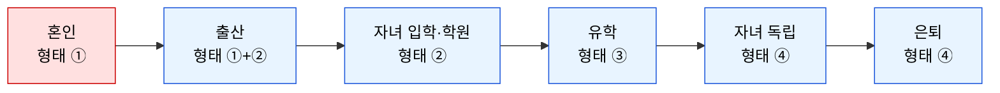
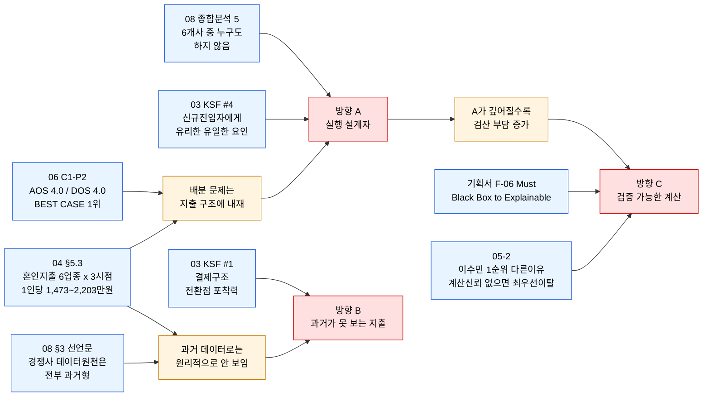

# 08-1. 경쟁사 가치 선언 기반 차별적 가치목표 제안 — 미래지출 카드결제 설계 서비스

> **방법론:** [`business-analysis-frameworks/08_가치제안서_VPS/00_방법론.md`](https://github.com/jennie-brain/business-analysis-frameworks/blob/main/08_%EA%B0%80%EC%B9%98%EC%A0%9C%EC%95%88%EC%84%9C_VPS/00_%EB%B0%A9%EB%B2%95%EB%A1%A0.md) 2절(경쟁사 가치 선언 → 차별적 가치목표 3방향)
> **입력:** [`08`](<./08 - 주요 경쟁사 기존 솔루션 기반 시장 가치 현황 분석.md>)(경쟁사 가치 선언문) · [`01`](<./01 - Porter's Five Forces 모델.md>) · [`03`](<./03 - 핵심 성공 요인(KSFs) 분석.md>) · [`04`](<./04 - TAM-SAM-SOM 과 Market Segment Map.md>) · [`05-1`](<./05-1 - 페르소나 스펙트럼.md>) · [`05-2`](<./05-2 - 고객 여정지도.md>) · [`06`](<./06 - 시장기회 분석(기회점수 OS).md>) · [`07`](<./07 - JTBD 분석.md>)
> **분석 기준일:** 2026-08-14

> **상태 표기** — 🟢 확인된 사실 · 🔷 합리적 추론 · 🟡 가설 · ⬜ 미조사

## 개요

08단계가 정리한 6개 경쟁사의 가치 선언문을 겹쳐 보면 아무도 점유하지 않은 세 개의 자리가 드러난다 — ① 추천에서 멈추지 않는 **실행 깊이**, ② 과거 데이터로는 원리적으로 볼 수 없는 **소비구조 변화**, ③ 광고가 아닌 **검증 가능한 계산**. 이 문서는 세 자리를 각각 하나의 가치목표 방향으로 제안하되, **세 방향이 서로 다른 축의 주장**임을 명시한다 — A·B는 시장을 획득하는 축(무엇으로 고객을 데려오는가), C는 고객을 유지하는 축(무엇 때문에 고객이 떠나는가)이다. 이 축 구분 없이 세 방향을 같은 잣대(DOS)로 재면 C가 부당하게 저평가된다.

> ## ⚠️ 범위 전제 — 이 서비스는 "결혼 준비 서비스"가 아니다
>
> 이 문서의 가치 선언은 **소비구조가 바뀌는 모든 전환점**을 대상으로 한다. 혼인은 그중 **가장 먼저 검증할 Beachhead**일 뿐이며, 시장 정의가 아니다.
>
> | 층위 | 범위 | 근거 |
> |---|---|---|
> | **가치 선언의 범위** | 소비구조 전환점 전반 — 혼인·출산·자녀 입학·유학·이사·은퇴 등 | 03단계 Decision Log가 KSF #1을 "문제 인식(결혼·입주 Trigger)"에서 **"결제구조 전환점 포착력"으로 이미 넓혀 두었다**. 기획서 §2.2도 "결혼·입주·이사 **등** Life Event"로 예시 열거일 뿐 한정하지 않았다 |
> | **1차 검증 시장(Beachhead)** | 혼인 | 04단계가 유일하게 1인당 지출강도까지 실측 근거를 확보한 세그먼트(§5.3). 감지 신호(웨딩업체)도 가장 뚜렷하다 |
>
> 04~08단계의 정량 근거가 혼인에 집중된 것은 **그 사건이 특별해서가 아니라 그 사건만 데이터를 구할 수 있었기 때문**이다. 아래 §3의 세 선언문은 모두 이벤트에 중립적으로 서술한다 — 혼인 숫자는 "이 구조가 실재함을 보여주는 측정 사례"로만 인용한다.
>
> 다만 03단계가 함께 남긴 경고를 지킨다 — *"트리거를 넓히면 대상 시장은 커지지만 감지 난이도가 오히려 올라가고 Non-consumption 위협도 커짐 — 필터 없이 넓히면 KSF가 더 약해짐."* 따라서 범위를 넓히되 03의 3개 필터(①카드결제 대상 ②외부 감지 가능성 ③비교 유인 크기)를 통과한 사건만 대상으로 본다(§1.1).

### Decision Log

| 날짜 | 결정 | 이유 |
|---|---|---|
| 2026-08-14 | 세 방향을 "경쟁사가 이미 하는 것"이 아니라 "경쟁사 여섯 곳 모두가 공통으로 안 하는 것"을 기준으로 도출 | 08단계 종합 분석의 핵심 결론("6개 기업 중 누구도 하지 않는다")을 그대로 출발점으로 삼음 |
| 2026-08-14 | 각 방향에 리스크·고려사항을 반드시 병기 | 차별화 방향 제안이 장점만 나열하는 홍보 문구가 되지 않도록, 01~07단계가 이미 확인한 반대 근거도 함께 제시 |
| 2026-08-14 | 방향 A를 추상어("카드조합 배분")에서 기획서 §2.2/F-01/F-05 원문의 3단계 메커니즘으로 재기술 | 05~08로 오면서 분석이 상위 개념어로 계속 추상화되다 구체성을 잃었음을 확인. 원본 기획서에 이미 있던 메커니즘을 그대로 복원 |
| 2026-08-14 | **방향 B의 근거를 "04단계가 미래 지향으로 정의했으므로"에서 "경쟁사의 데이터 원천이 원리적으로 볼 수 없는 지출이므로"로 교체** | 전자는 순환논증이었다 — 우리가 그렇게 정의했으니 그것이 차별점이라는 주장은 근거가 결론을 지지하지 못한다. 후자는 경쟁사 아키텍처에 대한 검증 가능한 주장이다 |
| 2026-08-14 | **방향 C를 A·B와 다른 축(유지·이탈)의 선언으로 명시**하고, 근거를 DOS가 아니라 05-2의 이탈 판정으로 교체 | C의 근거였던 E1-P2는 DOS 0.9로 06단계가 후순위로 분류한 항목이다. 그러나 05-2는 같은 인물(이수민)을 "🟢 1순위(다른 이유) — KSF #2 계산신뢰성을 가장 먼저 검증할 대상"으로 규정했다. C는 시장 규모 주장이 아니라 이탈 방지 주장이므로 DOS로 재는 것 자체가 범주 오류 |
| 2026-08-14 | 04단계 §5.3(혼인 지출 항목별 재분해)을 방향 A·B의 공통 근거로 채택 | "왜 카드 배분 문제가 발생하는가"를 점수(AOS 4.0)가 아니라 지출 구조(6개 업종 × 3개 시점)로 설명할 수 있게 됨 |
| 2026-08-14 | 최종 통합 선언문 1개는 이 문서에서 확정하지 않고 08-2(VPS)로 이월 | 세 방향 모두 07단계 인터뷰 전이라 가설 상태다. 방법론이 요구하는 "통합된 최종 선언문"은 인터뷰로 무게중심이 정해진 뒤 확정하는 것이 순서에 맞다 |

---

## 1. 대상 사건의 범위 — 이름이 아니라 "지출 변화의 형태"로 분류한다

이벤트를 이름(혼인·출산·유학)으로 나열하면 목록이 끝없이 늘어나고 각각을 따로 설계해야 한다. **지출 변화의 형태**로 묶으면 네 가지뿐이며, 형태마다 카드 설계 문제가 다르다.

| 형태 | 해당 사건(예시) | 카드 설계 문제 | 현재 설계 대응 |
|---|---|---|---|
| ① 급증 → 새 기준선 | 혼인, 출산, 이사·입주 | 다업종·다시점 배분(§2 방향 A) | 🟢 대응 중 — 04 §5.3이 측정한 형태 |
| ② 지속 증가 | 자녀 입학·학원, 부양 시작 | 매달 반복되는 실적을 어느 카드에 고정 배정할지 — 단발 배분이 아니라 **포트폴리오 재편** | 🟡 미설계 |
| ③ 급증 → 급감 | 유학, 이민, 장기 해외근무 | 초기엔 배분 문제, **이후엔 보유 카드가 과잉이 됨** | ⬜ 미검토 |
| ④ 지속 감소 | 은퇴, 자녀 독립 | 소비 감소로 전월실적 미달 → **연회비 대비 혜택 역전** | ⬜ 미검토 |

### 1.1 ③·④ 형태가 드러내는 설계의 구멍

**③·④에서는 문제가 뒤집힌다.** 소비가 줄면 전월실적 구간을 채우지 못해 기존 카드의 혜택이 무효화되고, 연회비만 남는다. 이때 최적해는 카드 배분이 아니라 **"카드를 줄여라"** 다. 현재 설계(혜택 최대화를 위한 배분 계산)는 이 답을 산출할 수 없다.

**그런데 여기가 차별화가 가장 커지는 지점이다** 🔷 — 08단계 §3이 정리했듯 뱅크샐러드·카드고릴라·Credit Karma·NerdWallet은 **전부 카드 발급 리드·제휴 수수료가 수익원**이다. 이들에게는 "카드를 줄이세요"라고 말할 구조적 유인이 없다. 이 조언을 할 수 있다는 것 자체가 방향 C(검증 가능한 계산)의 가장 강력한 증거가 된다.

> ⚠️ **BM 자기점검**: 기획서 §10.3이 상정한 리드/전환 매칭 BM을 그대로 택하면 우리도 같은 유인 구조에 놓인다 — "줄이라"는 결론이 수익과 충돌한다. 이 충돌을 어떻게 처리할지가 08-2(VPS)에서 결정해야 할 사항이다(OQ-49).

### 1.2 이 확장이 A-07(일회성 사용)을 해소한다 🔷

기획서 A-07("일회성 사용 문제를 극복할 Distribution/BM 구조가 존재한다", 중요도 High)과 03단계 KSF #5(Event 이후 재사용)는, 서비스를 **혼인 서비스로 정의하는 한 구조적으로 해결 불가능**하다 — 혼인은 대다수에게 생애 1회이기 때문이다.

반면 대상을 소비구조 전환점 전반으로 두면 **한 사용자가 생애에 여러 번 되돌아온다**.

**그림 1. 한 사용자의 생애 전환점 연쇄** — 붉은색이 Beachhead(혼인). 이 연쇄가 성립하면 재방문 트리거가 서비스 외부(사용자의 삶)에서 자동으로 발생하므로, KSF #5를 마케팅이 아니라 **대상 정의로** 해결하게 된다.

> 🟡 이 연쇄는 논리적 가능성이며, 실제로 사용자가 다음 전환점에 이 서비스를 다시 떠올리는지는 미검증이다(OQ-48).

---

## 2. 경쟁사 가치 선언 재구성 — 세 개의 빈 자리

08단계 §3이 도출한 6개 선언문을 세 축으로 재배치한다.

| 축 | 경쟁사들의 위치 | 비어 있는 자리 |
|---|---|---|
| **실행 깊이** | 뱅크샐러드("원 단위까지 증명")·카드고릴라("의사결정 시간 단축")·Credit Karma("맞는 상품 연결")·NerdWallet("스스로 결정하도록 돕는다") — 넷 다 **카드 한 장 선택**에서 끝난다 | 선택 이후 "무엇을·언제·어떤 카드로 결제할지"까지 설계하는 자리 |
| **시점 기준** | 뱅크샐러드·Credit Karma는 **보유 데이터가 전부 과거 기록**이다(마이데이터·신용정보). 카드고릴라·NerdWallet은 사용자 데이터 자체가 없다 | 아직 발생하지 않은 지출을 사용자에게 직접 입력받아 계산하는 자리 |
| **신뢰 구조** | 카드고릴라·NerdWallet은 제휴·광고가 수익원이라 추천 동기에 의심 여지가 있다. 뱅크샐러드는 계산 정밀도로 신뢰를 얻지만 계산 과정 자체를 열지는 않는다 | 계산 과정을 사용자가 직접 검증할 수 있게 공개하는 자리 |

---

## 3. 세 가지 차별적 가치목표 방향

> **축이 다르다는 점을 먼저 밝힌다.** A·B는 **획득 축**(고객을 데려오는 이유)이고, C는 **유지 축**(고객이 떠나는 이유를 막는 것)이다. 세 방향은 동등하게 유효하지만 같은 지표로 비교되지 않는다 — A·B는 AOS·DOS로, C는 이탈 지점으로 검증된다.

### 방향 A — "실행 설계자" (획득 축)

> **제안 가치 선언문**
> **"우리는 카드를 추천하는 데서 멈추지 않고, 다가올 모든 지출을 구체적인 결제 실행 계획으로 완성해준다."**

**메커니즘** (기획서 §2.2 Constraint·§4.2 보조원리·F-01/F-05/F-06 원문):

1. **입력** — 마이데이터로 확인된 현재 소비를 기준선으로 삼되, 사용자가 다가올 변화를 카테고리별로 직접 수정한다("다음 달 가전 800만원", "가구 500만원", "식비는 2인가구로 전환되어 월 얼마").
2. **계산** — 보유·신규 카드의 **전월실적 구간·혜택한도·연회비**를 반영해, "카드 A를 OO만원까지 쓰고, 그 구간을 채우면 카드 B로 전환하라"는 **구간별 순차 전환 순서**를 산출한다.
3. **출력** — 그 실행안을 따랐을 때 받는 **정확한 혜택 금액**을 카드별·구간별로 제시한다.

세 단계가 함께 묶여야 "카드 추천"과 구별된다 — 1번만 있으면 가계부, 2번만 있으면 카드 비교표, 3번만 있으면 혜택 계산기다.

**근거 ①(구조) — 왜 이 문제가 애초에 발생하는가** 🟢
04단계 §5.3이 혼인 지출 5,912만원을 항목별로 분해한 결과, 이 지출은 **6개 업종 × 3개 시점**에 흩어져 있다.

| 업종 분산 | 시점 분산 |
|---|---|
| 예식장(서비스) · 웨딩패키지 · 항공/호텔(해외결제) · 전자상가(가전) · 가구 · 귀금속 | 예식(D-day 고정) → 신혼여행(예식 직후) → 혼수(입주 시점) |

카드마다 업종별 적립률·한도가 다르고 전월실적은 **월 단위로 리셋**되므로, 이 구조에서는 카드 한 장으로 최적해가 나오지 않는다. **배분 문제는 우리가 만들어낸 것이 아니라 지출 구조에 이미 내재해 있다** — 단일 카테고리 지출이었다면 존재하지 않았을 문제다.

**근거 ②(고객) — 사용자가 실제로 이 문제를 겪는가** 🟡
06단계 C1-P2 "추천이 카드 1장 단위, 배분법을 안 알려줌" — **AOS 4.0(20개 중 1위)·DOS 4.0(1위)**, Market Relevance 1.0(확인). 06단계가 **BEST CASE(즉시 타게팅)** 로 분류한 두 항목 중 하나다.

**근거 ③(경쟁) — 왜 지금 비어 있는가** 🔷
03단계는 KSF #1·2·3·5가 모두 기존 플레이어에게 유리한데 **KSF #4(실행 깊이)만 정반대**라고 판정했다 — "대형 플랫폼일수록 복잡하고 당장 수익성이 낮아 보이는 실행에 조직 자원을 배정할 유인이 약하기 때문이다. 신규 진입자에게 열린 유일한 문." 08단계는 이를 실제 시장에서 재확인했다 — 6개사 중 이 자리에 온 곳이 없다.

**리스크** 🟡
가장 근접했던 헥토이노베이션(더쎈카드)이 활발한 기능 출시 뒤 서비스를 종료(추정)했다. 01단계의 두 가설 — 🟡A "니치 수요 부족" vs 🟡B "얕은 구현" — 은 08단계 리서치로도 확정되지 않았다(OQ-40). **A가 맞으면 이 방향 전체가 무효**가 되므로, 07단계 "중단자" 모집군 인터뷰가 이 방향의 존폐를 가르는 검증이다.

---

### 방향 B — "과거가 보지 못하는 소비" (획득 축)

> **제안 가치 선언문**
> **"우리는 지난 소비 기록이 아니라, 앞으로 달라질 소비를 기준으로 카드를 설계한다."**

> 선언문에 "늘어날"이 아니라 **"달라질"** 을 쓴 것은 의도적이다 — §1의 형태 ③·④(유학·은퇴)에서는 소비가 **줄어들고**, 그때도 카드 설계는 여전히 필요하다(오히려 카드를 줄이는 방향으로). "미래 지출"로 좁히면 이 절반이 선언에서 빠진다.

**근거 ①(경쟁사 아키텍처의 구조적 한계)** 🟢
이 방향의 핵심 근거는 "우리가 미래 지향적이다"가 아니라 **"경쟁사의 데이터 원천으로는 이 변화를 볼 수 없다"** 는 점이다.

| 경쟁사 | 데이터 원천 | 전환점을 앞둔 사용자에게 무엇이 보이는가 |
|---|---|---|
| 뱅크샐러드 | 마이데이터(과거 거래내역) | **전환 이전의 소비 패턴만** — 혼인 예정자라면 1인가구 시절 기록, 유학 예정자라면 출국 전 국내 소비. 달라질 부분은 데이터에 없다 |
| Credit Karma | 신용정보(과거 신용행동) | 위와 동일 |
| 카드고릴라·NerdWallet | 사용자 데이터 없음(콘텐츠·랭킹) | 개인 상황 자체를 모른다 |

경쟁사가 게을러서가 아니라 **데이터 원천이 과거형이기 때문**이며, 사용자 직접 입력(F-01) 없이는 원리적으로 해결되지 않는다. 이것이 이 방향이 모방당하기 어려운 이유다 — 마이데이터를 아무리 정교하게 분석해도 아직 기록되지 않은 변화는 나오지 않는다.

**근거 ②(불연속성의 크기 — 혼인 사례로 측정)** 🟢
전환점의 소비 변화가 "조금 달라지는" 수준이 아님을 보여주는 유일한 실측 사례가 혼인이다. 04단계 §5.3 기준 카드결제 대상 지출만 **1인당 1,473~2,203만원**으로, 이는 평소 소비와 자릿수가 다른 규모다. 과거 12개월 평균에 기반한 추천이 이 구간에서 무력해지는 이유다.

> 다른 형태(②지속 증가·③급증 후 급감·④지속 감소)에서도 같은 크기의 불연속이 발생하는지는 아직 측정되지 않았다(OQ-50). 혼인 숫자는 **이 구조가 실재한다는 증명**이지, 이 서비스가 혼인 서비스라는 뜻이 아니다.

**근거 ③(KSF 연결)** 🔷
03단계 KSF #1은 애초에 "문제 인식(결혼·입주 Trigger)"이 아니라 **"결제구조 전환점 포착력"** 으로 정의됐다 — 03단계가 이미 특정 사건이 아니라 전환점 일반을 대상으로 삼았다는 뜻이다. 03이 붙인 3개 필터 중 ①카드결제 대상은 04단계 §5.3에서 처음 적용됐고(예단·예물 1,351만원 제외), ②외부 감지 가능성은 04단계가 혼인을 1차 표적으로 고른 이유(웨딩업체 신호)다.

**리스크** 🟡
① 사용자가 달라질 소비를 **충분히 정확하게 입력할 수 있어야** 성립한다(기획서 A-04, 중요도 Mid). 입력 부담이 크면 방향 A의 계산이 아무리 정교해도 진입 자체가 막힌다.
② 03단계의 경고가 그대로 적용된다 — 대상 사건을 넓힐수록 **외부 감지 난이도가 올라간다**. 혼인은 웨딩업체라는 뚜렷한 신호가 있지만, 유학·은퇴·자녀 입학은 감지 채널이 불분명하다(OQ-51).

---

### 방향 C — "검증 가능한 계산" (유지 축)

> **제안 가치 선언문**
> **"우리는 추천의 이유를 숨기지 않는다 — 계산의 근거와 조건을 사용자가 직접 확인할 수 있게 보여준다."**

**축이 다르다는 점** 🔷
C의 근거인 06단계 E1-P2(계산신뢰 부족)는 **AOS 3.0(공동 4위)이지만 DOS 0.9**로, 06단계가 "AOS高 DOS低 — 시장 규모가 아직 잠정치"로 분류한 항목이다. 그러나 **이것은 C가 약하다는 뜻이 아니라, C가 시장 규모 주장이 아니라는 뜻이다.** DOS는 세그먼트 인원수(Market Relevance)를 곱한 값이므로 "이탈을 막는 가치"를 측정하도록 설계된 지표가 아니다.

**근거 ①(이탈 지점 판정)** 🟢
05-2단계는 이수민(Extreme)을 **"🟢 1순위(다른 이유) — KSF #2 계산신뢰성을 가장 먼저 검증할 대상"** 으로 명시적으로 규정했다. 같은 문서의 CJM ③검토·결정 단계 기록은 이렇다.

| 단계 | 행동 | 발화 | 감정 | 판정 |
|---|---|---|---|---|
| ③검토·결정 | 카드 3장 비교 중단 | "뭐가 맞는지 모르겠다" | 🔴 신뢰부족 | **계산신뢰 없으면 최우선 이탈(KSF#2)** |

즉 05-2는 "계산을 신뢰할 수 없을 때 **가장 먼저, 가장 크게 이탈하는 사용자**"를 이미 특정해 뒀다. 이것이 C의 직접 근거다.

**근거 ②(방향 A가 실패하는 경로)** 🔷
방향 A의 출력물은 "카드 A를 320만원까지, 그다음 카드 B로"처럼 **사용자가 스스로 검산하기 어려운 형태**다. 계산이 복잡할수록 신뢰 요구는 커진다 — **A를 깊게 갈수록 C가 더 필요해진다.** 05-2의 ④입력(재도전) 단계가 이를 뒷받침한다("낮은 신뢰라 오류에 취약 → 결과에 근거 항상 노출").

**근거 ③(설계 원칙에 이미 존재)** 🟢
기획서 §4.2 보조 해결원리 5번 "Black Box → Explainable", §3.1 운영/리스크 관점("모든 계산의 조건과 근거를 사용자가 확인할 수 있게 한다"), §3.2 Success Criteria의 Risk 항목("주요 혜택 계산에 확인 가능한 조건·출처가 연결됨 / Rule Audit"), F-06(계산 근거·조건·주의사항 설명, Must). 이 방향은 새로 발명한 것이 아니라 기획서가 이미 Must로 지정해 둔 것이다.

**리스크** 🟡
03단계 KSF #2에 조직 자원을 가장 많이 투입해야 한다. 또한 설명을 과하게 노출하면 방향 A가 줄이려던 인지 부담을 되레 늘릴 수 있다 — "설명 가능성"과 "단순함"의 상충은 07단계 데모 인터뷰(관찰 항목: 정지시간·재확인)에서 직접 관찰 가능하다.

---

## 4. 근거 → 결론 직결 지도

**그림 1. 각 방향의 근거 연결** — 04 §5.3(지출 구조)은 A와 B 양쪽의 공통 뿌리다. 방향 A → C로 향하는 화살표는 **A를 실행할수록 C의 필요가 커진다**는 종속 관계를 나타낸다.

---

## 5. 세 방향 비교

| 항목 | A. 실행 설계자 | B. 과거가 못 보는 소비 | C. 검증 가능한 계산 |
|---|---|---|---|
| 축 | 획득 | 획득 | **유지** |
| 관련 KSF | #4 실행 깊이 | #1 전환점 포착력 | #2 계산 신뢰성 |
| 직접 근거 | 06 C1-P2 (AOS 4.0·DOS 4.0, BEST CASE) | 04 §5.3 + 08 §3(경쟁사 데이터 원천) | 05-2 이탈 판정(1순위·다른 이유) |
| 근거 강도 | 🟢 정량 최상위 | 🟢 구조적 사실 | 🟢 이탈 지점 특정 |
| 경쟁사 점유 | 없음(6/6 미실행) | 없음(원리적 불가) | 부분(뱅크샐러드가 정밀도로 접근) |
| 대응하는 형태(§1) | ① 검증 완료 / ②③④ 미설계 | ①~④ 전부(선언 수준) | ①~④ 전부 |
| 검증 방법 | 07 중단자 인터뷰(존폐 판정) | 07 데모 입력 관찰(A-04) | 07 데모 관찰(정지시간·재확인) |
| 핵심 리스크 | 더쎈카드 실패 원인 미확정(OQ-40) | 사건 확대 시 감지 난이도 상승(OQ-51) | 설명 노출 ↔ 단순함 상충 |

## 6. 추가 검토 아이디어

세 방향에 포함하지 않았지만 근거가 확인된 확장 후보다. 08-2(VPS)의 Job-Feature Map 작성 시 재검토 대상이다.

| 아이디어 | 핵심 | 근거 | 연결되는 방향 |
|---|---|---|---|
| **살아있는 계획** | "한 번 추천하고 끝나지 않는다 — 계획이 바뀔 때마다 실행안을 다시 그려준다" | 기획서 §6.2 예산 변경 시나리오, Success Criteria "미래지출 변경 시 추천 결과가 일관되게 재계산" | A 확장 |
| **상환 여력 안전장치** | "최대 혜택이 아니라, 감당 가능한 범위 안에서 최선을 추천한다" — 경쟁사는 전부 혜택 최대화만 계산 | 기획서 §2.2 Constraint "사용자가 감당할 수 있는 월 상환액", 05-1 이수민(Extreme, 연체이력)의 이탈 원인 | C 확장 |
| **카드 생애주기 관리** | "구매 순간만 설계하지 않는다 — 이벤트가 끝난 뒤의 카드 정리까지 책임진다" | 기획서 To-be "[향후] Event 종료 후 카드 유지 여부 재평가", 사업 리스크 A-07(일회성 사용) | 03 KSF #5 직결 |
| **신혼여행 결제 설계** | 해외결제·환율·항공 마일리지는 국내 가전·가구와 최적 카드가 다르다 | 04 §5.3 — 신혼여행 1,030만원은 일반 해외여행(약 102만원)의 10배(OQ-45) | A·B 교차 |
| **함께 결정하기** | "혼자가 아니라 둘이 함께 설계하는 재무 결정" — 경쟁 서비스는 1인 기준 설계 | 05-1 최다인(비혼 동거) — 공동 명의·공동 결정 니즈(OQ-24). 단 DOS 0.15로 우선순위는 낮음 | 보류 |
| **손해를 보여주는 정직함** | "잘 하고 있다는 위로가 아니라, 실제로 놓치고 있는 걸 보여준다" | 06 N1-P2(최유리, 손해를 인지 못함) — 단 DOS −0.2로 Non-user 전환은 06단계가 과잉투자로 분류 | 보류 |

> 마지막 두 건은 근거는 있으나 06단계 정량 판단에서 후순위로 밀린 항목이다 — 아이디어의 타당성과 실행 우선순위는 별개라는 점을 명시해 둔다.

---

## 7. 인사이트

**세 방향은 선택지가 아니라 하나의 구조다.** B가 진입 이유를 만들고(과거 데이터로는 볼 수 없는 소비 변화가 눈앞에 있다), A가 그 변화를 실행 계획으로 바꾸며(업종·시점에 흩어진 배분 문제를 푼다), C가 그 계획을 신뢰하게 만든다(복잡한 계산일수록 검산 가능해야 한다). 어느 하나를 빼면 나머지가 성립하지 않는다 — B 없이 A는 기존 카드 비교 서비스와 같아지고, C 없이 A는 05-2가 특정한 이탈 지점에 그대로 부딪힌다.

**대상은 사건이 아니라 형태다.** §1이 정리했듯 이 서비스가 다루는 것은 혼인이 아니라 **소비구조가 바뀌는 네 가지 형태**이고, 혼인은 그중 형태 ①의 측정 가능한 사례일 뿐이다. 이 구분이 중요한 이유는 세 가지다.

1. **A-07(일회성 사용)이 해소된다** — 혼인 서비스로 정의하면 재방문이 구조적으로 불가능하지만, 전환점 서비스로 정의하면 사용자가 생애에 여러 번 돌아온다(§1.2).
2. **형태 ③·④에서 차별화가 가장 커진다** — 소비가 줄어드는 국면에서 최적해는 "카드를 줄여라"인데, 리드·제휴 수수료가 수익원인 경쟁사 6곳은 이 조언을 할 유인이 없다(§1.1).
3. **동시에 가장 큰 리스크도 여기서 나온다** — 03단계가 경고했듯 대상을 넓힐수록 외부 감지가 어려워진다. 혼인의 웨딩업체 같은 뚜렷한 신호가 다른 형태에는 없다(OQ-51).

**다만 지금은 전부 가설이다.** 세 방향의 근거는 01~08단계의 데스크 리서치와 가상 CJM에서 나왔고, 실제 사용자 발화로 검증된 것은 아직 없다. 특히 방향 A는 더쎈카드 선례라는 **직접적인 반증 가능성**을 안고 있다(OQ-40). 07단계 인터뷰 전에 어느 하나로 무게중심을 확정하지 않고, 세 방향을 각각 검증 가능한 형태로 문항지에 반영해 둔 상태를 유지한다.

**통합 선언문은 08-2(VPS)에서 확정한다.** 8단계 방법론이 요구하는 "수정·변경·통합된 최종 가치 선언문"은 인터뷰 결과로 세 방향의 무게가 정해진 뒤 작성하는 것이 순서에 맞다.

## Open Questions

| ID | 내용 | 관련 단계 |
|---|---|---|
| OQ-42 | 세 방향 중 실제 인터뷰(07단계)에서 가장 강하게 검증되는 방향은 무엇인가 | 07 JTBD |
| OQ-43 | 방향 C의 구현 비용이 KSF #2 실행 우선순위(03단계)를 얼마나 앞당겨야 하는가 | 03 재검토 |
| OQ-46 | 방향 C의 "설명 노출"과 방향 A의 "인지 부담 축소"가 상충하는 지점은 어디인가 — 어느 수준까지 설명하면 오히려 이탈이 늘어나는가 | 07-2 데모 관찰 |
| OQ-47 | 방향 B의 전제(A-04, 사용자가 달라질 소비를 충분히 입력할 수 있다)가 깨지면 A·C는 독립적으로 성립하는가 | 07 JTBD |
| OQ-48 | 사용자가 다음 전환점(출산·입학·유학 등)에 이 서비스를 실제로 다시 떠올리는가 — §1.2 생애 연쇄 가설의 검증 | 07 JTBD |
| OQ-49 | 형태 ③·④의 최적해가 "카드를 줄여라"일 때, 리드/전환 매칭 BM(기획서 §10.3)과 충돌한다 — 어떤 수익 구조가 이 조언과 양립하는가 | 08-2 VPS |
| OQ-50 | 형태 ②·③·④에서도 형태 ①(혼인, 1인당 1,473~2,203만원)에 준하는 소비 불연속이 발생하는가 — 사건별 지출강도 실측 | 04 재검토 |
| OQ-51 | 형태 ②·③·④의 외부 감지 채널은 무엇인가 — 혼인의 웨딩업체에 대응하는 신호가 유학·은퇴·자녀 입학에 존재하는가(03단계 필터 ②) | 03 KSF #1 |
