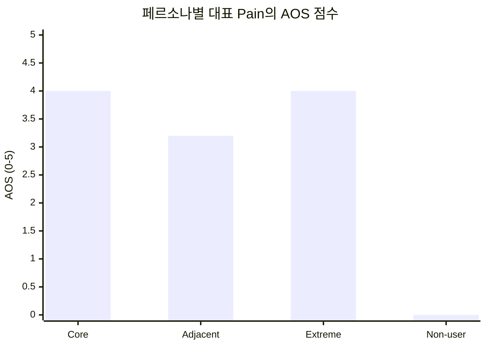
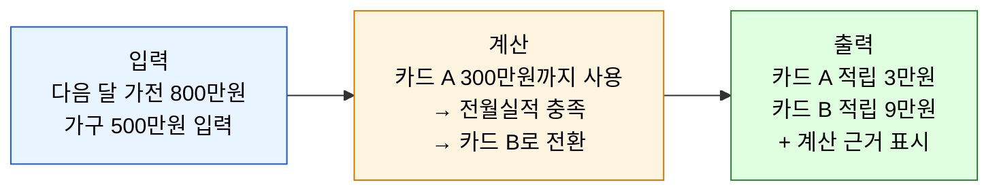
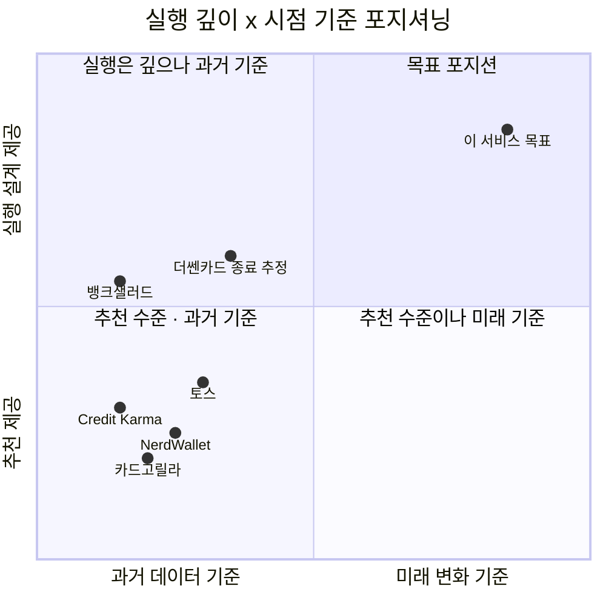

# Value Proposition Sheet — 미래지출 카드결제 설계 서비스

> **작성 모델 / Effort:** Claude Sonnet 5 / Medium
> **방법론:** [`00_방법론.md`](<./00_방법론.md>) 3단계(Value Proposition Sheet 통합)
> **입력:** [`01_경쟁사_가치선언문_분석.md`](<./01_경쟁사_가치선언문_분석.md>) · [`02_차별화된_서비스_가치선언문.md`](<./02_차별화된_서비스_가치선언문.md>) · [`01_핵심성공요인_분석.md`](<../03_핵심성공요인_분석/01_핵심성공요인_분석.md>) · [`01_TAM-SAM-SOM_마켓세그먼트.md`](<../04_TAM-SAM-SOM_마켓세그먼트/01_TAM-SAM-SOM_마켓세그먼트.md>) · [`01_페르소나_스펙트럼.md`](<../05_페르소나_고객여정지도/01_페르소나_스펙트럼.md>) · [`02_고객여정지도.md`](<../05_페르소나_고객여정지도/02_고객여정지도.md>) · [`01_시장기회분석.md`](<../06_시장기회분석/01_시장기회분석.md>) · [`01_JTBD분석.md`](<../07_JTBD분석/01_JTBD분석.md>) · [`04_인터뷰결과보고서_사전카드.md`](<../07_JTBD분석/04_인터뷰결과보고서_사전카드.md>)
> **분석 기준일:** 2026-08-14
> **Decision Log:** [`00_Decision_Log.md`](<./00_Decision_Log.md>)

> **상태 표기** — 🟢 확인된 사실 · 🔷 합리적 추론 · 🟡 가설 · ⬜ 미조사

## 개요

01～08단계의 분석 결과를 하나의 문서로 통합해, 이 서비스가 어떤 고객에게 어떤 차별적 가치를 전달하는지 정리한다. 페르소나별 문제(§1), JTBD 목표와 측정 가능한 Outcome(§2～3), 기존 대안(§4), 솔루션 제안과 차별적 가치(§5～6), 근거와 경쟁사 대비 차별성(§7), 기능 우선순위(§8)로 구성한다. 이 문서의 통합 선언문과 우선순위는 07단계 실제 인터뷰 이전의 가설이며, 인터뷰 결과로 갱신 대상이다.

### 핵심 지표 요약

| 지표 | 값 | 상태 | 출처 |
|---|---|---|---|
| TAM(마이데이터 이용자) | 약 3,000만 명 | 🟡 가정 | 04단계 |
| SAM(제품 능력 범위) | 약 428만 명 | 🟡 가정 | 04단계 |
| SOM 1년차(혼인 Beachhead) | 약 240～480명 | 🟡 가정 | 04단계 |
| 혼인 1인당 카드결제 대상 지출 | 1,473～2,203만원 | 🔷 추정 | 04단계 §5.3 |
| 최우선 Pain(C1-P2) AOS·DOS | 4.0 / 4.0 — 20개 중 공동 1위 | 🟡 가설 | 06단계 |
| 분석 대상 경쟁사 | 6개사 — 전부 미실행 | 🟢 확인 | 08단계 |

---

## 1. 고객별 핵심 문제 (Pain · Needs)

05단계 페르소나 스펙트럼·고객여정지도에서 확정한 4개 대표 페르소나의 핵심 문제다.

| 페르소나 | 프로필 | Pain | Needs |
|---|---|---|---|
| **Core — 김지은(29)** | 예비신부·마케팅, 혼인 3개월 전 | 지출이 여러 건에 흩어져 있어 전체를 한눈에 못 봄(C1-P1) · 추천이 카드 1장 단위라 배분법을 안 알려줌(C1-P2) | 최대 혜택 카드·조합 확인 |
| **Adjacent — 박준혁(32)** | 1인가구·IT, 입주 예정 | 외부 신호 없이 스스로 지출계획 입력을 시작해야 함(A1-P1) | 새 가전 구매 최적화 |
| **Extreme — 이수민(34)** | 재혼 준비, 신용제약 | 신규카드 시나리오 자체가 성립 안 함(E1-P1) · 계산 신뢰가 없으면 최우선 이탈(E1-P2) | 기존 카드로 손해 최소화 |
| **Non-user — 최유리(27)** | 예비신부, 부모 지원형 | Non-consumption — 문제 인식 자체가 없음(N1-P1) · 손해를 인지하지 못함(N1-P2) | 무난하게 넘어가기 |

06단계 AOS·DOS 분석 결과, Core의 두 Pain(C1-P1, C1-P2)이 AOS·DOS 모두 최상위(BEST CASE)로 확정됐다 — 이 문서의 우선 검증 대상이다.



**그림 1. 페르소나별 AOS 비교** — Core(C1-P2)와 Extreme(E1-P1)이 공동 최고점(4.0)이다. Non-user는 정의상 0.0으로, 06단계가 이미 확인한 Non-consumption 판정을 수치로도 재확인한다.

---

## 2. 고객 상황별 목표 (Goal · Job)

07단계 JTBD Job Statement(3단 구조: 상황·목표·이유)다. 실제 인터뷰 전이므로 가설(🟡)이다.

| 항목 | 내용 |
|---|---|
| Persona / Segment | Core — 혼인 3개월 앞둔 예비신부 |
| Situation | 예식 3개월 전, 가전·가구 목록·예산을 처음 정리하는 시점 |
| Job Statement | 여러 구매건을 어떤 카드로 나눠 결제할지 한 번에 확인하고 싶다 |
| 4 Forces | Push: 지출이 흩어져 전체를 못 봄 / Pull: 카드조합 배분 제시 / Habit: 엑셀·개별검색 / Anxiety: 소비데이터 입력 |
| Current Solutions | 카드고릴라·뱅크샐러드 개별 검색, 엑셀 수기 계산 |

---

## 3. 고객이 원하는 Outcome (측정 가능한 형태)

07단계가 확립한 Pain→Outcome 변환표다. 측정 단위([O분], [O건] 등)는 실제 인터뷰 이후 확정하며, 지금 임의의 숫자로 채우지 않는다.

| Outcome | Persona | Importance | Satisfaction | AOS | MR(SAM 기준) | DOS |
|---|---|---|---|---|---|---|
| 구매 목록 입력 후 [O분] 안에 카드별 배분안 확인 | 김지은형(Core) | 5 | 1 | 4.0 | 1.0 | 4.0 |
| 모든 예정 지출을 [O건] 한 화면에서 확인 | 김지은형(Core) | 5 | 2 | 3.0 | 1.0 | 3.0 |
| 신규발급 없이도 기존 카드로 [O%] 손해 절감 확인 | 중단자(Extreme 흡수) | 5 | 1 | 4.0 | 0.3 | 1.2 |
| 계산 근거를 [O초] 안에 직접 확인 | 중단자 | 5 | 2 | 3.0 | 0.3 | 0.9 |
| [특정 시점]에 지출계획 입력을 먼저 제안받음 | 박준혁형(Adjacent) | 4 | 1 | 3.2 | 0.4 | 1.2 |

---

## 4. 기존 대안 (Competitor / Substitute)

08단계가 확인한 6개 경쟁사의 가치 선언문이다. 상세 근거·출처는 `01_경쟁사_가치선언문_분석.md` 참고.

| 기업 | 가치 선언문 | 이 서비스와의 격차 |
|---|---|---|
| 뱅크샐러드 | "흩어진 금융 데이터를 모아, 놓친 혜택을 원 단위까지 증명한다" | 카드 한 장 추천에서 멈춤, 데이터 원천이 과거 거래내역 |
| 카드고릴라 | "카드 혜택 정보를 큐레이션해 의사결정 시간을 줄인다" | 정보 제공에 머무름, 실행 설계 없음 |
| 헥토이노베이션(더쎈카드) | "보유 카드의 실적·혜택을 실시간 계산해 안내한다" | 개념적으로 가장 근접하나 서비스 종료(추정), 실패 원인 미확정 |
| 토스 | "모든 금융 활동을 하나의 앱에서 연결한다" | 카드 리밸런싱 기능 없음, 가장 위협적인 잠재 진입자 |
| Credit Karma | "신용정보를 무료 공개하고 맞춤 상품을 연결한다" | 리드 매칭 BM — 카드 축소 조언과 구조적으로 충돌 |
| NerdWallet | "신뢰할 콘텐츠와 비교 도구로 스스로 결정하게 돕는다" | 콘텐츠·제휴 기반, 개인 상황 데이터 없음 |

6개 기업 중 어느 곳도 "소비구조 전환점에 따른 카드조합·구매건별 배분 설계"를 제공하지 않는다(08단계 종합분석 5). 세 핵심 차원으로 좁혀 비교하면 격차가 더 뚜렷해진다.

| 기업 | 실행 설계(카드 배분) | 미래 소비 반영 | 계산 근거 공개 |
|---|---|---|---|
| 뱅크샐러드 | ✗ | ✗ | 🔶 부분 |
| 카드고릴라 | ✗ | ✗ | ✗ |
| 헥토이노베이션(더쎈카드) | ✔ | ✗ | ⬜ 불명 |
| 토스 | ✗ | ✗ | ✗ |
| Credit Karma | ✗ | ✗ | ✗ |
| NerdWallet | ✗ | ✗ | 🔶 부분 |
| **이 서비스(목표)** | **✔** | **✔** | **✔** |

**표 1. 3대 차원 경쟁사 비교** — 세 열 전부 ✔인 기업은 없다. 더쎈카드가 유일하게 "실행 설계"에서 ✔를 받지만 서비스가 종료(추정)됐고, 계산 근거 공개 여부는 확인하지 못했다(⬜).

---

## 5. 우리 솔루션의 핵심 제안 (Value Proposition)

> **통합 가치 선언문** 🟡
> **"우리는 소비구조가 바뀌는 전환점마다, 사용자가 입력한 상황에 맞춰 카드 사용 순서와 정확한 혜택 금액을 계산 근거와 함께 제시한다."**

이 선언문은 `02_차별화된_서비스_가치선언문.md`의 세 방향을 결합한 것이다 — 방향 B(과거가 보지 못하는 소비 변화)가 진입 이유를, 방향 A(실행 설계자)가 실행 메커니즘을, 방향 C(검증 가능한 계산)가 신뢰 기반을 담당한다. 메커니즘은 다음 3단계다.

1. **입력** — 사용자가 현재 소비 기준선과 다가올 변화를 카테고리별로 직접 입력한다.
2. **계산** — 보유·신규 카드의 전월실적 구간·혜택한도·연회비를 반영해 카드별 순차 전환 순서를 산출한다.
3. **출력** — 그 실행안을 따랐을 때의 정확한 혜택 금액을 카드별·구간별로 제시하고, 계산 근거를 함께 공개한다.



**그림 2. 실행 메커니즘 예시** — 금액은 방향 A의 계산 방식을 보여주기 위한 가상 예시(🟡)이며, 실제 사용자 데이터가 아니다.

---

## 6. 우리가 제공하는 차별적 가치

| 방향 | 가치 선언 | 근거 |
|---|---|---|
| A. 실행 설계자 | 추천에서 멈추지 않고 구매건별 카드 배분까지 설계 | 06단계 C1-P2(AOS·DOS 공동 1위), 03단계 KSF #4(신규진입자 유일 유리 요인) |
| B. 과거가 보지 못하는 소비 | 경쟁사 데이터 원천은 과거형이라 전환점의 소비 변화를 원리적으로 볼 수 없음 | 04단계 §5.3(혼인 지출 1인당 1,473～2,203만원), 08단계 §3(6개사 데이터 원천 전부 과거 기록) |
| C. 검증 가능한 계산 | 계산 과정을 사용자가 직접 확인할 수 있게 공개 | 05단계 CJM(이수민, 계산신뢰 없으면 최우선 이탈), 기획서 F-06(Must) |

세 방향은 서로 다른 평가축이다 — A·B는 고객 획득(무엇으로 데려오는가), C는 고객 유지(무엇 때문에 떠나는가)를 담당하므로 같은 지표(DOS)로 비교하지 않는다.

---

## 7. Proof — 근거 및 경쟁사 대비 차별성

### 7.1 포지셔닝 비교



**그림 3. 경쟁사 대비 목표 포지션** — 6개 경쟁사는 모두 좌하단～좌상단(과거 데이터·추천 수준)에 몰려 있다. 더쎈카드가 실행 깊이에서 가장 근접했으나 시점 기준은 여전히 과거형이었고 서비스가 종료(추정)됐다. 이 서비스의 목표 포지션은 두 축 모두에서 비어 있는 우상단이다.

### 7.2 근거 요약

| 근거 | 내용 | 상태 |
|---|---|---|
| 06단계 C1-P2 | AOS 4.0·DOS 4.0, 20개 Pain 중 공동 1위(BEST CASE) | 🟢 |
| 03단계 KSF #4 | 신규 진입자에게 유일하게 유리한 요인(대형 플랫폼은 실행 깊이에 조직 자원 배정 유인 부족) | 🔷 |
| 04단계 §5.3 | 혼인 지출 1인당 카드결제 대상 1,473～2,203만원, 6개 업종×3개 시점 분산 | 🟢 |
| 08단계 §3 | 6개 경쟁사 전부 과거 데이터 기반, 실행 설계·계산 공개 중 하나 이상 결여 | 🟢 |
| 05단계 CJM | 이수민(Extreme) — 계산신뢰 없으면 최우선 이탈 | 🟢(가상 CJM 근거) |

---

## 8. Job-Feature Map (MVP 포함 여부 및 우선순위)

기획서 F-01～F-06(Must)에 `02_차별화된_서비스_가치선언문.md`가 도출한 확장 아이디어를 F-07～F-12로 추가했다. 중요도·난이도는 01～08단계 근거에 기반한 가설(🟡)이며, 실제 값이 아니다.

| 기능명 | 핵심 Job 연관성 | 중요도(1～5) | 개발 난이도(1～5) | MVP 포함 여부 | 우선순위 |
|---|---|---|---|---|---|
| F-01 현재 소비 기준선 + 미래 지출 입력/수정 | 방향 B — 소비 변화를 사용자가 직접 입력 | 5 | 3 | ✔ | High |
| F-02 보유카드 및 사용자 제약조건 입력 | 방향 A — 계산의 입력 조건 | 5 | 2 | ✔ | High |
| F-03 카드 혜택 Rule 기반 Payment Scenario 계산 | 방향 A — 핵심 계산 엔진 | 5 | 5 | ✔ | High |
| F-04 신규카드 포함/미포함 시나리오 비교 | 방향 A — Extreme(이수민) 포함 전제 | 4 | 3 | ✔ | High |
| F-05 구매건별 결제수단 배분 및 카드 역할 설계 | 방향 A — C1-P2(AOS·DOS 공동 1위) 직접 대응 | 5 | 4 | ✔ | High |
| F-06 계산 근거·조건·주의사항 설명 | 방향 C — 계산 신뢰 확보 | 5 | 3 | ✔ | High |
| F-07 살아있는 계획(입력 변경 시 재계산) | 방향 A 확장 — 기획서 Success Criteria 요구사항 | 4 | 2 | ✖ | Mid |
| F-08 상환 여력 안전장치 | 방향 C 확장 — 이수민(Extreme) 이탈 원인 직결 | 4 | 3 | ✖ | Mid |
| F-09 카드 생애주기 관리(정리형 실행안) | KSF #5 재사용 직결, A-07 완화 | 4 | 4 | ✖ | Mid(BM 충돌 미해결, OQ-49) |
| F-10 신혼여행 결제 설계(해외결제 통합) | 04단계 §5.3 — 신혼여행 1,030만원, 일반 해외여행의 10배 | 3 | 3 | ✖ | Low |
| F-11 공동 입력(비혼 동거 등 2인 결정) | 05-1 최다인 — 공동 명의·결정 니즈 | 3 | 3 | ✖ | Low(DOS 0.15) |
| F-12 손해 인지 리포트(Non-user 대상) | 06단계 N1-P2 — 손해 인지 못함 | 2 | 3 | ✖ | Low(06단계 과잉투자 분류) |

```mermaid
quadrantChart
    title Job-Feature 우선순위 매트릭스 — 중요도 x 난이도
    x-axis 낮은 난이도 --> 높은 난이도
    y-axis 낮은 중요도 --> 높은 중요도
    quadrant-1 전략적 투자
    quadrant-2 즉시 실행
    quadrant-3 저순위 후보
    quadrant-4 재검토
    "F-02": [0.4, 1.0]
    "F-01": [0.58, 1.0]
    "F-06": [0.62, 0.98]
    "F-05": [0.8, 1.0]
    "F-03": [1.0, 1.0]
    "F-04": [0.58, 0.8]
    "F-08": [0.62, 0.78]
    "F-07": [0.4, 0.8]
    "F-09": [0.8, 0.8]
    "F-10": [0.58, 0.6]
    "F-11": [0.62, 0.58]
    "F-12": [0.6, 0.4]
```

**그림 4. Job-Feature 우선순위 매트릭스** — F-01～F-06(MVP, Must)이 우상단～좌상단(중요도 5 부근)에 몰려 있고, F-03(핵심 계산 엔진)만 전략적 투자 칸(중요도·난이도 모두 최고)에 위치한다. F-07～F-12는 중요도 3～4대의 즉시 실행～저순위 구간에 분산돼 있어, MVP 이후 확장 순서를 정할 때 이 칸 배치를 참고할 수 있다.

---

## 인사이트

이 문서의 핵심 제안(§5)은 세 방향(A·B·C)을 배타적 선택이 아니라 하나의 구조로 결합한 결과다 — B가 진입 이유를, A가 실행 메커니즘을, C가 신뢰 기반을 맡는다. Job-Feature Map에서 F-01～F-06(Must)이 모두 이 구조를 구현하는 데 필요한 최소 조건이며, F-07 이후는 이 최소 조건이 검증된 뒤 확장할 후보다.

가장 큰 미해결 리스크는 두 가지다. 첫째, 방향 A의 실행 설계가 개념적으로 가장 근접했던 더쎈카드조차 서비스 종료(추정)로 이어졌다는 점 — 07단계 중단자 인터뷰가 이 방향의 존폐를 가른다. 둘째, F-09(정리형 실행안)가 강력한 차별화 후보이면서 동시에 리드/전환 매칭 BM과 충돌한다는 점(OQ-49) — 수익 모델 결정이 이 기능의 채택 여부를 좌우한다.

이 문서는 Claude Sonnet 5(Effort: Medium)로 1차 작성했다. 방법론이 요구하는 2개 벤더사 교차검증은 아직 수행하지 않았다 — 다른 벤더사 모델로 동일 입력을 재실행해 선언문·우선순위가 모델에 따라 흔들리지 않는지 확인하는 작업이 남아 있다(OQ-55).

## Open Questions

| ID | 내용 | 관련 단계 |
|---|---|---|
| OQ-52 | 통합 선언문(§5)이 07단계 실제 인터뷰에서도 그대로 유지되는가, 세 방향 중 하나로 무게가 쏠리는가 | 07 JTBD |
| OQ-53 | Job-Feature Map의 중요도·난이도 값을 실제 개발 견적·사용자 검증으로 교체 | 08 VPS 갱신 |
| OQ-54 | F-09(정리형 실행안)의 BM 충돌(OQ-49)이 해결되지 않으면 이 기능을 Job-Feature Map에서 제외해야 하는가 | 08 VPS |
| OQ-55 | 이 문서를 다른 벤더사 모델로 재실행했을 때 §5 통합 선언문과 §8 우선순위가 동일하게 나오는가 | 08 VPS 교차검증 |
