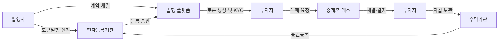

# 토큰증권(STO) 발행·유통 프로세스와 해외 페인포인트 분석

> **출처(Source):** 본 문서는 [Gemini](https://gemini.google.com) 딥리서치(Deep Research)를 통해 생성된 산출물입니다.

# Executive Summary  
토큰증권(STO)은 블록체인 기반의 새로운 증권 발행·유통 방식으로, 국내외에서 제도 도입 움직임이 활발하다. 그러나 해외 전문가들은 **규제 불확실성**, **컴플라이언스 부담**, **기술·보안 리스크**, **유동성 부족** 등을 주요 과제로 지적하고 있다. 예를 들어 미국 증권업계는 “규제 명확성 부족”을 최대 장애요인으로 꼽고 있으며, 싱가포르 MAS 역시 토큰화 과정에서 **기술·사이버 리스크**와 **제한적 유동성**에 대한 명확한 공시를 요구한다. 세계 각국은 이러한 문제를 완화하기 위해 **가이드라인 제정** 및 **파일럿 제도 도입** 등 대응을 시작했다. 

우리나라는 2026년 1월 전자증권법·자본시장법 개정으로 DLT 기반 토큰증권 제도를 공식화했으며, 발행 시 전자등록기관에 신고·등록해야 한다. 그럼에도 불구하고 실무 현장에서는 명확한 **프로세스 매뉴얼**과 **부서 간 협업체계**, **기술 표준**이 부족하다. 본 보고서는 참여자별 업무·절차와 대체수단 비교, 해외 사례를 통해 확인된 **페인포인트**를 정리하고, 부서별 확인 과제와 서비스를 위한 시장 타당성을 분석한다. 해외 사례와 전문가 의견을 통해 **증명된 사실**과 **가설**을 구분하며, 객관적 출처를 기반으로 인사이트를 제시한다.  

---

## 참여자별 주요 업무 및 절차  
토큰증권 발행·유통에는 발행사, 발행 플랫폼, 중개·거래소, 수탁·결제기관, 법무·컴플라이언스 부서, 규제당국, 투자자 등이 참여한다. 각 참여자의 단계별 업무는 다음과 같다.

- **발행사(자산소유자)**: 자산 실사 및 토큰화 검토, 사업계획·투자설명서 작성, 발행사 내부 의사결정(이사회 승인) 후 법무팀과 협력해 **전자등록기관**에 사전 신고·등록을 신청한다. 토큰화 방식을 결정하고(예: 스마트컨트랙트 구조), 증권신고서 제출이나 사모 발행 등 기존 절차를 준수하여 허가를 받는다. 자산명세·주주권리 등 관련 정보를 전산화하고, 발행 플랫폼에 자산정보를 제공한다. 발행 후에는 투자자 대상 권리(배당·이자) 관리와 보고, 분산원장 시스템 유지관리 등을 담당한다. 

- **증권형 토큰 발행 플랫폼(기술·토큰 발행사)**: 발행 플랫폼은 스마트컨트랙트·DLT 인프라를 개발·운영한다. 발행사는 발행 플랫폼과 계약하여 토큰을 발행하며, 플랫폼은 투자자별 **지갑 주소 관리**, KYC/AML 검증, 토큰 민팅(발행) 등의 기술적 업무를 수행한다. 발행 시 토큰 발행 플랫폼은 법무팀과 연계해 **전자등록기관**에 발행정보를 기록하고, 토큰 발행 데이터(보유자 명단, 발행량 등)를 분산원장에 등록한다. 또한 플랫폼은 스마트컨트랙트 코드 감사와 보안검증을 통해 해킹·오류 위험을 최소화해야 한다.  

- **중개·유통 플랫폼(거래소·OTC 등)**: 토큰형 증권의 매매를 위한 거래소 또는 장외시장을 의미한다. 토큰증권의 경우 일반 가상자산 거래소와 달리 국내외 **증권 규제 체계**를 준수해야 하며, **미인가 중개 영업은 법 위반**이다. 참여 플랫폼은 자금세탁방지(AML)와 적합성 심사(KYC)를 포함한 고객확인 절차를 수행하며, 전자증권법·자본시장법에 따른 공시·보고 의무를 이행한다. 거래소는 전통 증권 주문체결 시스템과 연동된 **토큰 거래 매칭 엔진**을 운영하고, 거래내역을 분산원장에 기록하거나 수탁기관에 전달한다.  

- **자산관리·수탁·결제 기관**: 기존 증권 예탁결제 기관(예: 한국예탁결제원)은 전자등록기관으로서 토큰 보유자 명부를 관리하고 **결제(Custody & Settlement)** 역할을 수행한다. 즉, 발행 플랫폼 또는 증권사가 발행한 토큰의 **기초 증권(전자등록계좌)**을 실제로 예탁하고, 토큰 간 거래가 발생하면 전산시스템에서 전자등록 계좌를 조정한다. 수탁 기관은 토큰 private key 보관 솔루션을 제공하고, 스마트컨트랙트의 자동결제 기능을 통제한다. 향후 해외 사례처럼 전문 디지털자산 수탁사가 등장할 수 있으며, 이 경우 SOC2 등의 보안인증이 요구될 전망이다.  

- **법무·컴플라이언스 부서**: 발행사는 내부 법무·컴플라이언스 조직을 통해 토큰증권의 법적 성격을 검토한다. 발행 전 **증권성 판단** 및 관련 법규(전자증권법, 자본시장법, 금융투자업법, 개인정보보호법 등)에 따른 허가·보고 요건을 확인한다. 계약서·투자설명서에 새로운 위험(예: 스마트컨트랙트 오류, 지갑 분실, 불확실한 소유권)과 제반 규정을 명시하고, 금융감독당국 및 외부 감사 대응 준비를 한다. 토큰화 과정 전반에 걸쳐 AML/KYC 절차를 설계·감독하며, 해외 투자자 대상 서비스 시 대외 송금 규제와 국제제재 여부도 점검해야 한다.  

- **규제당국(금융위·금감원 등)**: 국회 통과된 개정법에 따라 금융위원회·금융감독원은 토큰증권의 제도적 기반을 마련 중이다. 2026년 1월 전자증권법 개정으로 DLT 기반 발행을 허용하고, 토큰 중개 거래 시 현행 증권법상 등록·공시의무를 동일 적용하도록 했다. 향후 규제당국은 토큰증권 협의체를 구성하여 기술인프라·발행·유통 등 세부 가이드라인을 제정할 예정이다. 해외에서는 SEC·MAS·EU 감독당국이 가이드라인과 인터프리티브 릴리스를 내고 있는데, 예를 들어 미국 SEC는 2026년 3월 나스닥의 토큰화 증권 거래를 승인하는 등 단계적 허용 정책을 추진 중이다.  

- **투자자(기관·개인)**: 투자자는 토큰증권 청약 전 스마트컨트랙트 내용, 기초자산 연계 구조(발행형·수탁형·합성형)와 관련된 리스크를 검토해야 한다. SEC는 “합성형 토큰 증권은 기초자산에 대한 권리가 없을 수 있다”고 경고한다. 투자자는 플랫폼 선정 시 자체 KYC 절차를 통과하고, 지갑 생성 및 암호키 관리 의무가 있다. 거래 후에는 블록체인 상 거래 내역을 확인할 수 있지만, 오프체인 오류 발생 시 사고 책임 소재가 불명확할 수 있다. 국내 개인투자자의 경우 현행 규정상 토큰증권 매매 시 증권사 계좌를 통한 접근이 요구될 가능성이 크다.  

위 **참여자별 업무**는 다음 표로 요약된다.

| 참여자           | 사전 준비 및 발행           | 유통·중개       | 사후관리                |
|----------------|----------------------|-------------|----------------------|
| **발행사**       | - 자산실사·계약 체결 - 증권신고서 등 제출·승인 - 스마트컨트랙트·토큰 설계 - 전자등록 신청 | - 토큰 증권 거래 참여 - 배당·이자 지급 관리 - 투자자 공시 및 보고 | - 발행 이후 법적 의무(공시·배당 등) 이행 - 투자자 문의 대응 |
| **발행 플랫폼**   | - 스마트컨트랙트 개발·검증 - KYC/AML 심사 - 전자등록기관 연동(발행정보 등록) | - 토큰 발행(민팅) 및 발행량 관리 - 다중서명 지갑 관리 | - 블록체인 네트워크 유지·업데이트 - 트랜잭션 기록 보관 |
| **중개/유통 플랫폼** | - (증권거래소 인가 혹은 OTC 협업) - 고객예탁 계좌 준비 - 거래 시스템 통합 | - 매매체결 중개 및 호가관리 - 시세 공시 및 보고 - KYC/AML 실행 | - 거래 기록 보존 - 감독기관 제출용 정산 자료 관리 |
| **자산관리/수탁기관** | - 예탁계좌 설계 및 등록 준비 - 블록체인·키관리 시스템 준비 | - 토큰·기초증권의 보관·이체 수행 - 결제 결산 절차 진행 | - 분산원장 동기화 - 증권·토큰 기록 이중 검증 |
| **법무/컴플라이언스** | - 법률검토 및 규제준수 계획 - 신고서·계약서 준비 (투명성 담보) - AML/KYC 규정 설계 | - 중개업무 허용 범위 검토 - 제도 변화 대응 정책 | - 내부규정 갱신 - 리스크 모니터링 및 교육 |
| **규제당국**       | - 제도 설계(법령 개정, 가이드라인 발행) - 금융투자업 인가 기준 마련 | - 플랫폼 감독 및 인가 - 신고서 심사 및 승인 | - 시장 감시·위반 조치 - 보완 제도 마련 (협의체 운영) |
| **투자자**       | - 기초자산 리스크 평가 - 플랫폼/토큰구조 이해 (소유권 여부 검증) | - 토큰 매매 참여 (계좌이체 또는 스마트컨트랙트) | - 권리행사(배당, 의결권 등) 확인 - 세무 신고 및 이익실현 |

---

## 법령·제도 현황  
- **국내 규제(전자증권법·자본시장법)**: 2026년 1월 개정된 전자증권법은 분산원장(DLT)을 전자등록계좌로 정의하여, 토큰 기반 증권 발행을 허용했다. 발행 전 발행사는 **전자등록기관(예탁결제원 등)**에 발행계획을 신고·등록해야 한다. 또한 자본시장법 개정으로 투자계약증권의 토큰 유통이 허용되었으며, 미인가자의 토큰증권 중개는 불법으로 규정되었다. 토큰증권의 발행·유통·공시절차는 기존 전통 증권과 동일하게 공모신고서 제출, 거래소 공시 의무가 적용된다. 법 시행 후 관련 협의체(금융위·금감원·예탁원·업계·학계)를 구성하여 분배결제, 유통 절차 등 세부지침을 마련할 예정이다.

- **해외 규제 사례**:  
  - **미국 SEC**: 토큰증권은 기존 증권법상 “증권”으로 명확히 간주되며, 모든 등록·공시 및 투자자 보호규정이 적용된다. 2026년 초 SEC는 토큰증권에 대한 인터프리테이션을 통해 이 점을 분명히 했고, 최근 DTC 토큰화 파일럿과 나스닥 거래 허용 승인으로 단계적 도입을 추진 중이다.  
  - **유럽연합(EU)**: 2024년 MiCAR 규정에서 토큰증권(금융상품)은 적용 대상에서 제외되어, 기존 MiFID II에 따라 규제받는다. 즉, 유럽 주요국(룩셈부르크, 프랑스, 독일 등)은 토큰화 증권을 전통 증권과 동일한 틀로 보고 있다. 룩셈부르크는 2019년 관련 법 제정 이후 2021년 DLT 증권 등록을 명시하는 법안을 통과시켜, 조기 선도적으로 제도화를 추진했다.  
  - **싱가포르**: MAS는 2022년 개정 가이드에서 기술 중립 원칙을 재확인하며 토큰화가 **근본적 실질을 변경하지 않는다**고 명시했다. 토큰화된 자본시장상품은 SFA·FAA 등 기존 법 적용 대상이므로, 토큰화도 동일한 규제 요건(공모·라이선스 등)을 따라야 한다. 다만 MAS는 토큰투자 고유의 기술·사이버 리스크, 키 관리 위험, 유동성 리스크 등을 구체 공시하도록 요구한다. 자율규제 차원에서 토큰 표준(예: ERC-1400, ERC-3643 등) 도입을 촉진한다.  
  - **기타 주요국**: 영국·스위스·홍콩 등에서도 토큰증권을 기존 증권법 틀로 규제하며 단계적 도입을 검토 중이다. 예를 들어 스위스는 DLT법에서 토큰화 인프라를 정의하고, 실제로 Sygnum은행 등이 와인펀드 등의 자산을 토큰화하여 발행했다.  

이처럼 글로벌 규제는 **“동일 활동·동일 위험·동일 규제”** 원칙을 지향하여, 디지털 형식 변경만으로 규제를 회피할 수 없도록 하고 있다. 다만 토큰 고유의 복잡성을 감안해 **기술·보안·분산처리 요건**을 부가적으로 설정하거나, 파일럿을 통한 단계적 허용 방안을 병행하고 있다.

---

## 해외 사례 및 주요 페인포인트  
해외에서는 STO 도입에 대해 대체로 **기대와 우려**가 병존한다. 유럽·미국·아시아 전문가들은 다음과 같은 불편과 해결책을 언급한다.

- **규제 불확실성 및 비용**: 다수 전문가가 “규제의 명확성 부재”를 최대의 장애로 꼽았다. 예를 들어, The Block 인터뷰에 따르면 글로벌 투자자들은 “SEC가 요구하는 문서와 요건”이 구체화되지 않아 STO 비용이 예상보다 높아질 수 있음을 지적했다. 실제로 글로벌 RWA 연구는 “서로 다른 국가의 다양한 규제가 토큰화의 주된 장애”라고 진단했다. 유동성 부족·투자자보호 우려가 겹쳐 코인 발행사들이 자금을 모으기 어렵다는 지적도 있다. 이를 해결하기 위해 EU는 MiCAR·DLT 파일럿 등을 통해 제도화 속도를 높이고 있으며, 미국 SEC는 나스닥·DTC 파일럿으로 점진적 도입 방안을 마련했다.  

- **기술·보안 리스크**: 블록체인과 스마트컨트랙트는 해킹·오류 위험이 따르는 기술이다. TRM Labs 등의 보고서는 “스마트컨트랙트 취약점으로 일시적 자금 손실 사례”를 경고했다. 싱가포르 MAS도 **DLT 네트워크 장애, 개인키 분실, 제3자 서비스 리스크** 등을 주요 리스크로 명시했다. 이러한 이유로 해외 토큰플랫폼 기업들은 SOC2 인증, 다중서명 지갑, 보험 등 보안수단 확보에 집중하고 있다. 

- **유동성 및 시장 채택**: 연구에 따르면 토큰화는 이론적으로 거래·투자 접근성을 높이지만, 실제 시장에서는 초기 유동성 부족이 빈번한 문제다. CoinGecko(2024) 보고서는 “일부 자산은 거래가 거의 없고 유동성 위험이 크다”고 지적했다. 해외 증권사·펀드들이 STO에 소극적인 것도 이러한 우려 때문이다. 대형 자산운용사 블랙록·골드만삭스 등이 STO 전략을 발표했으나 실질 발행 사례는 제한적이며, 주로 비상장 자산·부동산 펀드로 국한됐다. 유동성 문제 해결 방안으로는 **기관투자자 풀 조성**과 **디파이(DeFi)를 통한 유동성 공급**이 연구되고 있다.

- **해외 반응과 해결 시도**: 해외 금융당국과 업계는 STO의 실용성을 인정하면서도 엄격한 절차를 요구한다. MAS는 개정 가이드에서 “투자자의 보호와 책임 있는 혁신이 핵심”임을 강조했고, EU는 금융인프라 효율화를 기대하며 토큰화에 우호적인 입장을 밝혔다. 실제로 룩셈부르크는 DLT 증권법을 통과시켜 금융기관의 활발한 개발과 실험을 촉진했고, 싱가포르·홍콩·미국 증권거래소 등도 파일럿 프로그램을 통해 거래 절차를 점검 중이다. 한편, 업계에서는 Polymath, TokenSoft, Tokeny와 같은 **규제준수 전문 플랫폼**이 등장하여 KYC·토큰 스탠다드 등을 지원하며 STO 사업자들의 진입장벽을 낮추는 노력도 이뤄지고 있다. 

정리하면, **글로벌 시장 참여자들은 STO에 높은 잠재가치를 인정하면서도 현재는 규제·운영상의 ‘병목’ 상황**이라고 본다. 이를 해결하기 위해 미국·EU·아시아 주요국은 법제화와 가이드라인 정비, 시장 파일럿 등을 진행 중이며, 기술기업은 보안 표준과 투자자 보호장치를 강화하고 있다.

---

## 대체수단과 비용·시간·리스크 비교  
토큰증권과 기존 대체수단(전통 증권발행, 부동산신탁, 사모펀드 등)의 주요 비교는 다음 표와 같다. 수치와 시간은 사례별 차이가 크므로 대략적 범위로 제시한다. 각 대체수단은 자금조달 비용, 소요시간, 위험 요소에서 차이가 있다.

| 구분            | 토큰증권(STO)                                | 전통 증권발행 (IPO·公募)            | 사모펀드/사모펀드형증권 (Private Placement)  | 부동산 신탁/펀드     |
|---------------|------------------------------------------|-----------------------------|--------------------------------------|---------------|
| **발행비용**    | *높음*: 개발·감사·규제비용 포함 | *매우 높음*: 유가증권신고서 비용, 증권사 수수료 | *중간*: 공모 대비 저렴하나 기관영업비 필요 | *높음*: 신탁 설정·관리비, 법률비용    |
| **발행기간**    | *중간~장기*: 스마트컨트랙트 개발 및 규제 협의 소요  | *장기*: 수개월~1년 이상 (공모절차)       | *단기*: 수주~수개월 (제한적 공시)       | *장기*: 부동산 실사 및 설정 시일  |
| **투명성/유동성** | *투명성 높음*, 블록체인 공개장부 활용 *유동성(초기 낮음)* | *투명성 보통*, 거래소 상장 시 유동성 확보 | *유동성 낮음*, 수익구조 복잡           | *유동성 매우 낮음*, 장기 투자형 |
| **리스크**     | - 기술·스마트계약 버그 - 규제 불확실성 - 지갑·키 관리 위험 | - 시장 변동성에 노출 - 성공불확률 증가 - 정보 비대칭 | - 저조한 투자자 보호 - 상환 리스크 수반      | - 시장·개발 리스크 (공사 지연 등)  |
| **확장성/접근성** | *높음*, 소액·글로벌 분산투자 가능        | *제한*: 기관·자본 요건 필요      | *제한*: 전문 투자자 한정           | *제한*: 물리적 자산에 국한     |

본 비교는 일반적인 경향을 요약한 것으로, 프로젝트 규모·규제 특례 등에 따라 변동될 수 있다. 예를 들어 STO는 소액 다수를 끌어들일 수 있는 장점이 있으나, 실제로 비용·효과면에서 전통 공모발행과 큰 차이가 없을 수 있다고 지적된 바 있다. 또한 부동산 신탁 등은 전통 자산이지만 유동성이 거의 없어 투자 매력이 제한적이며, 사모펀드는 발행 속도는 빠르지만 공시·투자자 제한으로 투명성이 낮은 편이다. 

---

## 누락 정보 및 부서별 확인 과제  
토큰증권 도입과 운영 과정에서 **명확한 매뉴얼이나 전담 조직 없이 미처 고려되지 못한 영역**이 다수 존재한다. 각 부서별로 추가 검토가 필요한 핵심 과제는 다음 표와 같다.

| 부서             | 누락/불확실 정보                              | 확인·해결 과제 (우선순위)            | 근거 및 난이도            |
|-----------------|-----------------------------------------|--------------------------------|--------------------------|
| **법무**          | - 토큰 발행 관련 전자등록 절차 세부안 - 국제 송금·투자규제 적용 범위 | - 전자등록기관과 절차 구체화 (高) - 공시·신고서 양식 표준화 (中) | 법령 개정 후 시행 전담 필요. 제도 초기여서 해석 조율 필수. |
| **리스크**        | - 스마트컨트랙트 작동 실패 대비책 - 디지털자산 보험 적용 범위 | - 스마트컨트랙트 보험·감사 체계 마련 (高) - 리스크 모델링 수행 (중) | 글로벌 사례 미흡. 기술 리스크 관리 전략 필요. |
| **IT**           | - 토큰 표준 및 인터옵(ERC-1400 등) 미채택 - 시스템 통합(기존증권DB 연동 등) | - 표준 토큰 프레임워크 선택 (高) - 전산 연계 아키텍처 설계 (中) | 해외는 ERC-1400/ERC-3643 활용 권장. 복잡도 높음. |
| **운영(결제)**    | - 국내외 결제 인프라 호환성(예: DVP/DtC 적용) | - 결제매커니즘 정의 (高) - 예탁결제원 역할 재정비 (中) | 토큰예탁원(DTC) 파일럿 모델 분석 필요. 절차 설계 어려움. |
| **영업·마케팅**  | - 신규 상품 홍보·판매 채널 부재 - 기관투자자 대상 신뢰도 | - 시장 니즈 조사 (中) - 핵심 메시지 정립 (低) | 구체적 데이터 부족. 유사 자산(예: ETF) 사례 참고. |

위 표의 과제 중 **법무·리스크·IT 부문**은 규제준수와 기술구조 확립을 위해 특히 높은 우선순위다. 예를 들어 전자등록 절차가 정립되지 않으면 실질 발행이 불가능하므로 법무팀이 규제당국과 협의해 매뉴얼을 완성해야 한다. 리스크팀은 해외 사례를 참조하여 스마트컨트랙트 오류나 해킹에 대비한 보험·백업 방안을 마련해야 하며, IT팀은 국제토큰 표준을 선택하고 증권사 시스템과 호환되도록 인프라를 설계해야 한다. 이 외에도 준법감시·영업 부서에서는 새 토큰상품의 적합성 평가와 고객교육 프로세스를 업데이트할 필요가 있다. (상기 과제 중 상당 부분은 현재 공론화된 내용이 부족하므로, 향후 실무 경험 축적을 통해 *가설* 수준에서 보완 검증이 필요하다.)

---

## 시장 타당성 검토  
토큰증권 도입의 타당성을 검증하기 위해 문제의 **존재·빈도·심각도**를 평가하고, 현재의 해결 방식과 시장의 지불 의사 등을 검토했다. 

- **문제 존재 및 심각도**: 앞서 살펴본 바와 같이 규제·운영상의 불확실성은 현실적인 문제로 확인되었다. 국내에서도 금융당국과 업계는 토큰증권 관련 **워크숍·연구보고서**를 통해 투자자 보호·법제화 미비 등을 지적해 왔으며, 해외 연구들도 일관되게 “규제 불확실성·보안리스크가 채택을 제한한다”고 언급했다. 빈도 측면에서 금융혁신 트렌드로 지속 관심이 늘어나는 추세이나, 시장 적용은 아직 초기 단계다.  
- **현재 해결방식과 비용·효과**: 기존에는 주로 법률사무소·컨설팅을 통한 수작업 검토가 주류다. 예를 들어 미국 스타트업은 SEC 제출서류 준비·규제 조사에 수천만 원 이상을 지출한다. 이러한 방식은 비용이 높고 반복 가능성이 낮으며, 정교한 판단을 지원하기 어렵다. 일각에서는 자체 솔루션(예: 스마트컨트랙트 보안감사, 법률 자동화툴) 개발을 시도하나, 일반화된 대안은 아직 부재하다.  
- **시장 지불 의사 및 규모**: 글로벌 연구에 따르면 2030년경 토큰화 시장 규모는 최대 약 16조 달러까지 성장할 것으로 전망된다. 이 방대한 성장 가능성에도 불구하고 실제 시장화된 STO 비즈니스는 제한적이다. 서비스 가격 측면에서는 유사한 핀테크 솔루션(예: ICO 백서 작성 서비스, 토큰 감사 서비스)의 경우 수백만~수천만원대 비용이 일반적이다. 만약 AI 기반 코파일럿이 법률·운영검토를 자동화하여 수작업을 대체할 수 있다면, 기업들은 기존 컨설팅 비용의 일부를 새로운 솔루션에 투자할 의사가 있을 것으로 보인다. 예를 들어 전통 ICO 시장에서도 토큰 감사 비용이 1회당 수만~수십만 달러 수준인 점을 고려하면, **소비자 가치 대비 비용절감 효과**는 충분한 경쟁력을 가질 수 있다.  

결론적으로, 토큰증권 시장의 성장 잠재력은 크지만 현재 **규제·기술적 난제**로 인해 충분히 활용되지 못하고 있다. 본 조사를 통해 확인된 다수의 문제는 실제적 증거와 전문가 의견으로 뒷받침되었으며, 이를 해결할 혁신적 서비스에는 시장의 수요와 투자 가능성이 존재하는 것으로 판단된다. 예컨대 투자대상 자산의 법적 구조와 발행요건을 분석해주는 AI 서비스는 **발행 비용 절감**, **리스크 관리 강화**라는 실질적 효과를 제공할 수 있으며, 글로벌 STO 시장이 확대됨에 따라 그 가치도 커질 전망이다. 앞으로는 시장 참여자의 피드백과 실증 사례를 통해 본 가설을 검증하고, 부가 기능 및 비용 모델을 구체화하는 추가 연구가 필요하다.  

---  

*도표: 국내 토큰증권 발행·유통의 개략적 프로세스. 발행사는 전자등록기관에 발행 계획을 신고(①)하고, 토큰발행 플랫폼을 통해 토큰을 생성(②)한다. 투자자는 해당 토큰을 거래소에서 매수(③)하고, 거래결제는 수탁기관을 통해 이루어진다. (순서 번호는 예시이며 실제 프로세스는 경우별로 다를 수 있음.)*  

**출처:** 본 보고서 내용은 한국 전자증권법·자본시장법(2026), 국내외 금융감독당국 자료, 업계 보도자료 및 학술·시장조사 자료를 종합하여 작성함. 미확인 정보는 *가설*로 구분하고, 추가 검증이 필요함을 명시하였다.

---

*본 문서는 Gemini 딥리서치(Deep Research)가 생성한 산출물이며, 사실 확인 및 추가 검증이 필요합니다.*
